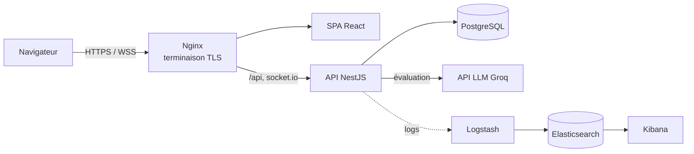

# 🛡️ SafeSchool

🇬🇧 [English version](README.md)

**Une plateforme web full-stack qui aide les établissements scolaires à signaler, suivre et traiter les situations de harcèlement, du signalement de l'élève jusqu'au suivi par l'équipe éducative.**

Projet final du tronc commun de l'École 42 (*ft_transcendence*), réalisé en équipe de quatre.
J'étais **Lead Technique Backend**, responsable de l'architecture de l'API, de la sécurité et de l'infrastructure Docker.


<!-- Ajouter 1 à 3 captures d'écran ici : connexion, tableau de bord admin, détail d'un signalement -->

---

## ✨ Fonctionnalités principales

- **Signalement d'incidents** : les élèves déposent un signalement (victimes, suspects, description) avec validation en temps réel
- **Gestion des dossiers** : l'équipe suit chaque signalement tout au long de son cycle de vie (`nouveau → en cours → en attente → résolu / faux signalement`), ajoute des notes et planifie des convocations
- **Tri assisté par IA** : les signalements sont évalués par un LLM (API Groq) pour aider à prioriser les cas urgents
- **Notifications en temps réel** : mises à jour par WebSocket (Socket.IO) avec badges de non-lus
- **Tableaux de bord par rôle** : vues administrateur, élève et parent, tableau de statistiques
- **Internationalisation** : français, anglais et allemand

## 🏗️ Architecture



Sept conteneurs Docker orchestrés avec Docker Compose, avec des configurations **dev** et **prod** distinctes (Dockerfiles multi-stages, fichiers de surcharge Compose).

## 🔐 Points forts en sécurité

- Hachage des mots de passe avec **bcrypt**, authentification sans état par **JWT**
- Autorisations via les guards NestJS (`JwtAuthGuard`, `RolesGuard`)
- Validation des entrées par **DTO + class-validator** (`ValidationPipe` global, `whitelist: true`)
- **Limitation de débit** sur la route de connexion
- En-têtes de sécurité **Helmet**, CORS configurable
- HTTPS partout : Nginx termine le TLS et redirige HTTP → HTTPS
- **Protection contre l'injection de prompt** sur l'évaluation IA (isolation du prompt système, sortie validée par liste blanche)
- Elasticsearch sécurisé avec X-Pack, aucun port public exposé

## 👩‍💻 Ma contribution (Lead Technique Backend)

- Conception de l'**API NestJS** : modules, services, entités TypeORM et modèle de données PostgreSQL (MCD)
- Mise en place de l'**authentification et des autorisations par rôle**
- Développement du circuit de traitement des signalements, du système de convocations et des notifications
- Intégration de l'évaluation par **LLM Groq**, sécurisée contre l'injection de prompt
- Mise en place de l'infrastructure **Docker Compose** (dev/prod) et participation à la stack de logs ELK
- Coordination du travail backend et revues de code via pull requests sur une branche `main` protégée

## 🚀 Démarrage

**Prérequis :** Docker, Docker Compose, Make

```bash
git clone git@github.com:Moufidakrainah/safeschoolV1.git
cd safeschoolV1
cp .env.example .env      # puis renseigner les valeurs requises (secret JWT, clé API Groq…)
make                      # mode production (par défaut)
# ou : make dev
```

L'application est ensuite accessible sur `https://localhost` (certificat auto-signé).

Les comptes de démonstration et la documentation technique complète se trouvent dans [`docs/`](docs/).

## 🧰 Stack technique

| Couche | Technologies |
|---|---|
| Frontend | React, TypeScript, Vite, shadcn/ui, i18next |
| Backend | NestJS, TypeORM, Passport JWT, class-validator, Socket.IO |
| Base de données | PostgreSQL |
| IA | API Groq (LLM) |
| Infrastructure | Docker, Docker Compose, Nginx, Make |
| Observabilité | Elasticsearch, Logstash, Kibana |

## 👥 Équipe

Réalisé à l'**École 42 Mulhouse** par une équipe de quatre :
[@hydnumrepandum68](https://github.com/hydnumrepandum68) ·
[@Moufidakrainah](https://github.com/Moufidakrainah) ·
[@quentinlm](https://github.com/quentinlm) ·
[@Emji6326](https://github.com/Emji6326)
