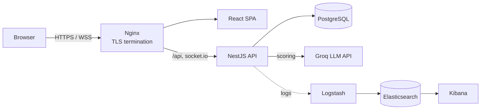

# 🛡️ SafeSchool

🇫🇷 [Version française](README.fr.md)

**A full-stack web platform that helps schools report, track and handle harassment incidents — from the student's report to the staff's follow-up.**

Final project of the École 42 common core (*ft_transcendence*), built by a team of four.
I was the **Backend Technical Lead**, responsible for the API architecture, security and the Docker infrastructure.


<!-- Add 1–3 screenshots here: login page, admin dashboard, report detail -->

---

## ✨ Key features

- **Incident reporting** — students submit reports (victims, suspects, description) with real-time validation
- **Case management** — staff follow each report through its lifecycle (`new → in_progress → pending → resolved / false_report`), add notes and schedule convocations
- **AI-assisted triage** — reports are scored by an LLM (Groq API) to help prioritise urgent cases
- **Real-time notifications** — WebSocket (Socket.IO) updates with unread badges
- **Role-based dashboards** — admin, student and parent views, statistics dashboard
- **Internationalisation** — French, English and German

## 🏗️ Architecture



Seven Docker containers orchestrated with Docker Compose, with separate **dev** and **prod** configurations (multi-stage Dockerfiles, compose override files).

## 🔐 Security highlights

- Password hashing with **bcrypt**, stateless auth with **JWT**
- Authorisation with NestJS guards (`JwtAuthGuard`, `RolesGuard`)
- Input validation with **DTOs + class-validator** (global `ValidationPipe`, `whitelist: true`)
- **Rate limiting** on the login endpoint
- **Helmet** security headers, configurable CORS
- HTTPS everywhere: Nginx terminates TLS and redirects HTTP → HTTPS
- **Prompt-injection mitigation** on the AI scoring (system prompt isolation, output validated against an allow-list)
- Elasticsearch secured with X-Pack, no public port exposed

## 👩‍💻 My contribution (Backend Technical Lead)

- Designed the **NestJS API**: modules, services, TypeORM entities and the PostgreSQL data model (ERD)
- Implemented **authentication and role-based authorisation**
- Built the report workflow, convocation system and notification logic
- Integrated the **Groq LLM** scoring and secured it against prompt injection
- Set up the **Docker Compose** infrastructure (dev/prod) and contributed to the ELK logging stack
- Coordinated the backend work and code reviews through pull requests on a protected `main` branch

## 🚀 Getting started

**Prerequisites:** Docker, Docker Compose, Make

```bash
git clone git@github.com:Moufidakrainah/safeschoolV1.git
cd safeschoolV1
cp .env.example .env      # then fill in the required values (JWT secret, Groq API key…)
make                      # production mode (default)
# or: make dev
```

The app is then available at `https://localhost` (self-signed certificate).

Demo accounts and the full technical documentation are available in [`docs/`](docs/).

## 🧰 Tech stack

| Layer | Technologies |
|---|---|
| Frontend | React, TypeScript, Vite, shadcn/ui, i18next |
| Backend | NestJS, TypeORM, Passport JWT, class-validator, Socket.IO |
| Database | PostgreSQL |
| AI | Groq API (LLM) |
| Infrastructure | Docker, Docker Compose, Nginx, Make |
| Observability | Elasticsearch, Logstash, Kibana |

## 👥 Team

Built at **École 42 Mulhouse** by a team of four:
[@hydnumrepandum68](https://github.com/hydnumrepandum68) ·
[@Moufidakrainah](https://github.com/Moufidakrainah) ·
[@quentinlm](https://github.com/quentinlm) ·
[@Emji6326](https://github.com/Emji6326)
