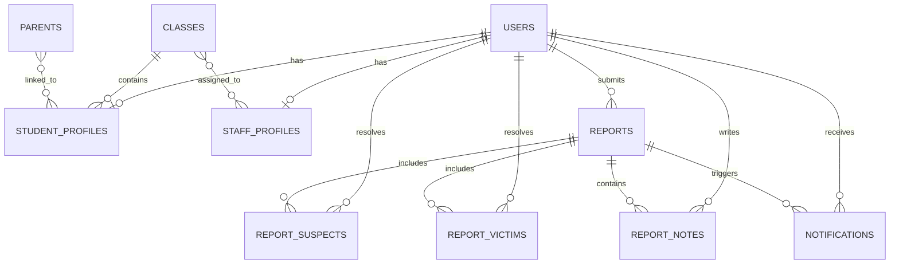

!!!! VERIFIER QU'IL NE RESTE PAS DE TODO !!!!

*This project has been created as part of the 42 curriculum by eguthman, mdoan, mobougri, quclaque.*

---
## Description

**SafeSchool** is a web platform for managing school harassment reports in middle schools. Students and school staff can report harassment situations they witness or experience. Each report is automatically graded by severity with AI assistance, then routed to and handled by the school's administrative staff (teachers, supervisors, directors).

### Key Features

- Report submission and triage, with AI-assisted severity scoring and sentiment analysis of report descriptions
- Role-based dashboards for students, reporting staff, and administrators, including full CRUD on users, classes and reports
- Organization system: schools structured into classes, with students, parents and staff linked to them
- Real-time multiplayer quiz on school-harassment awareness, powered by WebSockets
- Game features include live score updates, leaderboard, and remote play across devices
- Notification system for report status changes, quiz invitations and other key events
- Multilingual interface (French / English / German) tested across Chrome, Firefox and Edge
- Installable Progressive Web App (PWA) with offline support
- Centralized log management and monitoring via the ELK stack (Elasticsearch, Logstash, Kibana)

<!- TODO équipe : relire/ajuster cette description en anglais et cette liste pour qu'elles correspondent exactement au périmètre livré -->

---
## Instructions

### Prerequisites

Docker, Docker Compose, Make, Git.

### Environment Setup

`.env.example` documents every variable the stack needs without exposing real values — copy it to `.env` and fill in your own:


| Variable | Purpose |
|----------|---------|
| `DB_HOST` / `DB_PORT` / `DB_NAME` / `DB_USER` / `DB_PASSWORD` | PostgreSQL connection |
| `BACKEND_PORT` | NestJS listening port |
| `JWT_SECRET` | Secret used to sign authentication tokens |
| `VITE_API_URL` | URL the frontend uses to reach the backend API |
| `GROQ_API_KEY` | API key for the Groq LLM used in AI report scoring/sentiment analysis |
| `AI_ENABLED` | Toggles the AI scoring feature on/off |
| `LOGSTASH_HOST` / `LOGSTASH_PORT` / `LOG_LEVEL` | Log shipping configuration for the ELK stack |
| `ELASTIC_PASSWORD` | Password for the Elasticsearch `elastic` superuser (also used to log into Kibana) |

### Run the Project

```bash
# Clone the repository
git clone ...

# Start all services
make all

# The database is seeded automatically on first run if it's empty.
# To force a manual re-seed: make seed
```

### Stop the Project

```bash
make down       # Stop containers
make fclean     # Down + remove volumes
```


### Access URLs

**Development (`make dev`)**

| URL | Service |
|-----|---------|
| `http://localhost:5173` | Frontend (Vite dev server) |
| `http://localhost:5000` | Backend API |
| `http://localhost:5601` | Kibana (log monitoring) |

**Production (`make all`)**

| URL | Service |
|-----|---------|
| `https://localhost:8443` | Application (frontend + `/api` backend) |
| `http://localhost:5601` | Kibana (log monitoring) |

Kibana credentials: login `elastic`, password = value of `ELASTIC_PASSWORD` in your `.env`.

### Demo Accounts

If the sample dataset has been seeded, the following accounts can be used for demonstrations:

| Email | Password | Role | Main area |
|-------|----------|------|-----------|
| `lotfi@safeschool.com` | `ELEVEeleve123123+` | student | `/student` |
| `admin@safeschool.com` | `ADMINadmin123123+` | admin | `/dashboard` |
| `prof@safeschool.com` | `PROFprof123123+` | teacher | `/reporter` |


---
## Resources

### Official Documentation

- [NestJS documentation](https://nestjs.com)
- [PostgreSQL documentation](https://www.postgresql.org/docs/)
- [Docker documentation](https://docs.docker.com)
- [TypeORM documentation](https://typeorm.io)
- [Socket.IO documentation](https://socket.io/docs/v4/)
- [Elastic (ELK) documentation](https://www.elastic.co/guide/index.html)
- [React documentation](https://react.dev)
- [Tailwind CSS documentation](https://tailwindcss.com/docs)
- [Stephane Robert documentation](https://blog.stephane-robert.info/docs/)

### Learning Resources

- [React Beginner Course 2025 : Vite, Tailwind CSS, TypeScript](https://www.youtube.com/watch?v=siTUv1L9ymM&list=PLB_GSA94AMIyqIOyeRolfvuaxr2rA_52j&index=2)

### Domain References

- [Color contrast checker](https://www.acquia.com/fr/products/acquia-web-governance/tools/color-contrast-checker)
- [Studies on school harassment](docs/project/resources.md)

### Testing and Validation

- [Chrome DevTools](https://developer.chrome.com/docs/devtools) for runtime inspection, network debugging and UI checks
- [Lighthouse](https://developer.chrome.com/docs/lighthouse/overview) for quick audits on performance and general best practices
- [Cross-browser validation notes](docs/technical/browser_support.md)
<br><!- TODO équipe : completez en anglais la liste avec quelques sources pertinentes qui vont ont servi au cours du developpement -->

### AI Usage

AI tools were used during this project both **as a feature of the application** and **as a productivity tool**:

- **In the product**: report descriptions are scored and graded by severity with AI assistance to help staff triage incoming reports faster.
- **During the project lifecycle**:
  - Drafting and restructuring project documentation, always reviewed and corrected before being kept.
  - Helping weigh architecture choices and understand the trade-offs between alternatives.
  - Generating boilerplate code, always reviewed by the team and adapted to our needs.
  - Advising on how to prioritize tasks to avoid technical bottlenecks or conflicts.
  - Debugging: explaining error messages and stack traces, suggesting fixes to investigate.
  - Researching and comparing libraries before adopting one.
  - Producing a first draft of UI translations (FR/EN/DE), reviewed and corrected by the team.
  - Improving technical write-ups: PR descriptions, meeting summaries, issue reports.
  - Rewriting contribution summaries and README sections in English from rough working notes, then manually reviewing and correcting them before publication.
  - General-purpose help with linguistic questions: translation, wording, grammar and tone consistency across the FR/EN/DE interface and documentation.
  <br><!- TODO équipe : completez en anglais avec vos usages réels -->

---
## Team Information

Every team member contributed to the code as well as to the organization of the collective work.

| Member | Main role | Technical specialty |
|--------|-----------|---------------------|
| eguthman | Project Manager / Scrum Master | Frontend architecture, workflow, infrastructure |
| mdoan | Product Owner | Frontend, Design, API |
| mobougri | Technical Lead | Backend, DB, API |
| quclaque | Technical Lead | Websockets, Backend |


### 1. Product Owner — mdoan

<!- TODO mdoan : completer en anglais avec une description precise de ton role -->


### 2. Project Manager / Scrum Master — eguthman

Led project coordination for the full duration of the project, with responsibility for workflow structure, visibility, and documentation.

- Designed and maintained the GitHub board: views, labels, columns, module tracking and priority visibility, evolving the structure as the project grew.
- Built out the Makefile from a minimal starting point: added targets, structured startup commands, and added healthchecks in Docker Compose to make the stack reliable to bring up consistently.
- Structured the Git and pull-request workflow: wrote the conventions and maintained them throughout the project.
- Organized and facilitated team meetings throughout the project, prepared agendas in advance and wrote minutes to keep decisions and next actions traceable.
- Reviewed pull request diffs and filed issues on the board when inconsistencies or potential problems surfaced, maintaining codebase awareness even without owning the implementation.
- Built and maintained the project documentation: architecture, API, ELK stack, design system, testing guide, Git workflow.
- Took ownership of the ELK integration (Elasticsearch, Logstash, Kibana): configured the full stack with security enabled, structured backend logging, and automated dashboard import on startup.
- Contributed to frontend architecture choices: introduced Tailwind CSS and shadcn/ui to give the team a consistent visual base.

### 3. Technical Lead 1 — mobougri

<!- TODO mobougri : completer en anglais avec une description precise de ton role -->

### 4. Technical Lead 2 — quclaque

<!- TODO quclaque : completer en anglais avec une description precise de ton role -->


---
## Project Management

### Organization

The team used a lightweight agile workflow centered on a shared GitHub project board. Work was split into issues, tagged by feature area and targeted module, then tracked through dedicated columns and filtered views to keep priorities and tasks readable at any time.

The team held recurring meetings throughout the project (most weeks, alternating solo / pair / whole-team work sessions in between — see the minutes archived in [`docs/meetings/`](docs/meetings/)). Each session reviewed progress, prioritized the backlog, clarified blockers and was used to share knowledge.

To improve coordination in a team that was discovering full-stack web development for the first time, project management also included documenting Git workflows, introducing pull-request best practices, monitoring board activity continuously, and recording decisions so the team could recover context between work sessions.

### Tools

- **GitHub Issues & Projects** — backlog, task tracking, assignment, labels, module visibility and filtered board views adapted to the project's workflow
- **GitHub Pull Requests** — code review workflow with documented expectations on review, merge readiness and collaboration hygiene
- **Git worktrees** — used during the final sprint to minimize branch-switching overhead (see [`docs/process/git-worktrees.md`](docs/process/git-worktrees.md))

### Communication

- **Slack** — day-to-day coordination, quick questions and sharing urgent information
- **GitHub** (issues / PR comments) — asynchronous, traceable technical discussions and review feedback
- **Meeting agendas and minutes** — written support for coordination, follow-up and decision traceability across the project

---
## Technical Stack


### Frontend

| Technology | Version | Purpose |
|-----------|---------|---------|
| React | 19 | UI framework |
| TypeScript | 5 | Type safety |
| Vite | 8 | Build tool & dev server |
| Tailwind CSS | 4 | Styling |
| shadcn/ui | — | Component library and UI patterns |
| react-router-dom | 7 | Client-side routing |
| Axios | 1 | HTTP client |
| socket.io-client | 4 | Real-time communication |
| i18next | 26 | Internationalization |
| recharts | 3 | Charts & data visualization |
| lucide-react | 1 | Icon library |

### Backend

| Technology | Version | Purpose |
|-----------|---------|---------|
| NestJS | 11 | Backend framework (modules, controllers, services, guards, pipes, dependency injection) |
| TypeScript | 5 | Type safety |
| TypeORM | 0.3 | ORM used to map TypeScript entities to PostgreSQL tables |
| socket.io | 4 | Real-time communication (quiz, notifications) |
| Passport / @nestjs/jwt | 11 / 4 | Authentication (JWT strategy + guards) |
| bcrypt | 6 | Secure password hashing |
| class-validator / class-transformer | — | Validation of incoming request data |
| Winston | 3 | Structured logging sent to the ELK stack |
| Multer | — | File upload handling (avatars) |

### Database

| Technology | Version | Purpose |
|-----------|---------|---------|
| PostgreSQL | 15 | Main relational database |

### Infrastructure & Logging

| Technology | Purpose |
|-----------|---------|
| Docker / Docker Compose | Containerization |
| Elasticsearch 8.12 | Log storage & search |
| Logstash 8.12 | Log ingestion pipeline |
| Kibana 8.12 | Log visualization |

### Technical Choices

- **React** — the subject requires a modern JavaScript frontend framework, and React gave us a widely used ecosystem with solid TypeScript support and accessible documentation.
- **NestJS** —  provides a clearer structure out of the box for a team project. It helped us organize backend code into modules, controllers and services instead of defining everything from scratch.
- **PostgreSQL** — good fit because the project relies on many related entities such as users, classes, reports, notes and parents (see [Database Schema](#database-schema)). It integrates cleanly with the rest of the stack through TypeORM.
- **TypeORM** — helped us work with the database through TypeScript entities instead of writing and maintaining all queries by hand.
- **JWT + bcrypt** — JWT was used for authentication, while bcrypt was used to securely hash passwords before storing them.
- **Docker Compose** — the project depends on several services running together. Docker Compose made local setup more consistent by giving the team a shared environment and a simple startup process.
- **ELK (Elasticsearch, Logstash, Kibana)** — ELK was chosen to centralize logs from the application and infrastructure in one place, making them easier to inspect and monitor.

<!- TODO équipe : compléter en anglais si d'autres choix structurants méritent d'être justifiés (i18n, design system, choix du quiz comme "jeu", etc.) -->

---
## Database Schema

All tables use UUID primary keys and are managed through TypeORM entities.

### ER Diagram



### Tables and Relationships

```
users (role: student | teacher | staff | director | admin)
  ├── id (PK, uuid)
  ├── email (unique), password (hashed, select: false), firstName, lastName, avatar
  ├── 1—1 → student_profiles (if role = student)
  ├── 1—1 → staff_profiles (if role = staff/teacher/director)
  └── 1—N → reports (as the reporting student)

student_profiles
  ├── id (PK), dateOfBirth
  ├── N—1 → classes        (current class, nullable)
  ├── 1—1 → users
  └── N—N → parents

staff_profiles
  ├── id (PK), profession, subject
  ├── 1—1 → users
  └── N—N → classes        (classes a staff member supervises/teaches)

classes
  ├── id (PK), level, section
  ├── 1—N → student_profiles
  └── N—N → staff_profiles

parents
  ├── id (PK), firstName, lastName, email, phone, address
  └── N—N → student_profiles

reports
  ├── id (PK), caseNumber (unique), type, description, grade (enum), status (enum)
  ├── aiScore, aiReason, isAnonymous
  ├── N—1 → users           (reporting student)
  ├── 1—N → report_suspects  (cascade delete)
  └── 1—N → report_victims   (cascade delete)

report_suspects / report_victims
  ├── id (PK), freeText, ...
  ├── N—1 → reports          (cascade delete)
  └── N—1 → users            (resolvedUserId, nullable, set null on delete)

report_notes
  ├── id (PK), content, type
  ├── N—1 → reports          (cascade delete)
  └── N—1 → users            (author, nullable, set null on delete)

notifications
  ├── id (PK), message, isRead
  ├── N—1 → users            (cascade delete)
  └── N—1 → reports          (nullable, cascade delete)
```

### Key Fields and Data Types

| Table | Field | Type | Description |
|-------|-------|------|-------------|
| users | id | UUID | Primary key |
| users | email | varchar, unique | Login identifier |
| users | password | varchar (hashed, `select: false`) | bcrypt hash, never returned by default queries |
| users | role | enum (`UserRole`) | student / teacher / staff / director / admin — drives permissions |
| reports | grade | enum (`ReportGrade`) | Severity grade computed from the AI scoring service |
| reports | status | enum (`ReportStatus`) | Lifecycle state of a report (default: `NEW`) |
| reports | aiScore / aiReason | float / text | Output of the AI severity scoring (`scoring.service.ts`) |
| classes | level / section | varchar | e.g. "6e" / "A" — identifies a school class |

---
## Features List

| Feature | Description | Team member(s) |
|---------|-------------|---------------|
| Authentication | Users sign in securely and are routed to role-specific areas of the application depending on their permissions. | <!-- login --> |
| Report submission and follow-up | Students and school staff can submit harassment reports, optionally anonymously, then follow their status as the case is handled. | <!-- login --> |
| Report review workflow | Authorized staff can assess reports, add notes, update statuses and manage case follow-up from dedicated dashboards. | <!-- login --> |
| AI-assisted report analysis | When a report is submitted, the description is automatically analyzed to estimate severity and produce a human-readable summary shown to staff. | <!-- login --> |
| User and role administration | Admin users can manage accounts, update roles and maintain access control across the platform. | <!-- login --> |
| School organization management | Classes, students, parents and staff can be linked together to reflect the school's structure inside the application. | <!-- login --> |
| Real-time multiplayer quiz | Users can join a shared harassment-awareness quiz with synchronized progression and live score updates. | <!-- login --> |
| Notification system | The platform notifies users about report updates, quiz events and other important actions. | <!-- login --> |
| Design system and reusable UI | The frontend relies on reusable interface components to keep the application consistent across pages and roles. | <!-- login --> |
| Internationalization | The interface is available in French, English and German through a language switcher. | <!-- login --> |
| Progressive Web App | The frontend can be installed as a PWA and provides limited offline support. | <!-- login --> |
| Search and filtering | Users can search, filter and sort reports or administrative data more efficiently. | <!-- login --> |
| Legal information pages | Privacy Policy and Terms of Service pages are accessible directly from the application. | <!-- login --> |
| Activity analytics | Dashboards provide visual summaries of platform activity through charts and key indicators. | <!-- login --> |
| Centralized logging | Application logs can be collected and inspected through the ELK stack for monitoring and troubleshooting. | <!-- login --> |

<!- TODO équipe : assigner les logins (un ou plusieurs par ligne), ajuster les libellés/descriptions si besoin pour coller exactement au périmètre livré -->

---
## Modules

| Module | Category | Type | Points | Description / justification | Team member(s) |
|--------|----------|------|--------|------------------------------|---------------|
| Use a framework for both frontend and backend | Web | Major | 2 | Implemented with React on the frontend and NestJS on the backend, giving both sides of the project a structured framework-based architecture. | <!-- login --> |
| Real-time features — WebSockets (Quiz) | Web | Major | 2 | Implemented through a Socket.io quiz module that synchronizes room state, scores and progression between connected players in real time. | <!-- login --> |
| ORM database (TypeORM) | Web | Minor | 1 | Implemented with TypeORM entities, repositories and relations to manage persistence against the PostgreSQL database. | <!-- login --> |
| Advanced search functionality | Web | Minor | 1 | Implemented with filtering, sorting and search controls on report and administration views. | <!-- login --> |
| Progressive Web App (PWA) | Web | Minor | 1 | Implemented with a web app manifest and service-worker-based offline support for the frontend. | <!-- login --> |
| 10 reusable components — Custom design system | Web | Minor | 1 | Implemented through a reusable component set and shared UI rules for colors, typography and layout patterns. | <!-- login --> |
| Notification system | Web | Minor | 1 | Implemented as in-app notifications tied to report updates, quiz-related events and other important user actions. | <!-- login --> |
| Sentiment analysis on report descriptions | Artificial Intelligence | Minor | 1 | Implemented via a Groq LLM call on each report submission: the model classifies the description by severity (physical threat / emotional distress / verbal / banal), returns an urgency flag and a short explanation. The score contribution feeds the final severity grade; the explanation is displayed to staff in the report detail view. | <!-- login --> |
| Support 3 languages (i18n — fr/en/de) | Accessibility & i18n | Minor | 1 | Implemented with translated interface strings and a language switcher for French, English and German. | <!-- login --> |
| Support 3 browsers | Accessibility & i18n | Minor | 1 | Implemented by testing and adjusting the application for Chrome, Firefox and Edge. | <!-- login --> |
| Advanced permissions system (CRUD) | User Management | Major | 2 | Implemented with role-based access control and administrative CRUD actions adapted to each user type. | <!-- login --> |
| Organization system | User Management | Major | 2 | Implemented with classes, student profiles, staff profiles and parents linked together inside the same data model and admin workflows. | <!-- login --> |
| User activity analytics dashboard | User Management | Minor | 1 | Implemented with dashboard views and charts summarizing activity and platform data. | <!-- login --> |
| Implement a complete web-based game (Quiz) | Gaming & UX | Major | 2 | Implemented as a complete browser-based awareness quiz with rules, scoring, question flow and shared match state. | <!-- login --> |
| Remote players | Gaming & UX | Major | 2 | Implemented by allowing players on separate devices to join the same live quiz room and play together over the network. | <!-- login --> |
| Multiplayer game (3+ players) | Gaming & UX | Major | 2 | Implemented with quiz rooms that support more than two simultaneous players in the same match. | <!-- login --> |
| Infrastructure for log management (ELK) | Devops | Major | 2 | Implemented with Elasticsearch, Logstash and Kibana connected to application logging so logs can be centralized and inspected from one stack. | <!-- login --> |

**Total: 8 Major × 2 + 9 Minor × 1 = 25 pts** (minimum required: 14 pts — the surplus beyond 14 may count as bonus, capped at +5 pts per the subject's Bonus part)

<!- TODO équipe :
  - assigner les logins par module
  - vérifier que chaque module est démontrable intégralement à l'éval
  - si certains modules listés ci-dessus ne sont finalement pas livrés, les retirer et recalculer le total
-->

---
## Individual Contributions

<!- TODO équipe (important) : le sujet est explicite — chaque membre doit pouvoir expliquer et justifier sa propre contribution à l'oral. Ne décrivez que ce que vous avez réellement fait et comprenez en profondeur. -->

### eguthman

- Acted as Project Manager / Scrum Master throughout the project. Researched project-management practices suitable for a small 42 team, designed the GitHub board structure, created dedicated views, labels and columns, and maintained a workflow that kept features, modules and priorities visible over time.
- Built a collaboration framework around Git and pull requests. This included learning more advanced Git workflows, documenting them for the team, and introducing pull-request practices intended to make review, integration and ownership clearer.
- Organized recurring meetings, prepared agendas beforehand, and wrote meeting minutes afterward so that decisions, blockers and next actions were consistently recorded.
- Monitored project progress throughout the development cycle and worked on making module tracking more explicit through labels, documentation and board organization.
- Contributed significantly to documentation and team enablement work by studying the subject in depth, researching unfamiliar web-development concepts, and turning that learning into written guidance that could be shared across the team.
- On the technical side, helped steer the frontend toward a more modular structure and introduced Tailwind CSS and shadcn/ui to improve consistency, reuse and implementation speed.
- Later in the project, focused more directly on DevOps and delivery readiness. This included improving the Makefile and Docker Compose setup and working on the ELK integration so that the logging stack could become more usable in practice.
- Main challenge: much of this contribution was centered on coordination, documentation, process and project reliability rather than on end-user feature development. The way this was addressed was by making the work traceable, reusable and directly supportive of the team's ability to deliver.

### mdoan

- TODO mdoan: describe concrete features, modules, responsibilities and challenges personally handled.

### mobougri

- TODO mobougri: describe concrete features, modules, responsibilities and challenges personally handled.

### quclaque

- TODO quclaque: describe concrete features, modules, responsibilities and challenges personally handled.


---
## Additional Information

For deeper documentation beyond what is required here — architecture overview, API map, WebSocket quiz flow, ELK, PWA, design-system material, meeting minutes and workflow notes — start with [`docs/DOCS.md`](docs/DOCS.md).

### Known Limitations

<!- TODO équipe : lister les en anglais les limites connues constatées en fin de projet (ex. fonctionnalités partielles, contraintes de temps, choix assumés).  -->

### License

This project was created as part of the 42 School curriculum (common core, "ft_transcendence") and is intended for educational and evaluation purposes as of June 2026.
