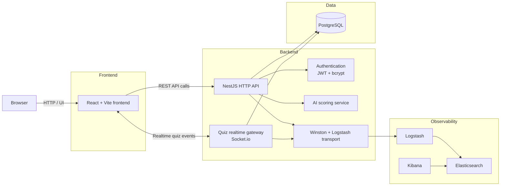

# Architecture

# SafeSchool

> Application de gestion des signalements de harcèlement scolaire

---

## Vue d'ensemble du système



### Lecture rapide

- The browser loads the React frontend and interacts with the application through the UI.
- Standard application actions go through the NestJS HTTP API.
- Real-time quiz interactions use the Socket.io gateway handled by the same backend.
- Application data is stored in PostgreSQL through the backend.
- Authentication relies on JWT tokens and bcrypt-hashed passwords.
- Report scoring can call the AI service when that feature is enabled.
- Logs are sent through Logstash to Elasticsearch and inspected in Kibana.

---

## Architecture réseau actuelle vs cible

### État actuel (dev, HTTP)

Chaque service expose directement son port à l'extérieur. Le navigateur parle à plusieurs
serveurs différents :

```
Navigateur
  ├── port 5173 → container frontend  (React / Vite)
  ├── port 5000 → container backend   (NestJS)
  └── port 5601 → container Kibana    (logs)
```

Tout circule en HTTP clair. Les tokens JWT, les mots de passe, les données élèves sont
lisibles sur le réseau.

### État cible (prod, HTTPS avec reverse proxy nginx)

Un seul point d'entrée : nginx. Le navigateur ne parle qu'à lui. nginx redirige ensuite
les requêtes en interne, sur le réseau Docker privé.

```
Navigateur
  └── port 443 (HTTPS) → nginx (reverse proxy)
                              ├── /          → frontend (React)
                              ├── /api/      → backend (NestJS)
                              └── /ws/       → backend WebSocket (quiz)

Réseau Docker interne (HTTP, pas exposé) :
  nginx → frontend:5173
  nginx → backend:3000
```

**Pourquoi nginx et pas directement chaque service ?**

Un reverse proxy est un serveur qui se met devant tous les autres. Son rôle :
- **Chiffrement TLS** : il gère le certificat HTTPS. Les services internes restent en HTTP
  simple (le réseau Docker est privé, c'est acceptable).
- **Point d'entrée unique** : un seul port exposé à l'extérieur au lieu de cinq.
- **Headers WebSocket** : nginx transmet les headers `Upgrade` et `Connection` nécessaires
  aux connexions WebSocket (quiz temps réel).

C'est exactement le même concept que dans Inception : nginx devant WordPress + MariaDB.

**Exigence du sujet** : la section "Technical requirements" précise :
> *"Any connection to the backend, from a browser, from a script, from an external API, etc.,
> must use HTTPS."*
C'est une condition de non-rejet, pas un module optionnel.

---

## Comment ça marche — Scénario complet

> **Lotfi Bougrine (élève) envoie un signalement**

### Étape 1 — Lotfi ouvre Firefox

```
FIREFOX
  └── React affiche la page http://localhost:5173
        └── Vite a transformé le TypeScript en JS lisible par Firefox
```

Lotfi voit le formulaire de login. Il tape `eleve@safeschool.com` / `eleve123` et clique **Se connecter**.

---

### Étape 2 — Login

```
FIREFOX
  └── React détecte le clic sur "Se connecter"
        └── Axios envoie :
              POST http://localhost:5000/auth/login
              Body: { email: "eleve@safeschool.com", password: "eleve123" }
                          ↕ HTTP
SERVEUR
  └── NestJS reçoit la requête sur /auth/login
        ├── Passport laisse passer (route publique, pas de vérification)
        ├── AuthService.login() s'exécute
        │     ├── TypeORM cherche : SELECT * FROM users WHERE email = '...'
        │     │         ↕ SQL
        │     │   PostgreSQL retourne Lotfi Bougrine
        │     ├── bcrypt compare "eleve123" avec le hash en BDD
        │     │   → correspondance OK ✅
        │     └── JWT génère un ticket :
        │           "sub:2, email:eleve@safeschool.com, role:student, expire:24h"
        └── NestJS répond :
              { access_token: "eyJhbG...", user: { id:2, role:"student" } }
                          ↕ HTTP
FIREFOX
  └── Axios reçoit la réponse
        └── React (AuthContext) sauvegarde le token dans localStorage
              └── React Router redirige vers /student
```

---

### Étape 3 — Lotfi remplit le formulaire

```
FIREFOX
  └── React Router affiche /student → StudentDashboard
        └── React affiche le formulaire
```

Lotfi tape :

| Champ | Valeur |
|-------|--------|
| Titre | "Harcèlement dans les couloirs" |
| Description | "Un élève m'insulte et me frappe tous les jours" |
| Anonyme | non coché |

Lotfi clique **Envoyer le signalement**.

---

### Étape 4 — Envoi du signalement

```
FIREFOX
  └── React déclenche handleSubmit()
        └── Axios prépare la requête :
              POST http://localhost:5000/reports
              Header: Authorization: Bearer eyJhbG...  ← token ajouté automatiquement
              Body: { title: "Harcèlement...", description: "...", isAnonymous: false }
                          ↕ HTTP
SERVEUR
  └── NestJS reçoit la requête sur POST /reports
        ├── Passport intercepte la requête
        │     ├── Lit le token dans le header Authorization
        │     ├── JWT vérifie la signature du token
        │     ├── Token valide → extrait { sub:2, role:"student" }
        │     └── TypeORM charge l'utilisateur : SELECT * FROM users WHERE id = 2
        │               ↕ SQL
        │         PostgreSQL retourne Lotfi Bougrine ✅
        │
        ├── ReportsController reçoit la requête
        │     └── req.user = Lotfi Bougrine (injecté par Passport)
        │
        └── ReportsService.create() s'exécute
              ├── classifyByIA("Un élève m'insulte et me frappe tous les jours")
              │     ├── Détecte le mot "insulte" → trouvé !
              │     └── Retourne grade = "urgent"
              │
              ├── TypeORM crée le signalement :
              │     INSERT INTO reports (title, grade, status, studentId...)
              │     VALUES ("Harcèlement...", "urgent", "pending", 2)
              │               ↕ SQL
              │     PostgreSQL sauvegarde → retourne id=5 ✅
              │
              └── NestJS répond :
                    { id:5, grade:"urgent", status:"pending", ... }
                          ↕ HTTP
FIREFOX
  └── Axios reçoit la réponse
        └── React met à jour l'affichage :
              setSuccess(report) → affiche la confirmation
```

---

### Résultat final dans le navigateur

```
✅ Signalement envoyé avec succès !
Grade attribué par l'IA : 🟠 Urgent
Statut : En attente de traitement
```

---

### Ce qui est maintenant en base de données

**Table `users`**

| id | firstName | lastName | email | role |
|----|-----------|----------|-------|------|
| 2 | Lotfi | Bougrine | eleve@safeschool.com | student |

**Table `reports`**

| id | title | grade | status | studentId | isAnonymous |
|----|-------|-------|--------|-----------|-------------|
| 5 | Harcèlement dans les couloirs | urgent | pending | 2 | false |
