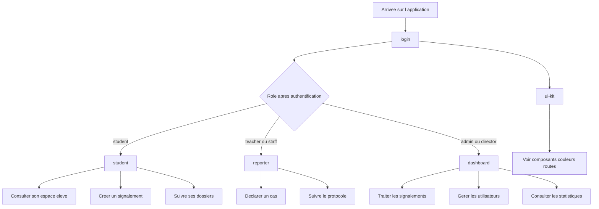

# Manuel de référence du projet — frontend, backend et flux applicatifs

Ce document sert de manuel de reference du projet. Il decrit l'ensemble du fonctionnement de SafeSchool, de l'infrastructure Docker jusqu'au rendu dans le navigateur, en passant par le backend, la base de donnees, l'authentification et le frontend.

---

## Table des matières

1. [Docker — l'infrastructure](#1-docker--linfrastructure)
2. [Le Backend — NestJS](#2-le-backend--nestjs)
3. [L'authentification JWT](#3-lauthentification-jwt)
4. [Le Frontend — React + Vite](#4-le-frontend--react--vite)
5. [Tailwind CSS — le système de classes](#5-tailwind-css--le-système-de-classes)
6. [Flux complet de A à Z](#6-flux-complet-de-a-à-z)

---

## 1. Docker — l'infrastructure

### Pourquoi Docker

L'application a besoin de nombreux composants : Node.js, PostgreSQL, Elasticsearch, etc. Sans Docker, chaque développeur installe tout sur sa machine dans des versions potentiellement différentes, ce qui crée des incompatibilités. Docker crée des **conteneurs** : des environnements isolés, identiques sur toutes les machines.

Un conteneur est comparable à une machine virtuelle très légère. Il contient exactement ce dont il a besoin et rien d'autre.

### `docker-compose.yml` — le chef d'orchestre

Ce fichier décrit les **7 services** qui constituent l'application et comment ils interagissent :

```
┌──────────────────────────────────────────────────────────────┐
│                       Machine hôte                           │
│                                                              │
│  :5173 ←→ [frontend]  ──────────────────────────────────────>│
│                        safeschool_network                    │
│                              ↓                               │
│                        [backend] :3000 (exposé en :5000)     │
│                              ↓                               │
│                        [database] PostgreSQL :5432 (:5433)   │
│                        [elasticsearch] :9200 (:9201)         │
│                        [logstash]  :5044                     │
│                        [kibana]    :5601                     │
│                        [pgadmin]   :80 (:8080)               │
└──────────────────────────────────────────────────────────────┘
```

### Ports

La notation `"5000:3000"` signifie : _le port 3000 du conteneur est accessible via le port 5000 de la machine hôte_. Le backend écoute sur 3000 à l'intérieur du conteneur, mais l'accès depuis le navigateur se fait via le port 5000.

| Service | Port interne | Port externe |
|---|---|---|
| frontend | 5173 | 5173 |
| backend | 3000 | 5000 |
| database (PostgreSQL) | 5432 | 5433 |
| elasticsearch | 9200 | 9201 |
| logstash | 5044 | 5044 |
| kibana | 5601 | 5601 |
| pgadmin | 80 | 8080 |

### Volumes

`./backend:/app` monte le dossier `backend/` de la machine hôte dans `/app` du conteneur. Toute modification de fichier dans l'éditeur est immédiatement visible dans le conteneur — ce qui rend le hot reload possible.

La deuxième entrée `/app/node_modules` empêche le volume précédent d'écraser les dépendances installées dans le conteneur.

### `depends_on` — ordre de démarrage

```
elasticsearch → logstash → database → backend → frontend
```

Le backend ne démarre pas avant que la base de données soit prête (`condition: service_healthy`). Sans ça, le backend tenterait de se connecter à Postgres qui n'existe pas encore et crasherait.

### `healthcheck`

Pour PostgreSQL :
```yaml
test: ["CMD-SHELL", "pg_isready -U ${DB_USER} -d ${DB_NAME}"]
interval: 5s
retries: 5
```
Docker interroge Postgres toutes les 5 secondes. Une fois que `pg_isready` répond positivement, le service est marqué `healthy` et les services dépendants peuvent démarrer.

### Réseau `safeschool_network`

Tous les services partagent le même réseau Docker privé. Dans ce réseau, chaque service est accessible via son **nom** (pas son IP). Le backend peut donc appeler `database:5432` directement — Docker résout `database` en l'IP interne du conteneur Postgres.

### Les Dockerfiles

**Frontend** (`frontend/Dockerfile`) :
```dockerfile
FROM node:20-alpine    # image de base légère
WORKDIR /app           # répertoire de travail
COPY package*.json ./  # copie les dépendances
RUN npm install        # installe
COPY . .               # copie le code
EXPOSE 5173            # déclare le port
CMD ["npm", "run", "dev", "--", "--host"]  # démarre Vite en mode dev
```

**Backend** (`backend/Dockerfile`) :
```dockerfile
FROM node:20-alpine
RUN npm install -g @nestjs/cli   # installe le CLI NestJS globalement
WORKDIR /app
COPY package*.json ./
RUN npm install
COPY . .
EXPOSE 3000
CMD ["npm", "run", "start:dev"]  # démarre NestJS en mode watch
```

---

## 2. Le Backend — NestJS

### Node.js et NestJS — la différence

Ces deux noms reviennent souvent ensemble et peuvent prêter à confusion :

- **Node.js** : c'est le moteur qui exécute du JavaScript côté serveur, en dehors du navigateur. C'est l'"environnement d'exécution" — comme une machine virtuelle qui sait lire du JS.
- **NestJS** : c'est un framework (une boîte à outils) qui s'appuie sur Node.js pour t'aider à créer des applications backend structurées. Il impose une architecture en modules, controllers, services, etc.

En résumé : **Node.js exécute le code, NestJS l'organise.** Quand tu lances le backend (`npm run start:dev`), c'est Node.js qui lit et exécute le code NestJS.

NestJS est un framework Node.js qui impose une architecture en **modules**. Chaque fonctionnalité est encapsulée dans son propre module.

### Architecture en modules

```
app.module.ts                ← module racine, assemble tout
  ├── AuthModule             ← connexion / inscription
  ├── UsersModule            ← gestion des utilisateurs
  ├── ReportsModule          ← signalements
  ├── NotificationsModule    ← notifications
  ├── StudentProfilesModule  ← profils élèves
  └── LoggerModule           ← logs HTTP → Logstash
```

Chaque module contient systématiquement :
- **`*.controller.ts`** : reçoit et route les requêtes HTTP (`GET /users`, `POST /auth/login`...)
- **`*.service.ts`** : contient la logique métier (vérifier un mot de passe, créer un enregistrement...)
- **`*.module.ts`** : déclare et relie les deux

### La base de données — TypeORM

TypeORM fait le lien entre les objets TypeScript et les tables PostgreSQL. Chaque fichier `*.entity.ts` correspond à une table en base.

Exemple — `user.entity.ts` :
```typescript
@Entity('users')                           // → table "users"
export class User {
  @PrimaryGeneratedColumn('uuid') id: string;
  @Column({ unique: true }) email: string;
  @Column({ select: false }) password: string;   // jamais renvoyé par défaut
  @Column({ type: 'enum', enum: UserRole }) role: UserRole;
  @OneToMany(() => Report, r => r.student) reports: Report[];
}
```

Avec `synchronize: true` dans `app.module.ts`, TypeORM crée et met à jour les tables automatiquement au démarrage. Le fichier `database/init.sql` ne sert qu'à l'initialisation à blanc de PostgreSQL.

### Relations entre tables

| Relation | Entités | Description |
|---|---|---|
| `OneToMany` | User → Report | Un utilisateur peut avoir plusieurs signalements |
| `ManyToOne` | Report → User | Un signalement appartient à un utilisateur |
| `OneToOne` | User ↔ StudentProfile | Un utilisateur a au plus un profil élève |
| `OneToMany` | Report → ReportSuspect | Un signalement peut avoir plusieurs suspects |

### ELK — Elasticsearch + Logstash + Kibana

C'est le système centralisé de logs :

1. Chaque requête HTTP est capturée par `HttpLoggerMiddleware` (`logger/http-logger.middleware.ts`)
2. Elle est envoyée à **Logstash** (port 5044) qui la formate selon le pipeline `elk/logstash/pipeline/logstash.conf`
3. Logstash l'envoie à **Elasticsearch** qui la stocke et l'indexe
4. **Kibana** (port 5601) permet de visualiser et requêter les logs via une interface web

---

## 3. L'authentification JWT

### Flux de connexion

```
[Navigateur]                    [Backend]                    [Base de données]
     │                              │                               │
     │  POST /auth/login            │                               │
     │  { email, password }  ──────>│                               │
     │                              │  findByEmailWithProfile()     │
     │                              │  ──────────────────────────── >│
     │                              │  < ─────────────────────────  │
     │                              │                               │
     │                              │  bcrypt.compare(              │
     │                              │    password_saisi,            │
     │                              │    hash_stocké                │
     │                              │  )                            │
     │                              │                               │
     │  { access_token, user } <────│  jwtService.sign(payload)     │
     │                              │                               │
```

**bcrypt** : les mots de passe ne sont jamais stockés en clair. `bcrypt.hash()` produit un hash irréversible. À la connexion, `bcrypt.compare()` vérifie si le mot de passe saisi correspond au hash sans jamais le "décoder".

**JWT (JSON Web Token)** : le token retourné (`eyJhbGci...`) est une chaîne encodée contenant `{ sub: userId, email, role }`. Il est signé avec une clé secrète côté serveur — le backend peut vérifier son authenticité sans requête en base.

### Protection des routes

Pour chaque requête sur une route protégée :

```
[Navigateur]                    [Backend]
     │                              │
     │  GET /reports                │
     │  Authorization: Bearer eyJ.. │
     │  ──────────────────────────>│
     │                              │  JwtAuthGuard (jwt-auth.guard.ts)
     │                              │    → vérifie la signature
     │                              │    → décode { userId, role }
     │                              │    → autorise ou renvoie 401
```

Le `JwtAuthGuard` est appliqué à toutes les routes qui nécessitent une authentification. La stratégie JWT (`jwt.strategy.ts`) définit comment le token est extrait et validé.

---

## 4. Le Frontend — React + Vite

### Le DOM — ce que React manipule

Le DOM (Document Object Model) est la représentation en mémoire de la page HTML, sous forme d'arbre d'objets. Quand le navigateur charge une page, il construit cet arbre à partir du HTML :

```
document
└── div#root
    ├── h1  → "Bonjour"
    └── p   → "Texte"
```

JavaScript peut ensuite lire ou modifier cet arbre : changer un texte, ajouter un nœud, supprimer un élément.

**React et le virtual DOM :** React ne touche pas directement le DOM à chaque changement. Il maintient une copie légère en mémoire appelée **virtual DOM**, calcule ce qui a changé entre deux états, puis applique uniquement les différences au vrai DOM. C'est ce qui le rend performant même avec beaucoup de données.

Le point d'entrée dans le DOM se trouve dans `main.tsx` :

```tsx
ReactDOM.createRoot(document.getElementById('root')!).render(<App />)
```

Cette ligne prend le nœud `<div id="root">` de `index.html` et y injecte toute l'application React. Tout ce que voit l'utilisateur est rendu à l'intérieur de ce seul div.

---

### Vue d'ensemble du frontend

Le frontend repose sur quelques fichiers pivots qui structurent toute l'application.

---

### Les couches technologiques du front — JS, TS, React, JSX, Tailwind

Quand on travaille sur le frontend, on manipule plusieurs technologies imbriquées. Voici comment elles s'articulent :

| Couche | Rôle | Exemple |
|---|---|---|
| **JavaScript (JS)** | Le langage de base, exécuté par le navigateur | `const x = 5;` |
| **TypeScript (TS)** | Une surcouche de JS qui ajoute le typage. Toujours transformé en JS avant d'être exécuté | `const x: number = 5;` |
| **React** | Une bibliothèque JS/TS pour créer des interfaces avec des composants | `function Button() { ... }` |
| **JSX / TSX** | Une syntaxe qui permet d'écrire du HTML dans du JS/TS, utilisée par React | `return <button>Valider</button>` |
| **Tailwind** | Un framework CSS utilitaire : on stylise en ajoutant des classes directement dans le JSX | `className="bg-primary text-white"` |

**Ce que ça veut dire concrètement :**

- Dans un fichier `.tsx`, tu écris du **TypeScript** (avec typage).
- À l'intérieur du `return` d'un composant, tu écris du **JSX** (HTML mélangé à du JS/TS).
- Dans ce JSX, tu appliques les styles **Tailwind** via `className`.
- **React** s'occupe d'assembler tout ça et de l'afficher dans la page.

#### Le typage — ce que ça change

JavaScript n'a pas de typage strict : tu peux écrire `let x = 5; x = "cinq";` sans erreur.

TypeScript, lui, te force à préciser le type :
```ts
let x: number = 5;
x = "cinq"; // ❌ Erreur TypeScript : on ne peut pas mettre une string dans un number
```

Le bénéfice : TypeScript attrape les erreurs **avant** l'exécution, directement dans l'éditeur. Il aide aussi à l'autocomplétion et à la documentation du code.

#### Commenter dans JSX — la syntaxe `{/* ... */}`

En JavaScript et TypeScript classiques (hors JSX), on commente normalement comme en C :
```ts
// commentaire sur une ligne
/* commentaire sur
   plusieurs lignes */
```

Mais **dans le JSX** (à l'intérieur du `return`), ces syntaxes provoquent une erreur de parsing. Il faut utiliser à la place :
```tsx
{/* ceci est un commentaire JSX */}
```

Les accolades `{}` signalent à JSX "ce qui suit est du JavaScript". Le `/* ... */` à l'intérieur est alors interprété comme un commentaire JS — et React l'ignore à l'affichage car l'expression ne retourne rien.

Résumé :
- Hors JSX (variables, fonctions…) → `//` et `/* */` fonctionnent.
- Dans JSX (dans le `return`) → utiliser `{/* ... */}` obligatoirement.

#### Les composants — ce qu'on crée nous-mêmes

React ne te fournit pas des composants tout faits comme `<Button>` ou `<Input>`. Il te donne le **système** pour en créer. C'est toi qui les construis dans `frontend/src/components/` et qui les utilises ensuite comme des balises personnalisées :

```tsx
// Tu définis le composant dans Button.tsx
function Button({ children }) {
  return <button className="bg-primary text-white">{children}</button>;
}

// Tu l'utilises dans n'importe quelle page
<Button>Valider</Button>
```

React s'occupe ensuite d'afficher, mettre à jour et organiser ces composants dans la page.

---

- `index.html` fournit le point d'ancrage HTML de l'application
- `main.tsx` monte React dans le DOM
- `AuthContext.tsx` conserve l'etat de connexion
- `App.tsx` contient la table de routage principale
- `pages/` contient les ecrans affiches selon l'URL et le role

### Vite — le transpileur qui rend tout possible

Le navigateur ne comprend pas le TypeScript ni le JSX. Il n'exécute que du JavaScript standard. **Vite** est l'outil qui fait la traduction :

1. Il lit tous les fichiers `.ts` et `.tsx` du projet.
2. Il les compile (on dit "transpile") en JavaScript compréhensible par le navigateur.
3. Il applique Tailwind sur les classes CSS utilisées.
4. Il sert le résultat via un serveur de développement (par défaut sur `http://localhost:5173`).

Le fichier `vite.config.ts` configure ce processus :

```ts
import { defineConfig } from 'vite'
import react from '@vitejs/plugin-react'
import tailwindcss from '@tailwindcss/vite'

export default defineConfig({
  plugins: [react(), tailwindcss()],
})
```

- Le plugin **`react()`** permet à Vite de comprendre le JSX/TSX et active le hot reload (mise à jour instantanée dans le navigateur à chaque modification de fichier).
- Le plugin **`tailwindcss()`** intègre Tailwind dans le processus de build.

Quand tu lances `npm run dev`, Vite démarre, compile, et surveille les fichiers. Toute modification est reflétée dans le navigateur sans avoir à recharger manuellement.

**Vite n'a aucun lien direct avec le backend.** Il s'occupe uniquement du frontend. Le frontend communique avec le backend via des requêtes HTTP (voir la section `api.ts`).

### Chaîne de chargement

Le parcours de chargement du frontend peut se lire comme suit :

1. Le navigateur charge `index.html`.
2. `main.tsx` monte l'application React dans `#root`.
3. `AuthProvider` rend l'etat d'authentification disponible dans toute l'application.
4. `BrowserRouter` active le routage cote client.
5. `App.tsx` choisit le composant de page a afficher selon l'URL et le role de l'utilisateur.

```
index.html
└── main.tsx
  └── AuthProvider
    └── BrowserRouter
      └── App.tsx
        ├── /login
        ├── /ui-kit
        ├── /reporter
        ├── /student
        └── /dashboard
```

### Routes actuellement branchees

| Route | Composant affiche | Acces | Etat |
|---|---|---|---|
| `/login` | `Login` | public | page active |
| `/ui-kit` | `UiShowcase` | public | page de reference interne |
| `/reporter` | `ReporterDashboard` | `teacher`, `staff` | base de travail branchee |
| `/student` | `StudentDashboard` | `student` | stub |
| `/dashboard` | `AdminDashboard` | `admin`, `director` | stub |

### Lecture du routage

Le comportement actuel du routeur peut se resumer ainsi :

- toute arrivee anonyme sur l'application est redirigee vers `/login`
- apres connexion, la destination depend du role retourne par le backend
- les routes `/student`, `/reporter` et `/dashboard` sont protegees par `ProtectedRoute`
- la route `/ui-kit` sert d'espace de reference pour construire les futurs ecrans de facon coherente

### Carte des routes en Mermaid



### Note de documentation — Mermaid

Pour ajouter un schema Mermaid dans un autre document Markdown, il suffit d'utiliser un bloc de code `mermaid`.

````markdown
```mermaid
flowchart TD
  A[Login] --> B[/reporter]
```
````

Le schema sera rendu automatiquement dans les outils compatibles Mermaid. Meme sans rendu graphique, le bloc reste lisible comme source documentaire.

### `AuthContext` — état global de l'authentification

`frontend/src/context/AuthContext.tsx` implémente un store global léger via l'API Context de React. Il expose :

```typescript
{
  user: User | null,          // informations de l'utilisateur connecté
  token: string | null,       // JWT
  loginUser(token, user),     // stocke dans localStorage + state
  logoutUser(),               // efface localStorage + state
  isAuthenticated: boolean,   // token
}
```

L'état est initialisé depuis `localStorage` au chargement — l'utilisateur reste connecté après un refresh.

N'importe quel composant peut accéder à ces données via `useAuth()` sans passer des props de parent en enfant.

### `App.tsx` et `AuthContext.tsx` — role de pilotage du frontend

`frontend/src/App.tsx` et `frontend/src/context/AuthContext.tsx` sont deux fichiers centraux du frontend.

**`App.tsx`** joue le role de chef d'aiguillage :
- il lit l'URL courante
- il choisit quelle page React doit etre affichee
- il protege certaines routes via `ProtectedRoute`

Exemple :
- `/login` affiche la page de connexion
- `/reporter` est reserve aux roles `teacher` et `staff`
- `/student` est reserve au role `student`
- `/dashboard` est reserve aux roles `admin` et `director`
- `/ui-kit` expose une page de reference interne pour les composants et tokens visuels deja disponibles

La fonction `ProtectedRoute` sert de filtre :
- si aucun utilisateur n'est connecte, redirection vers `/login`
- si le role n'est pas autorise, redirection vers `/login`
- sinon, la page demandee est affichee

**`AuthContext.tsx`** joue le role de stockage global de l'authentification :
- il conserve l'utilisateur courant
- il conserve le token JWT
- il expose `loginUser()` et `logoutUser()` a toute l'application

Ce fichier evite de faire circuler les informations d'authentification manuellement entre tous les composants.

### Page `UI kit`

- recenser les composants deja disponibles
- montrer les variantes de boutons et d'inputs existantes
- afficher la palette de couleurs et les tokens visuels utilises
- servir de base rapide pour assembler de nouvelles pages de facon coherente

### Composants réutilisables — anatomie et conventions

Les composants réutilisables vivent dans `frontend/src/components/`. Chaque fichier suit la même structure en 3 blocs.

#### Bloc 1 — Type (`XxxProps`)

Déclare le contrat du composant : ce qu'il accepte, ce qui est obligatoire, ce qui est optionnel.

```tsx
type ButtonProps =
{
  children:  React.ReactNode;   // obligatoire — pas de ?
  variant?:  'primary' | 'danger';  // optionnel
  disabled?: boolean;               // optionnel
};
```

- Un champ **sans `?`** est obligatoire. TypeScript refuse de compiler si on oublie de le passer.
- Un champ **avec `?`** est optionnel. On peut lui donner une valeur par défaut dans la signature de la fonction.
- **`React.ReactNode`** : type qui accepte "n'importe quoi de rendu par React" — texte, JSX, nombre, `null`… C'est le type standard pour la prop `children`, car on veut pouvoir écrire aussi bien `<Button>Texte</Button>` que `<Button><span>JSX</span></Button>`.
- **`() => void`** : type d'une fonction qui prend zéro argument et ne retourne rien. C'est le type standard pour `onClick`, `onClose`, etc. — des fonctions qui déclenchent une action sans produire de valeur.

#### Bloc 2 — Styles

Constantes Tailwind déclarées en dehors de la fonction pour ne pas mélanger la logique et le visuel.

```tsx
// Classes communes à toutes les variantes
const base = 'px-6 py-3 rounded-full font-semibold text-sm ...';

// Ce qui change selon la variante
const variants =
{
  primary: 'bg-primary text-white hover:bg-primary-hover',
  danger:  'bg-critical text-white hover:opacity-90',
};
```

Ce bloc est optionnel — uniquement utile quand il y a des variantes ou des classes longues.

#### Bloc 3 — Composant (`export default function`)

La fonction reçoit les props, applique les valeurs par défaut, retourne du JSX.

```tsx
export default function Button(
{
  children,
  variant  = 'primary',   // valeur par défaut si non fournie
  disabled = false,
}: ButtonProps)
{
  return (
    <button disabled={disabled} className={`${base} ${variants[variant]}`}>
      {children}
    </button>
  );
}
```

**Pourquoi `children` n'a pas de valeur par défaut ?** Parce qu'il est obligatoire dans le type (pas de `?`). Un bouton sans contenu n'a pas de sens — TypeScript force à le fournir.

#### `export` et `import` — visibilité entre fichiers

En JS/TS, chaque fichier est un **module isolé**. Rien n'est visible de l'extérieur par défaut.

- `export default` = "je rends ce composant disponible pour les autres fichiers"
- `import` = "je vais chercher quelque chose dans un autre fichier"

C'est comparable à `public` vs `private` en C++ : sans `export`, la fonction existe mais personne d'autre ne peut l'utiliser.

`frontend/src/components/index.ts` réexporte tous les composants en un seul point d'entrée — ce qui permet d'écrire :

```tsx
import { Button, Input } from '../components';
// au lieu de :
import Button from '../components/Button';
import Input from '../components/Input';
```

---

### `api.ts` — couche HTTP

`frontend/src/services/api.ts` centralise tous les appels au backend. Cette couche utilise **Axios**, une bibliothèque JavaScript qui simplifie l'envoi de requêtes HTTP (GET, POST, PATCH, DELETE…) depuis le frontend vers le backend. Sans Axios, il faudrait utiliser l'API `fetch` native du navigateur, plus verbeuse et sans gestion automatique des erreurs.

Axios ajoute automatiquement le token JWT dans chaque requête via un intercepteur :

```typescript
api.interceptors.request.use((config) => {
  const token = localStorage.getItem('token');
  if (token) config.headers.Authorization = `Bearer ${token}`;
  return config;
});
```

Endpoints disponibles :

| Fonction | Méthode | URL |
|---|---|---|
| `login` | POST | `/auth/login` |
| `register` | POST | `/auth/register` |
| `getReports` | GET | `/reports` |
| `createReport` | POST | `/reports` |
| `updateReport` | PATCH | `/reports/:id` |
| `escalateReport` | PATCH | `/reports/:id/escalate` |
| `searchUsers` | GET | `/users/search?q=` |
| `getNotes` | GET | `/reports/:id/notes` |
| `addNote` | POST | `/reports/:id/notes` |
| `getNotifications` | GET | `/notifications` |
| `getUnreadCount` | GET | `/notifications/unread-count` |
| `getAllUsers` | GET | `/users` |
| `createUser` | POST | `/users` |
| `updateUser` | PATCH | `/users/:id` |
| `deleteUser` | DELETE | `/users/:id` |

---

## 5. Tailwind CSS — le système de classes

### Principe

En CSS classique, on écrit :
```css
.ma-div {
  display: flex;
  flex-direction: column;
  align-items: center;
  gap: 2rem;
  background-color: #0097b2;
}
```

Tailwind inverse ce paradigme : **chaque classe = une seule propriété CSS**. Les classes sont appliquées directement dans le JSX, sans inventer de noms.

### Correspondance classe → CSS

| Classe Tailwind | CSS équivalent |
|---|---|
| `flex` | `display: flex` |
| `flex-col` | `flex-direction: column` |
| `items-center` | `align-items: center` |
| `justify-center` | `justify-content: center` |
| `gap-8` | `gap: 2rem` |
| `w-1/2` | `width: 50%` |
| `px-16` | `padding-left: 4rem; padding-right: 4rem` |
| `rounded-lg` | `border-radius: 0.5rem` |
| `rounded-full` | `border-radius: 9999px` (cercle parfait) |
| `text-sm` | `font-size: 0.875rem` |
| `font-semibold` | `font-weight: 600` |
| `min-h-screen` | `min-height: 100vh` |

### Le système d'échelle

Tailwind utilise une échelle où chaque unité = 0.25rem = 4px :
- `p-4` = padding de 1rem (16px)
- `p-8` = padding de 2rem (32px)
- `gap-2` = 0.5rem (8px) entre les éléments flex

### Couleurs personnalisées — le lien avec `index.css`

Les classes `bg-primary`, `text-critical`, `border-high` etc. ne sont pas définies par Tailwind — elles viennent du bloc `@theme` dans `frontend/src/index.css` :

```css
@theme {
  --color-primary:      #0097b2;
  --color-primary-dark: #007a91;
  --color-bg-light:     #ebfcff;
  --color-critical:     #cc0000;
  --color-high:         #ff914d;
  --color-medium:       #ffde59;
  --color-low:          #74cc00;
}
```

Tailwind v4 lit ces variables CSS et génère automatiquement les classes utilitaires correspondantes : `bg-primary`, `text-primary`, `border-primary`, `bg-critical`, etc.

### `className` — la prop qui reçoit les classes Tailwind

En React, les éléments HTML n'ont pas d'attribut `class` comme en HTML pur. On utilise la prop `className` à la place (c'est une contrainte de JSX car `class` est un mot réservé JavaScript).

La chaîne passée à `className` est juste du texte. Chaque mot séparé par un espace est une classe CSS indépendante. React transmet ce texte tel quel au DOM, qui l'interprète comme des classes CSS normales.

Tailwind, lui, lit tous les fichiers du projet au moment du build, repère ces chaînes, et génère uniquement le CSS correspondant aux classes réellement utilisées.

**Ce qui se passe avec des classes dynamiques :**

Quand une classe dépend d'une variable (par exemple la couleur d'un badge selon la sévérité), on construit la chaîne en JavaScript :

```tsx
// La couleur change selon la variable `severity`
<div className={`px-3 py-1 rounded-full ${SEVERITY_COLORS[severity]}`}>
  {label}
</div>
```

Les accolades `{}` signalent à JSX "ce qui suit est du JavaScript, pas du texte brut". Les backticks `` ` `` permettent d'interpoler des variables dans la chaîne via `${}`.

### Comment trouver une classe

Sur [tailwindcss.com/docs](https://tailwindcss.com/docs), la recherche se fait par **propriété CSS** souhaitée :
- Arrondir les coins → chercher "border radius" → `rounded-sm`, `rounded-md`, `rounded-lg`, `rounded-xl`, `rounded-full`
- Espacer des éléments → chercher "gap" ou "space between" → `gap-4`, `gap-8`
- Ombre → chercher "box shadow" → `shadow-sm`, `shadow-md`, `shadow-lg`

---

## 6. Flux complet de A à Z

### Première visite — page de login

```
Ouverture de localhost:5173
  → Docker route vers le conteneur frontend (Vite)
  → Vite sert index.html + le bundle JS compilé
  → React démarre, lit localStorage
  → Aucun token trouvé
  → App.tsx redirige vers /login
  → Login.tsx s'affiche
```

### Connexion

```
Saisie email + mot de passe → clic sur "Se connecter"
  → handleSubmit() dans Login.tsx
  → appel de login() dans api.ts
  → Axios envoie : POST http://localhost:5000/auth/login
                   body: { email, password }
  → Docker route le port 5000 vers le backend (port 3000 interne)
  → NestJS : AuthController.login() reçoit la requête
  → AuthService.login() :
      1. findByEmailWithProfile(email) → requête SQL via TypeORM
      2. bcrypt.compare(motDePasseSaisi, hashStocké)
      3. Si OK → jwtService.sign({ sub: id, email, role })
      4. Renvoie { access_token, user }
  → Login.tsx reçoit la réponse
  → AuthContext.loginUser(token, user) :
      - stocke dans localStorage
      - met à jour le state React
  → React Router navigue vers /student ou /dashboard selon le role
```

### Chargement du dashboard

```
Dashboard monté dans React
  → useEffect → appel de getReports() dans api.ts
  → Axios ajoute automatiquement : Authorization: Bearer <token>
  → Backend reçoit GET /reports
  → JwtAuthGuard vérifie le token (signature + expiration)
  → Token valide → décode { userId, role }
  → ReportsController.findAll() → ReportsService → TypeORM
  → SELECT * FROM reports ... → PostgreSQL
  → Données renvoyées en JSON
  → React met à jour le state
  → Composant re-render avec les données
```

### Déconnexion

```
Clic sur "Déconnexion"
  → logoutUser() dans AuthContext
  → localStorage.removeItem('token') + removeItem('user')
  → State React mis à null
  → App.tsx détecte isAuthenticated = false
  → Redirection automatique vers /login
```

---

## Résumé des technologies

| Couche | Technologie | Version | Rôle |
|---|---|---|---|
| Conteneurisation | Docker + Compose | v2 | Isolation et orchestration |
| Frontend | React + TypeScript | 18 | Interface utilisateur |
| Build frontend | Vite | 5 | Compilation et hot reload |
| Styles | Tailwind CSS | v4 | Classes utilitaires CSS |
| Backend | NestJS | 10 | API REST |
| ORM | TypeORM | — | Lien TypeScript ↔ SQL |
| Base de données | PostgreSQL | 15 | Stockage persistant |
| Auth | JWT + bcrypt | — | Authentification sécurisée |
| Logs | ELK (Elasticsearch + Logstash + Kibana) | 8.12 | Centralisation des logs |
| Admin DB | pgAdmin | 4 | Interface graphique PostgreSQL |

---

## MISC - a trier

### `useLocation` — hook React Router

`useLocation` est un hook fourni par `react-router-dom`. Il retourne un objet représentant l'URL courante du navigateur, notamment la propriété `pathname` qui contient le chemin actif.

```ts
const location = useLocation();
// Sur http://localhost:5173/reporter :
location.pathname // → "/reporter"
```

Cas d'usage typique : savoir sur quelle route on est pour conditionner un style, un comportement, ou un affichage. Dans ce projet, il est utilisé dans `DevBar` pour colorer en bleu le lien correspondant à la route active.

---

### `import { Routes, Route, Navigate, Link, useLocation } from 'react-router-dom'`

Cette ligne importe cinq outils distincts du même package `react-router-dom`. La syntaxe `{ }` signifie "je veux ces exports nommés" — contrairement à un import par défaut qui importe tout le module.

| Import | Type | Rôle |
|---|---|---|
| `Routes` | Composant | Conteneur obligatoire pour toutes les `Route` |
| `Route` | Composant | Associe un chemin (`path`) à un composant (`element`) |
| `Navigate` | Composant | Redirige vers une autre route sans interaction utilisateur |
| `Link` | Composant | Lien cliquable qui change de route sans recharger la page |
| `useLocation` | Hook | Retourne l'objet de l'URL courante |

La différence entre `Link` et une balise `<a>` HTML classique : `Link` intercepte le clic et met à jour l'URL via le routeur React (navigation côté client), sans déclencher un rechargement complet du serveur.

---

### DevBar

`DevBar` est un composant de développement visible uniquement en mode dev grâce à la garde `if (import.meta.env.PROD) return null`. Il n'apparaît pas en production et ne casse rien.

Cependant, le composant et ses imports (`Link`, `useLocation`) restent présents dans le code source, ce qu'un correcteur attentif pourrait relever comme code non-production.

**À retirer avant livraison :**
1. Le composant `DevBar` dans `App.tsx`
2. `Link` et `useLocation` dans la ligne d'import de `react-router-dom`
3. `<DevBar />` dans le JSX de `App`


---

### Hot Module Replacement — comment l'URL se rafraîchit toute seule

Quand un fichier est modifié dans l'éditeur, la page se met à jour dans le navigateur sans rechargement complet. Voici la chaîne complète :

```
Modification d'un fichier dans VS Code
  → Le dossier ./frontend sur la machine hôte est modifié
  → Le volume Docker ./frontend:/app le rend immédiatement visible dans le conteneur
  → Vite surveille en permanence les fichiers dans /app
  → Vite détecte le changement et recompile uniquement le module concerné
  → Vite envoie une notification au navigateur via une connexion WebSocket ouverte en arrière-plan
  → Le navigateur reçoit le signal et remplace le module à chaud
  → La page se met à jour sans recharger complètement
```

Ce mécanisme s'appelle **HMR (Hot Module Replacement)**. Il est propre à l'environnement de développement — en production, Vite génère un build statique (`npm run build`) et il n'existe plus aucun serveur de surveillance.

**Pourquoi le volume est essentiel ici :** sans `./frontend:/app`, les fichiers du conteneur seraient une copie figée au moment du build Docker. Toute modification locale serait invisible dans le conteneur, et le HMR ne fonctionnerait pas.

---

### Correspondance appels front ↔ endpoints backend

Tous les appels HTTP du frontend sont centralisés dans `frontend/src/services/api.ts`. Chaque fonction correspond exactement à un endpoint NestJS existant.

| Fonction `api.ts` | Méthode + Route backend | Module NestJS |
|---|---|---|
| `login` | `POST /auth/login` | `auth` |
| `register` | `POST /auth/register` | `auth` |
| `createReport` | `POST /reports` | `reports` |
| `getReports` / `getAllReports` | `GET /reports` | `reports` (doublon, identiques) |
| `updateReport` | `PATCH /reports/:id` | `reports` |
| `escalateReport` | `PATCH /reports/:id/escalate` | `reports` |
| `getNotes` | `GET /reports/:id/notes` | `reports` |
| `addNote` | `POST /reports/:id/notes` | `reports` |
| `searchUsers` | `GET /users/search?q=` | `users` |
| `getAllUsers` | `GET /users` | `users` |
| `createUser` | `POST /users` | `users` |
| `updateUser` | `PATCH /users/:id` | `users` |
| `deleteUser` | `DELETE /users/:id` | `users` |
| `getNotifications` | `GET /notifications` | `notifications` |
| `getUnreadCount` | `GET /notifications/unread-count` | `notifications` |
| `markNotificationRead` | `PATCH /notifications/:id/read` | `notifications` |

Toutes les requêtes portent automatiquement le header `Authorization: Bearer <token>` via un intercepteur axios configuré dans `api.ts`. Le token est lu depuis `localStorage` à chaque appel.

**Ce qui reste à vérifier à l'exécution** (non vérifiable dans le code seul) :
- Le backend est démarré et la base de données est seedée avec des données de test
- Le token JWT est valide et non expiré
- Les objets retournés ont la structure attendue (ex : `user.studentProfile.schoolClass`)

---

## Questions / Reponses - Validation des connaissances

### Docker et infrastructure

| Question | Réponse attendue |
|---|---|
| Pourquoi le backend écoute sur 3000 mais est accessible sur 5000 ? | Mapping de ports dans docker-compose : `"5000:3000"` signifie que le port 3000 du conteneur est exposé sur le port 5000 de la machine hôte. |
| Que se passe-t-il si on supprime la ligne `/app/node_modules` dans les volumes ? | Le volume `./frontend:/app` écraserait le dossier `node_modules` du conteneur avec celui de la machine hôte (vide ou incompatible). L'app ne démarrerait plus. |
| Pourquoi le frontend `depends_on` le backend ? | Pour garantir l'ordre de démarrage. Mais `depends_on` sans `condition: service_healthy` ne garantit pas que le backend est prêt — juste qu'il a démarré. |
| Que fait `pg_isready` dans le healthcheck ? | Il vérifie que PostgreSQL accepte des connexions. Docker interroge toutes les 5s, et attend que le service soit `healthy` avant de démarrer les services qui en dépendent. |
| Comment deux services Docker se parlent-ils par nom ? | Via le réseau Docker privé `safeschool_network`. Docker résout les noms de services en IPs internes. Le backend peut appeler `database:5432` directement. |
| Si on fait `docker compose down`, les données en base sont-elles perdues ? | Non, grâce au volume nommé `pgdata`. Les données persistent sur la machine hôte. `docker compose down -v` les supprimerait. |
| Pourquoi le Dockerfile installe les dépendances avant de copier le code ? | Pour exploiter le cache Docker. Si le code change mais pas `package.json`, Docker réutilise le layer `npm install` déjà construit — le build est beaucoup plus rapide. |

### Vite et Hot Module Replacement

| Question | Réponse attendue |
|---|---|
| Comment le navigateur sait-il qu'un fichier a changé ? | Vite maintient une connexion WebSocket avec le navigateur. À chaque modification détectée, il recompile le module et envoie une notification via ce WebSocket. |
| Est-ce que le hot reload fonctionne en production ? | Non. En production, `npm run build` génère un bundle statique. Il n'y a plus de serveur Vite, plus de surveillance de fichiers, plus de WebSocket. |
| Qui transforme le TypeScript en JavaScript ? | Vite (via esbuild en interne). Le navigateur ne comprend pas le TypeScript — il reçoit uniquement du JavaScript compilé. |
| Pourquoi `vite.config.ts` importe deux plugins ? | `react()` permet à Vite de traiter le JSX/TSX et active le HMR. `tailwindcss()` intègre Tailwind dans le pipeline de build pour générer uniquement le CSS des classes utilisées. |
| Quelle est la différence entre `npm run dev` et `npm run build` ? | `dev` démarre un serveur de développement avec HMR, sans optimisation. `build` génère des fichiers statiques minifiés et optimisés pour la production, sans serveur. |

### React et TypeScript

| Question | Réponse attendue |
|---|---|
| Pourquoi `className` et pas `class` en JSX ? | `class` est un mot réservé JavaScript (utilisé pour les classes ES6). JSX étant du JavaScript, on utilise `className` à la place pour éviter le conflit. |
| Quelle est la différence entre un composant et une page ? | Techniquement aucune — ce sont tous des fonctions React. C'est une convention d'organisation : les pages sont des composants associés à une route, les composants sont réutilisables dans plusieurs pages. |
| À quoi sert `export default` ? | Rend le composant disponible pour les autres fichiers. Sans `export`, la fonction existe mais est inaccessible depuis l'extérieur du fichier — comme `private` en C++. |
| Que veut dire `variant?: 'primary' | 'outline'` ? | Le `?` rend la prop optionnelle. Le type `'primary' | 'outline'` est une union — la valeur ne peut être que l'une de ces deux strings exactes. TypeScript refuse toute autre valeur. |
| Pourquoi utiliser `{/* ... */}` pour commenter dans le JSX ? | Les commentaires `//` et `/* */` ne sont pas valides à l'intérieur du JSX (dans le `return`). `{/* */}` est une expression JavaScript qui retourne `undefined` — React l'ignore à l'affichage. |
| Qu'est-ce que le virtual DOM ? | Une copie légère du DOM réel maintenue en mémoire par React. À chaque changement d'état, React calcule la différence entre l'ancien et le nouveau virtual DOM, puis applique uniquement les modifications nécessaires au vrai DOM. |
| Que fait `useState` concrètement ? | Déclare une variable d'état et une fonction pour la modifier. Quand la fonction est appelée, React re-rend le composant avec la nouvelle valeur. Contrairement à une variable classique, la valeur persiste entre les rendus. |

### Authentification et sécurité

| Question | Réponse attendue |
|---|---|
| Pourquoi stocker le mot de passe hashé et non en clair ? | Si la base de données est compromise, les mots de passe en clair seraient directement exploitables. bcrypt produit un hash irréversible — impossible de retrouver le mot de passe original. |
| Quelle est la différence entre `bcrypt.hash()` et `bcrypt.compare()` ? | `hash()` transforme un mot de passe en hash. `compare()` vérifie si un mot de passe saisi correspond à un hash stocké, sans "décoder" le hash. |
| Que contient un JWT et comment est-il vérifié ? | Un JWT contient un payload JSON encodé (`{ sub, email, role }`) et une signature. Le backend vérifie la signature avec sa clé secrète — si elle est valide, le token est authentique et non altéré, sans requête en base. |
| Comment savoir si un utilisateur est admin sans appeler le backend à chaque page ? | Le rôle est encodé dans le JWT, décodé au login et stocké dans `AuthContext`. Toute page peut lire ce rôle depuis le contexte sans requête réseau. |
| Pourquoi le token est-il envoyé dans le header `Authorization` et non dans l'URL ? | L'URL est loggée dans les serveurs, les proxies et l'historique navigateur. Le header `Authorization` n'est pas exposé ainsi — c'est la pratique standard pour les tokens. |
| Que se passe-t-il si le token JWT expire ? | Le backend renvoie une erreur 401. Le frontend (via l'intercepteur Axios) devrait détecter ce 401 et rediriger vers `/login`. Sans cette gestion, l'utilisateur voit des erreurs silencieuses. |
| localStorage vs cookie pour stocker le token — trade-offs ? | `localStorage` : simple, accessible en JS, vulnérable au XSS (un script malveillant peut le lire). Cookie `httpOnly` : inaccessible en JS, protégé contre XSS, mais vulnérable au CSRF. Les deux approches nécessitent des protections complémentaires. |

### Architecture et organisation du code

| Question | Réponse attendue |
|---|---|
| Si le backend est down, que voit l'utilisateur ? | La page React s'affiche quand même (servie par Vite). Mais toutes les requêtes API échouent — les données ne chargent pas et les erreurs doivent être gérées côté front. |
| Pourquoi centraliser tous les appels HTTP dans `api.ts` ? | Un seul endroit à modifier si l'URL du backend change. L'intercepteur Axios ajoute le token automatiquement à tous les appels. Les composants n'ont pas à gérer l'authentification individuellement. |
| Pourquoi utiliser un `AuthContext` plutôt que passer le token en props ? | Évite le "prop drilling" : passer des données à travers de nombreux niveaux de composants intermédiaires. N'importe quel composant accède directement à l'état d'auth via `useAuth()`. |
| Qu'est-ce qu'un module NestJS et pourquoi cette organisation ? | Un module encapsule un domaine fonctionnel (auth, users, reports…). Chaque module a son controller (routes), son service (logique métier) et son entity (structure de données). Cette séparation rend le code testable et maintenable indépendamment. |
| Pourquoi TypeORM avec `synchronize: true` en dev et pas en prod ? | En dev, TypeORM met à jour automatiquement le schéma SQL à partir des entities — pratique pour itérer vite. En production, c'est dangereux : une modification d'entity pourrait supprimer ou altérer des colonnes avec des vraies données. |
| Quelle est la différence entre `PATCH` et `PUT` en HTTP ? | `PUT` remplace la ressource entière. `PATCH` modifie partiellement — seuls les champs envoyés sont mis à jour. Pour un formulaire d'édition partielle, `PATCH` est plus approprié. |
| Pourquoi ELK dans ce projet ? | Centraliser les logs de toutes les requêtes HTTP dans Elasticsearch, les transformer via Logstash, et les visualiser dans Kibana. Permet de monitorer l'activité, détecter des anomalies et déboguer sans accès aux conteneurs. |
