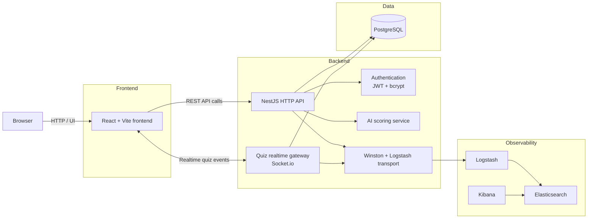

# Architecture — SafeSchool

> School harassment report management platform

---

## System Overview



### Quick read

- The browser loads the React frontend and interacts with the application through the UI.
- Standard application actions go through the NestJS HTTP API.
- Real-time quiz interactions use the Socket.io gateway handled by the same backend process.
- Application data is stored in PostgreSQL through the backend.
- Authentication relies on JWT tokens and bcrypt-hashed passwords.
- Report scoring calls the AI service when the feature is enabled.
- Logs are sent through Logstash to Elasticsearch and inspected in Kibana.

---

## Current vs Target Network Architecture

### Current state (dev, HTTP)

Each service exposes its port directly to the host. The browser talks to several different servers:

```
Browser
  ├── port 5173 → frontend container  (React / Vite)
  ├── port 5000 → backend container   (NestJS)
  └── port 5601 → Kibana container    (logs)
```

Everything runs over plain HTTP. JWT tokens, passwords, and student data are readable on the network.

| Service | Internal port | Host port |
|---|---|---|
| Frontend (Vite) | 5173 | 5173 |
| Backend (NestJS) | 3000 | 5000 |
| PostgreSQL | 5432 | 5433 |
| Elasticsearch | 9200 | 9201 |
| Logstash (TCP) | 5044 | 5044 |
| Kibana | 5601 | 5601 |

### Target state (prod, HTTPS with nginx reverse proxy)

A single entry point: nginx. The browser only talks to nginx. nginx then forwards requests internally over the private Docker network.

```
Browser
  └── port 443 (HTTPS) → nginx (reverse proxy)
                              ├── /          → frontend (React)
                              ├── /api/      → backend (NestJS)
                              └── /ws/       → backend WebSocket (quiz)

Docker internal network (HTTP, not exposed):
  nginx → frontend:5173
  nginx → backend:3000
```

**Why nginx and not direct service exposure?**

A reverse proxy sits in front of all other services:
- **TLS termination**: it handles the HTTPS certificate. Internal services stay on plain HTTP (the Docker network is private — this is acceptable).
- **Single entry point**: one exposed port instead of several.
- **WebSocket headers**: nginx forwards the `Upgrade` and `Connection` headers required for WebSocket connections (real-time quiz).

**Subject requirement** (section III.3):
> *"Any connection to the backend, from a browser, from a script, from an external API, etc., must use HTTPS."*

This is a rejection condition, not an optional module.

---

## End-to-End Walkthrough

> **A student submits a harassment report**

### Step 1 — The student opens the browser

```
BROWSER
  └── React renders the login page
        └── Vite compiled the TypeScript into browser-readable JS
```

The student sees the login form and enters their credentials.

---

### Step 2 — Login

```
BROWSER
  └── React detects the "Sign in" click
        └── Axios sends:
              POST http://localhost:5000/auth/login
              Body: { email: "student@safeschool.com", password: "..." }
                          ↕ HTTP
SERVER
  └── NestJS receives the request on /auth/login
        ├── Passport allows it through (public route, no guard)
        ├── AuthService.login() runs
        │     ├── TypeORM queries: SELECT * FROM users WHERE email = '...'
        │     │         ↕ SQL
        │     │   PostgreSQL returns the user record
        │     ├── bcrypt compares the submitted password against the stored hash
        │     │   → match OK ✅
        │     └── JWT signs a token:
        │           "sub:2, email:student@safeschool.com, role:student, exp:24h"
        └── NestJS responds:
              { access_token: "eyJhbG...", user: { id:2, role:"student" } }
                          ↕ HTTP
BROWSER
  └── Axios receives the response
        └── React (AuthContext) stores the token in localStorage
              └── React Router redirects to /student
```

---

### Step 3 — The student fills out the form

```
BROWSER
  └── React Router renders /student → StudentDashboard
        └── React displays the report submission form
```

The student fills in the title, description, and selects whether to report anonymously.

---

### Step 4 — Report submission

```
BROWSER
  └── React triggers handleSubmit()
        └── Axios prepares the request:
              POST http://localhost:5000/reports
              Header: Authorization: Bearer eyJhbG...  ← token added automatically
              Body: { title: "...", description: "...", isAnonymous: false }
                          ↕ HTTP
SERVER
  └── NestJS receives the request on POST /reports
        ├── Passport intercepts
        │     ├── Reads the token from the Authorization header
        │     ├── JWT verifies the signature
        │     ├── Valid token → extracts { sub:2, role:"student" }
        │     └── TypeORM loads the user: SELECT * FROM users WHERE id = 2
        │               ↕ SQL
        │         PostgreSQL returns the student record ✅
        │
        ├── ReportsController receives the request
        │     └── req.user = the student (injected by Passport)
        │
        └── ReportsService.create() runs
              ├── AI scoring service analyzes the description
              │     └── Returns grade = "high" (example)
              │
              ├── TypeORM creates the report:
              │     INSERT INTO reports (title, grade, status, studentId...)
              │     VALUES ("...", "high", "pending", 2)
              │               ↕ SQL
              │     PostgreSQL saves → returns id=5 ✅
              │
              └── NestJS responds:
                    { id:5, grade:"high", status:"pending", ... }
                          ↕ HTTP
BROWSER
  └── Axios receives the response
        └── React updates the display:
              setSuccess(report) → shows the confirmation message
```

---

### Final result in the browser

```
✅ Report submitted successfully
AI-assigned grade: High
Status: Pending review
```

---

### What is now in the database

**Table `users`**

| id | firstName | lastName | email | role |
|----|-----------|----------|-------|------|
| 2 | … | … | student@safeschool.com | student |

**Table `reports`**

| id | title | grade | status | studentId | isAnonymous |
|----|-------|-------|--------|-----------|-------------|
| 5 | … | high | pending | 2 | false |
