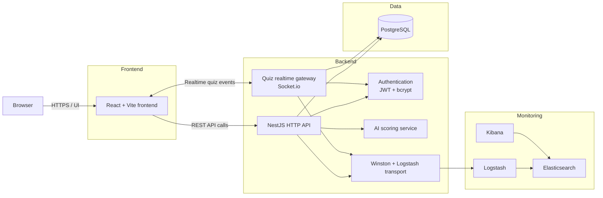

# Architecture

## System Overview



- The browser loads the React frontend and interacts with the application through the UI.
- Standard application actions go through the NestJS HTTP API.
- Real-time quiz interactions use the Socket.io gateway handled by the same backend process.
- Application data is stored in PostgreSQL through the backend.
- Authentication relies on JWT tokens and bcrypt-hashed passwords.
- Report scoring calls the AI service when the feature is enabled.
- Logs are sent through Logstash to Elasticsearch and inspected in Kibana.

## Network Architecture — Development vs Production

### Development state (HTTP, direct ports)

Each service exposes its port directly to the host. The browser talks to several different servers:

```
Browser
  ├── port 5173 → frontend container  (React / Vite)
  ├── port 5000 → backend container   (NestJS)
  └── port 5601 → Kibana container    (logs)
```

In development, everything runs over plain HTTP on localhost — convenient for local work, but with no encryption. Production mode puts the whole stack behind nginx with HTTPS (see below).

| Service          | Internal port | Host port           |
| ---------------- | ------------- | ------------------- |
| Frontend (Vite)  | 5173          | 5173                |
| Backend (NestJS) | 3000          | 5000                |
| PostgreSQL       | 5432          | 5433                |
| Elasticsearch    | 9200          | n/a (internal only) |
| Logstash (TCP)   | 5044          | n/a (internal only) |
| Kibana           | 5601          | 5601                |

### Production state (HTTPS with nginx reverse proxy)

In production, the browser only ever talks to nginx, over HTTPS. nginx serves the React build directly and forwards API and WebSocket traffic to the backend over the private Docker network.

```
Browser
  └── port 8443 (HTTPS) → nginx (reverse proxy + static file server)
            ├── /auth, /users, /reports, /classes, ...  → backend (NestJS REST API)
            ├── /socket.io/                             → backend WebSocket (quiz)
            └── /  (everything else)                    → static React build, served by nginx

Docker internal network (HTTP, not exposed):
  nginx → backend:3000   (REST API + WebSocket)
  nginx serves the compiled frontend itself — no frontend container in production
```

**nginx plays three roles in production**

- **TLS termination**: it handles the HTTPS certificate. Internal services stay on plain HTTP (the Docker network is private — this is acceptable).
- **Single entry point**: one exposed port instead of several.
- **WebSocket headers**: nginx forwards the `Upgrade` and `Connection` headers required for WebSocket connections (real-time quiz).

## Startup Sequence & Orchestration

`make all` is the default target and starts the **production** stack. It:

- generates the TLS certificates (`make certs`)
- brings up all services through Docker Compose (production overlay)
- seeds the database if it is empty (`seed-if-empty`)

(`make dev` starts the lighter development stack instead — Vite + backend in watch mode, no nginx, no TLS.)

Startup order is enforced through `depends_on` conditions, each backed by a
healthcheck: a service starts only once its dependencies report healthy.

```
make all
  ├── make certs                     generate the self-signed TLS cert if absent
  │
  ├── docker compose up (prod)
  │     1. database  +  elasticsearch        start in parallel
  │           │                  │
  │           │ (healthy)        │ (healthy)
  │           │                  ├── elasticsearch-setup-users    create system users, ILM, index template (runs once)
  │           │                  ├── logstash                     listen for logs on port 5044
  │           │                  └── kibana                       web UI
  │           │                            │ (healthy)
  │           │                            └── elasticsearch-setup-kibana    import data view + dashboard (runs once)
  │           │
  │           └── backend         starts when database is healthy AND logstash is started
  │                 │ (healthy)
  │                 └── nginx      reverse proxy + serves the static frontend build (prod only)
  │
  └── seed-if-empty                inject demo data only if the users table is empty
```

### Who waits for whom

| Service                    | Waits for     | Condition           |
| -------------------------- | ------------- | ------------------- |
| backend                    | database      | `service_healthy`   |
| backend                    | logstash      | _`service_started`_ |
| logstash                   | elasticsearch | `service_healthy`   |
| kibana                     | elasticsearch | `service_healthy`   |
| elasticsearch-setup-users  | elasticsearch | `service_healthy`   |
| elasticsearch-setup-kibana | kibana        | `service_healthy`   |
| nginx (prod)               | backend       | `service_healthy`   |

### Logging never blocks the application

The backend waits for logstash with `service_started`, not `service_healthy`.
Logging must never block startup: if the backend waited for logstash to be fully
healthy, a slow or broken log pipeline could prevent the whole application from
coming up.

### ELK warm-up on the first boot

logstash and kibana need two accounts (`kibana_system` and `logstash_internal`)
created by `elasticsearch-setup-users` when the stack starts. We chose not to
make logstash and kibana wait for that setup to finish: if the setup ever
failed, the whole ELK stack would refuse to start. Instead they start right
away, and `restart: on-failure` relaunches them until the accounts exist. The
setup script also retries each call to Elasticsearch until it works.

On the first `make all`, Kibana may show an error page
for a couple of minutes until the setup is done, then it recovers on its own.
Later starts reuse the accounts already saved in the `esdata` and `kibanadata`
volumes, so there is no delay.

This was a deliberate choice: a short startup delay that fixes itself, rather
than a stack that can get stuck if the setup fails.

## End-to-End Walkthrough — a student submits a harassment report

### Step 1 — The student opens the browser

```
BROWSER
  └── React renders the login page
        └── Vite compiled the TypeScript into browser-readable JS
```

The student sees the login form and enters their credentials.

---

### Step 2 — Login

```
BROWSER
  └── React detects the "Sign in" click
        └── Axios sends:
              POST http://localhost:5000/auth/login
              Body: { email: "student@safeschool.com", password: "..." }

  ────────────────────────  HTTP  ────────────────────────

SERVER
  └── NestJS receives the request on /auth/login
        ├── Passport allows it through (public route, no guard)
        ├── AuthService.login() runs
        │     ├── TypeORM queries: SELECT * FROM users WHERE email = '...'
        │     │   ────  SQL  ────
        │     │   PostgreSQL returns the user record
        │     ├── bcrypt compares the submitted password against the stored hash
        │     │   → match OK
        │     └── JWT signs a token:
        │           "sub:2, email:student@safeschool.com, role:student, exp:24h"
        └── NestJS responds:
              { access_token: "eyJhbG...", user: { id:2, role:"student" } }

  ────────────────────────  HTTP  ────────────────────────

BROWSER
  └── Axios receives the response
        └── React (AuthContext) stores the token in localStorage
              └── React Router redirects to /student
```

---

### Step 3 — The student fills out the form

```
BROWSER
  └── React Router renders /student → StudentDashboard
        └── React displays the report submission form
```

---

### Step 4 — Report submission

```
BROWSER
  └── React triggers handleSubmit()
        └── Axios prepares the request:
              POST http://localhost:5000/reports
              Header: Authorization: Bearer eyJhbG...  ← token added automatically
              Body: { title: "...", description: "...", isAnonymous: false }

  ────────────────────────  HTTP  ────────────────────────

SERVER
  └── NestJS receives the request on POST /reports
        ├── Passport intercepts
        │     ├── Reads the token from the Authorization header
        │     ├── JWT verifies the signature
        │     ├── Valid token → extracts { sub:2, role:"student" }
        │     └── TypeORM loads the user: SELECT * FROM users WHERE id = 2
        │         ────  SQL  ────
        │         PostgreSQL returns the student record
        │
        ├── ReportsController receives the request
        │     └── req.user = the student (injected by Passport)
        │
        └── ReportsService.create() runs
              ├── AI scoring service analyzes the description
              │     └── Returns grade = "high" (example)
              │
              ├── TypeORM creates the report:
              │     INSERT INTO reports (title, grade, status, studentId...)
              │     VALUES ("...", "high", "pending", 2)
              │     ────  SQL  ────
              │     PostgreSQL saves → returns id=5
              │
              └── NestJS responds:
                    { id:5, grade:"high", status:"pending", ... }

  ────────────────────────  HTTP  ────────────────────────

BROWSER
  └── Axios receives the response
        └── React updates the display:
              setSuccess(report) → shows the confirmation message
```

---

## Where to go next

For the details of each layer:

- **[backend.md](./backend.md)** — NestJS module structure, request lifecycle, TypeORM
- **[security.md](./security.md)** — authentication, password hashing, input validation, HTTPS
- **[websocket.md](./websocket.md)** — real-time quiz: Socket.IO gateway, rooms, reconnection
- **[elk.md](./elk.md)** — log pipeline, Kibana dashboard, retention policy
- **[pwa.md](./pwa.md)** — installable app and offline support
- **[api.md](./api.md)** — full REST endpoint reference
