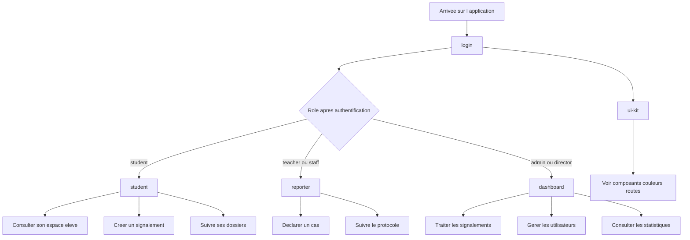

# Manuel de référence du projet — frontend, backend et flux applicatifs

Ce document sert de manuel de reference du projet. Il decrit l'ensemble du fonctionnement de SafeSchool, de l'infrastructure Docker jusqu'au rendu dans le navigateur, en passant par le backend, la base de donnees, l'authentification et le frontend.

---

## Table des matières

1. [Docker — l'infrastructure](#1-docker--linfrastructure)
2. [Le Backend — NestJS](#2-le-backend--nestjs)
3. [L'authentification JWT](#3-lauthentification-jwt)
4. [Le Frontend — React + Vite](#4-le-frontend--react--vite)
5. [Design System — composants et conventions](#5-design-system--composants-et-conventions)
6. [Internationalisation — react-i18next](#6-internationalisation--react-i18next)
7. [Tailwind CSS — le système de classes](#7-tailwind-css--le-système-de-classes)
8. [Accessibilité — WCAG AA et ARIA](#8-accessibilité--wcag-aa-et-aria)
8b. [Bugs corrigés — AdminDashboard (Phase 1)](#8b-bugs-corrigés--admindashboard-phase-1)
8c. [Tester l'accessibilité](#8c-tester-laccessibilité)
8d. [Optimisation React.memo](#8d-optimisation-reactmemo)
9. [Flux complet de A à Z](#9-flux-complet-de-a-à-z)
10. [WebSockets — le module Quiz temps réel](#10-websockets--le-module-quiz-temps-réel)
11. [Next.js, NestJS, Node.js — les confondre et les distinguer](#11-nextjs-nestjs-nodejs--les-confondre-et-les-distinguer)
12. [shadcn/ui — ajouter et migrer des composants](#12-shadcnui--ajouter-et-migrer-des-composants)
13. [CORS — autoriser le frontend à parler au backend](#13-cors--autoriser-le-frontend-à-parler-au-backend)
14. [Validation des formulaires côté frontend](#14-validation-des-formulaires-côté-frontend)

---

## 1. Docker — l'infrastructure

### Pourquoi Docker

L'application a besoin de nombreux composants : Node.js, PostgreSQL, Elasticsearch, etc. Sans Docker, chaque développeur installe tout sur sa machine dans des versions potentiellement différentes, ce qui crée des incompatibilités. Docker crée des **conteneurs** : des environnements isolés, identiques sur toutes les machines.

Un conteneur est comparable à une machine virtuelle très légère. Il contient exactement ce dont il a besoin et rien d'autre.

### `docker-compose.yml` — le chef d'orchestre

Ce fichier décrit les **7 services** qui constituent l'application et comment ils interagissent :

```
┌──────────────────────────────────────────────────────────────┐
│                       Machine hôte                           │
│                                                              │
│  :5173 ←→ [frontend]  ──────────────────────────────────────>│
│                        safeschool_network                    │
│                              ↓                               │
│                        [backend] :3000 (exposé en :5000)     │
│                              ↓                               │
│                        [database] PostgreSQL :5432 (:5433)   │
│                        [elasticsearch] :9200 (:9201)         │
│                        [logstash]  :5044                     │
│                        [kibana]    :5601                     │
│                        [pgadmin]   :80 (:8080)               │
└──────────────────────────────────────────────────────────────┘
```

### Ports

La notation `"5000:3000"` signifie : _le port 3000 du conteneur est accessible via le port 5000 de la machine hôte_. Le backend écoute sur 3000 à l'intérieur du conteneur, mais l'accès depuis le navigateur se fait via le port 5000.

| Service | Port interne | Port externe |
|---|---|---|
| frontend | 5173 | 5173 |
| backend | 3000 | 5000 |
| database (PostgreSQL) | 5432 | 5433 |
| elasticsearch | 9200 | 9201 |
| logstash | 5044 | 5044 |
| kibana | 5601 | 5601 |
| pgadmin | 80 | 8080 |

### Volumes

#### Le schéma des couches — vue d'ensemble

Avant d'expliquer les deux types de volumes, voici comment les différentes couches s'empilent :

```
┌─────────────────────────────────────────────────────────────┐
│  TON DISQUE (le "host" — ta machine physique)               │
│                                                             │
│  /home/user/Documents/Transcendence/frontend/               │
│    src/                                                     │
│    package.json                                             │
│    package-lock.json                                        │
│    (pas de node_modules ici)                                │
└────────────────────┬────────────────────────────────────────┘
                     │  bind mount (miroir en temps réel)
                     │  déclaré : - ./frontend:/app
                     ↓
┌─────────────────────────────────────────────────────────────┐
│  CONTENEUR Docker (safeschool_frontend)                     │
│  Système de fichiers Linux Alpine                           │
│                                                             │
│  /app/                          ← miroir de ton disque      │
│    src/                         ← tes fichiers source       │
│    package.json                 ← ta liste de dépendances   │
│    package-lock.json            ← versions verrouillées     │
│                                                             │
│  /app/node_modules/             ← volume séparé (voir bas)  │
│    react/                                                   │
│    vite/                                                     │
│    react-i18next/  ← installé ici, PAS sur ton disque       │
└─────────────────────────────────────────────────────────────┘
                     ↑
                     │  volume nommé anonyme (isolé)
                     │  déclaré : - /app/node_modules
┌─────────────────────────────────────────────────────────────┐
│  VOLUME DOCKER GÉRÉ PAR DOCKER (stocké ailleurs sur le SSD) │
│  invisible depuis ton bureau, géré uniquement par Docker    │
└─────────────────────────────────────────────────────────────┘
```

#### Deux types de volumes — la différence

**Bind mount** (`./frontend:/app`) — un miroir

Un bind mount est un lien direct entre un dossier de ta machine et un chemin dans le conteneur. Ce qui existe dans l'un existe dans l'autre, en permanence et dans les deux sens.

```
Tu modifies src/App.tsx dans VS Code
        ↓
Le fichier change sur ton disque
        ↓  (bind mount)
Le fichier change dans /app/src/App.tsx dans le conteneur
        ↓
Vite détecte le changement → navigateur rechargé
```

C'est le mécanisme qui rend le hot reload possible. Aucun rebuild nécessaire.

**Volume nommé anonyme** (`/app/node_modules`) — un espace isolé

Cette déclaration dit à Docker : _"pour ce chemin précis dans le conteneur, crée un espace de stockage séparé qui n'est pas relié à mon disque"_.

```
./frontend/          ←→  /app/           ← miroir (bind mount)
  (rien ici)              node_modules/  ← espace isolé (volume)
                            react/
                            vite/
                            react-i18next/
```

**Pourquoi isoler `node_modules` ?**

`node_modules` contient des fichiers binaires compilés pour un OS spécifique. Si ton disque hôte est macOS et que le conteneur est Linux Alpine, ces binaires sont incompatibles. En mettant `node_modules` dans un volume Docker isolé, chaque machine (la tienne, celle de chaque collègue) a ses propres binaires compilés pour son propre OS, sans jamais se mélanger.

Si ce volume n'existait pas, le bind mount écraserait le `node_modules` du conteneur avec le `node_modules` de ton disque (qui n'existe probablement pas) → le conteneur planterait au démarrage.

#### Décorticage de la commande `docker compose exec`

```bash
docker compose exec frontend npm install react-i18next i18next i18next-browser-languagedetector
│      │       │    │        │   │       │
│      │       │    │        │   │       └─ les 3 packages à installer
│      │       │    │        │   └───────── commande npm standard
│      │       │    │        └───────────── sous-commande npm : installe des packages
│      │       │    └────────────────────── nom du service cible (dans docker-compose.yml)
│      │       └─────────────────────────── "exécute une commande dans un conteneur en marche"
│      └─────────────────────────────────── lit docker-compose.yml pour trouver le service
└────────────────────────────────────────── outil Docker en ligne de commande
```

- `docker compose` — pas `docker` seul. Cette variante lit ton `docker-compose.yml` et connaît les noms des services (`frontend`, `backend`, etc.). Elle sait donc ce que `frontend` signifie.
- `exec` — "execute". Lance une commande à l'intérieur d'un conteneur **déjà en marche**, sans le redémarrer ni en créer un nouveau.
- `frontend` — le nom du service tel qu'il est déclaré dans `docker-compose.yml`. Docker le traduit en ID de conteneur (`safeschool_frontend`).
- `npm install` — commande Node standard. Ici elle s'exécute dans l'environnement Linux du conteneur, avec le bon Node, sur le bon OS.
- `react-i18next i18next i18next-browser-languagedetector` — les trois packages à installer en une seule passe.

**Ce qui se passe dans le système de fichiers :**

```
npm install s'exécute dans /app/ (le conteneur)
  │
  ├── écrit dans /app/package.json            → bind mount → ton disque ✅ (git le voit)
  ├── écrit dans /app/package-lock.json       → bind mount → ton disque ✅ (git le voit)
  └── installe dans /app/node_modules/        → volume isolé ✅ (disponible immédiatement)
```

Les deux fichiers que git doit suivre (`package.json` et `package-lock.json`) sont sur ton disque grâce au bind mount. Le code des packages lui-même est dans le volume isolé — git ne le suit pas (c'est voulu : `node_modules` est dans `.gitignore`).

> **Pourquoi `node_modules/` apparaît grisé dans VS Code ?**
> VS Code grise automatiquement tout ce qui est listé dans `.gitignore`. Ce n'est pas lié au fait que node_modules vit dans un volume Docker — c'est simplement parce que git l'ignore. Le dossier n'existe d'ailleurs probablement pas du tout sur ton disque local : il n'y a que le volume Docker qui le contient.

#### Ce que récupère un collègue après `git pull`

```bash
git pull
# → récupère package.json avec les nouveaux packages listés
# → récupère package-lock.json avec les versions exactes verrouillées

docker compose up --build
# → Dockerfile: RUN npm install  ← lit package.json → installe tout, y compris les nouveaux packages
```

Le `--build` reconstruit l'image Docker à partir du Dockerfile. La ligne `RUN npm install` y est présente, donc tout est réinstallé automatiquement dans le conteneur du collègue. Il n'a rien d'autre à faire.

#### Alternatives à `docker compose exec`

| Méthode | Quand l'utiliser | Besoin de Node sur le host ? |
|---|---|---|
| `docker compose exec frontend npm install ...` | Conteneur déjà lancé (cas habituel) | Non |
| `npm install ...` dans `./frontend/` directement | Si Node 20 est installé sur ta machine | Oui |
| Modifier `package.json` à la main + `docker compose up --build` | Si le conteneur est arrêté | Non |

**Pourquoi A ne marche pas ici :** les binaires de `node_modules` installés sur le host ne correspondent pas à l'OS Linux du conteneur, et le volume isolé les rendrait de toute façon invisibles depuis le conteneur.

**Pourquoi B est trop lourd :** reconstruire toute l'image prend plusieurs minutes alors que le conteneur tourne déjà. Pertinent seulement si le Dockerfile lui-même change.

**Pourquoi C est la bonne option :** on entre dans le conteneur en marche, npm s'exécute dans le bon environnement, les fichiers de verrouillage sont mis à jour sur le disque via le bind mount. Résultat immédiat, sans surcoût.

### `depends_on` — ordre de démarrage

```
elasticsearch → logstash → database → backend → frontend
```

Le backend ne démarre pas avant que la base de données soit prête (`condition: service_healthy`). Sans ça, le backend tenterait de se connecter à Postgres qui n'existe pas encore et crasherait.

### `healthcheck`

Pour PostgreSQL :
```yaml
test: ["CMD-SHELL", "pg_isready -U ${DB_USER} -d ${DB_NAME}"]
interval: 5s
retries: 5
```
Docker interroge Postgres toutes les 5 secondes. Une fois que `pg_isready` répond positivement, le service est marqué `healthy` et les services dépendants peuvent démarrer.

### Réseau `safeschool_network`

Tous les services partagent le même réseau Docker privé. Dans ce réseau, chaque service est accessible via son **nom** (pas son IP). Le backend peut donc appeler `database:5432` directement — Docker résout `database` en l'IP interne du conteneur Postgres.

Les IP internes (ex : 172.18.0.8) sont **attribuées dynamiquement** par Docker à chaque démarrage. Elles peuvent changer si tu recrées les conteneurs. On ne s'y fie jamais pour communiquer entre services — on utilise les noms de service à la place.

Le driver `bridge` est le type de réseau utilisé : il crée un réseau privé isolé sur la machine hôte, avec un routage interne géré par Docker. Les conteneurs ne sont pas accessibles depuis l'extérieur sauf via un port mapping explicite (`ports:`).

### `REACT_APP_API_URL`

Dans `docker-compose.yml`, le service frontend déclarait :
```yaml
environment:
  - REACT_APP_API_URL=http://localhost:5000
```
`REACT_APP_*` est la convention de **Create React App (CRA)**. Ce projet utilise **Vite**, qui exige le préfixe `VITE_` et la syntaxe `import.meta.env.VITE_XXX`. Le code frontend utilise `import.meta.env.VITE_API_URL` (visible dans `Quiz.tsx`). Cette variable n'est définie nulle part → la variable `REACT_APP_API_URL` dans docker-compose.yml est silencieusement ignorée et n'a aucun effet (supprimee)

### Dev vs Production — ce qui tourne vs ce qu'on livre

| | Dev (aujourd'hui) | Production livrée |
|---|---|---|
| Commande | `npm run dev` → Vite dev server | `npm run build` → génère des fichiers statiques dans `dist/` |
| Ce qui tourne | Serveur Node dans le conteneur | Fichiers HTML/CSS/JS servis par nginx |
| Prettier, ESLint, TypeScript | ✅ utilisés pendant le dev | ❌ absents du livrable |
| React, tailwindcss, etc. | ✅ utilisés | ✅ compilés dans le bundle JS |
| Hot reload, source maps | ✅ | ❌ |
| node_modules | Présent dans le conteneur Docker | Absent — le build n'en a plus besoin |
| Taille | ~500 Mo (node_modules) | ~1-5 Mo (juste HTML/CSS/JS compilé) |

**C'est quoi `dist/` ?**  
Quand tu fais `npm run build`, Vite lit tout ton code React/TypeScript, le compile, le minifie (rend illisible mais léger), et produit un dossier `dist/` avec quelques fichiers :
```
dist/
  index.html
  assets/
    main-abc123.js   ← tout ton code React compilé en un seul fichier
    main-def456.css  ← tout ton CSS compilé
```
C'est tout ce dont nginx a besoin pour servir l'application. Plus de Node, plus de TypeScript, juste des fichiers statiques.

> **Pourquoi `dist/` apparaît grisé dans VS Code ?** Même raison que `node_modules/` : il est dans `.gitignore`. On ne commit jamais le dossier de build, on le régénère à chaque fois avec `npm run build`. En développement avec Docker, tu ne le verras jamais — Vite sert directement depuis `src/` sans passer par `dist/`.

### Les Dockerfiles

**Frontend** (`frontend/Dockerfile`) :
```dockerfile
FROM node:20-alpine    # image de base légère
WORKDIR /app           # répertoire de travail
COPY package*.json ./  # copie les dépendances
RUN npm install        # installe
COPY . .               # copie le code
EXPOSE 5173            # déclare le port
CMD ["npm", "run", "dev", "--", "--host"]  # démarre Vite en mode dev
```

**Décortiqué : `CMD ["npm", "run", "dev", "--", "--host"]`**

```
npm run dev   → exécute le script "dev" défini dans package.json, soit "vite"
--            → séparateur : tout ce qui suit est passé directement à vite, pas à npm
--host        → option Vite : écoute sur toutes les interfaces réseau (0.0.0.0)
               sans ça, Vite n'accepte que les connexions depuis l'intérieur du conteneur
               → inaccessible depuis le navigateur sur la machine hôte
```

**Backend** (`backend/Dockerfile`) :
```dockerfile
FROM node:20-alpine
RUN npm install -g @nestjs/cli   # installe le CLI NestJS globalement
WORKDIR /app
COPY package*.json ./
RUN npm install
COPY . .
EXPOSE 3000
CMD ["npm", "run", "start:dev"]  # démarre NestJS en mode watch
```

### Le bind mount — mécanisme central du développement sous Docker

#### Définition

Un **bind mount** est un lien direct entre un chemin sur le système hôte (ta machine) et un chemin dans le conteneur. Les deux pointent vers les mêmes données sur le disque physique — ce n'est pas une copie, c'est le même fichier accessible depuis deux endroits.

```
SYSTÈME HÔTE                       CONTENEUR
────────────────                   ─────────────────────
/home/user/.../frontend/     ←──→  /app/
```

Toute écriture dans l'un est immédiatement visible dans l'autre, dans les deux sens, sans aucune commande supplémentaire.

#### Pourquoi c'est fondamental

Sans bind mount, le conteneur contiendrait une **copie figée** du code au moment où l'image a été construite (`docker compose up --build`). Toute modification dans VS Code resterait invisible dans le conteneur, et il faudrait rebuilder l'image après chaque changement. C'est inutilisable en développement.

Avec le bind mount `./frontend:/app` :

```
Tu modifies src/App.tsx dans VS Code
        ↓  (même fichier sur le disque)
Le conteneur voit le changement instantanément dans /app/src/App.tsx
        ↓
Vite détecte le changement
        ↓
HMR : le navigateur est mis à jour sans rechargement de page
```

#### Ce que le bind mount ne couvre pas

Le bind mount synchronise tout le dossier `frontend/` — **sauf** `node_modules/`, qui est volontairement exclu par la deuxième entrée de volumes :

```yaml
volumes:
  - ./frontend:/app        # bind mount — synchronisé
  - /app/node_modules      # volume Docker — isolé, NON synchronisé
```

Cette exclusion est nécessaire car `node_modules` contient des binaires compilés pour l'OS du conteneur (Linux Alpine). Si le dossier `node_modules` du hôte existait et était synchronisé, il écraserait les binaires corrects avec des binaires potentiellement incompatibles.

#### Récapitulatif

| Ce qui change dans VS Code | Visible dans le conteneur ? | Via quel mécanisme ? |
|---|---|---|
| `src/App.tsx` | Oui, immédiatement | Bind mount |
| `package.json` | Oui, immédiatement | Bind mount |
| `node_modules/` | Non | Volume isolé intentionnel |

### Avertissements `npm` — lecture et interprétation

Lors d'une commande `npm install`, npm peut afficher des avertissements. Voici ceux rencontrés dans ce projet et leur signification.

#### `version is obsolete` (dans docker-compose.yml)

```
WARN[0000] docker-compose.yml: the attribute `version` is obsolete
```

Le fichier `docker-compose.yml` du projet commence par `version: '3.8'`. Cette clé était autrefois obligatoire pour indiquer quelle version du format Compose utiliser. Les versions récentes de Docker Compose l'ignorent — le format est détecté automatiquement. Ce warning n'affecte rien au fonctionnement. La ligne peut être retirée du `docker-compose.yml` pour faire disparaître l'avertissement.

#### `N vulnerabilities` (dans les dépendances npm)

```
4 vulnerabilities (3 moderate, 1 high)
To address all issues, run: npm audit fix
```

Ce message signale que certains packages installés présentent des failles de sécurité connues, répertoriées dans la base de données publique npm. Il ne signifie pas que le projet est compromis — cela signifie que certaines dépendances ont des versions plus sécurisées disponibles.

Points importants :
- Ces vulnérabilités existaient avant l'installation des packages i18n — elles proviennent des dépendances déjà présentes (Vite, React, etc.)
- En développement local, l'impact est faible car l'application n'est pas exposée sur un serveur public
- La commande `npm audit fix` met à jour les dépendances affectées vers leurs versions corrigées lorsque c'est possible sans casser les autres packages

#### `packages are looking for funding`

```
60 packages are looking for funding
run `npm fund` for details
```

Message informatif uniquement. Certains mainteneurs de packages open source sollicitent des contributions financières. Aucune action requise.

### Les fichiers JSON du projet — rôle de chacun

Le projet contient plusieurs fichiers `.json` avec des rôles distincts. Aucun n'est interchangeable.

#### `package.json` (frontend et backend)

La **liste de courses** du projet Node. Contient :
- `dependencies` : packages nécessaires en production et en développement
- `devDependencies` : packages uniquement pour le développement (linters, types TypeScript…)
- `scripts` : commandes raccourcies (`npm run dev` → `vite`, `npm run build` → `vite build`…)
- `name`, `version` : métadonnées du projet

C'est le seul fichier qu'un humain modifie directement (ou via `npm install`). Il n'existe pas de version binaire — c'est du JSON lisible.

#### `package-lock.json` (frontend et backend)

La **liste de courses avec les marques précises**. Généré automatiquement par npm, jamais modifié à la main. Contient les versions exactes de **toutes** les dépendances, y compris les dépendances des dépendances (l'arbre complet).

Exemple : `package.json` dit `"react": "^18.0.0"` (n'importe quelle version 18.x). `package-lock.json` dit `"react": "18.3.1"` (exactement cette version). Cela garantit que deux développeurs différents installent exactement les mêmes versions, même si de nouvelles versions sont sorties entre-temps.

**Ce fichier doit être commité dans git.** Sans lui, `npm install` pourrait installer des versions légèrement différentes sur chaque machine.

#### `tsconfig.json` (frontend)

Fichier d'entrée de la configuration TypeScript côté frontend. Dans ce projet, il ne contient pas de configuration directe — il délègue vers deux sous-configurations via `references` :

```json
{
  "files": [],
  "references": [
    { "path": "./tsconfig.app.json" },
    { "path": "./tsconfig.node.json" }
  ]
}
```

Ce découpage permet d'avoir des règles TypeScript différentes pour le code applicatif (`src/`) et pour les fichiers de configuration Vite (qui s'exécutent dans Node, pas dans le navigateur).

#### `tsconfig.app.json` (frontend)

Configuration TypeScript pour le code de l'application (`src/`). Options clés :
- `"target": "ES2023"` : le JavaScript produit doit être compatible ES2023
- `"lib": ["ES2023", "DOM", "DOM.Iterable"]` : les types disponibles incluent les APIs du navigateur (DOM)
- `"jsx": "react-jsx"` : active la transformation JSX pour React
- `"strict": true` : active toutes les vérifications TypeScript strictes (typage complet obligatoire)
- `"noEmit": true` : TypeScript vérifie les types mais ne génère pas de fichiers JS — c'est Vite qui s'en charge

#### `tsconfig.node.json` (frontend)

Configuration TypeScript pour les fichiers de configuration Vite (`vite.config.ts`). Ces fichiers s'exécutent dans Node.js au moment du build, pas dans le navigateur. La lib utilisée est donc `["ES2023"]` (sans DOM) et les types sont `["node"]` (API Node.js, pas DOM).

#### `tsconfig.json` + `tsconfig.build.json` (backend)

Le backend NestJS a également deux configurations TypeScript :
- `tsconfig.json` : configuration de développement, inclut tous les fichiers `src/`
- `tsconfig.build.json` : configuration de production, exclut les fichiers de test (`*.spec.ts`) pour ne pas les inclure dans le build final

#### `nest-cli.json` (backend)

Fichier de configuration du CLI NestJS. Utilisé par la commande `nest generate` pour créer automatiquement des modules, controllers, services. Options présentes :
- `"sourceRoot": "src"` : le code source est dans `src/`
- `"deleteOutDir": true` : supprime le dossier de build précédent avant chaque nouveau build

#### `.vscode/settings.json`

Configuration locale de VS Code pour ce projet. Ne concerne pas le code — s'applique uniquement à l'éditeur sur la machine courante. Peut contenir des réglages d'indentation, de formatage, de linting spécifiques au projet. Ce fichier peut être commité pour partager les réglages éditeur avec l'équipe, ou ignoré si chaque développeur préfère ses propres réglages.

#### `elk/setup/ilm-policy.json`

Configuration de la politique de rétention des logs Elasticsearch (ILM = Index Lifecycle Management). Définit combien de temps les logs sont conservés avant d'être archivés ou supprimés. Ce fichier est utilisé par le script `elk/setup/setup.sh` lors de l'initialisation de la stack ELK.

---

## 2. Le Backend — NestJS

### Node.js et NestJS — la différence

Ces deux noms reviennent souvent ensemble et peuvent prêter à confusion :

- **Node.js** : c'est le moteur qui exécute du JavaScript côté serveur, en dehors du navigateur. C'est l'"environnement d'exécution" — comme une machine virtuelle qui sait lire du JS.
- **NestJS** : c'est un framework (une boîte à outils) qui s'appuie sur Node.js pour t'aider à créer des applications backend structurées. Il impose une architecture en modules, controllers, services, etc.

En résumé : **Node.js exécute le code, NestJS l'organise.** Quand tu lances le backend (`npm run start:dev`), c'est Node.js qui lit et exécute le code NestJS.

NestJS est un framework Node.js qui impose une architecture en **modules**. Chaque fonctionnalité est encapsulée dans son propre module.

### Architecture en modules

```
app.module.ts                ← module racine, assemble tout
  ├── AuthModule             ← connexion / inscription
  ├── UsersModule            ← gestion des utilisateurs
  ├── ReportsModule          ← signalements
  ├── NotificationsModule    ← notifications
  ├── StudentProfilesModule  ← profils élèves
  └── LoggerModule           ← logs HTTP → Logstash
```

Chaque module contient systématiquement :
- **`*.controller.ts`** : reçoit et route les requêtes HTTP (`GET /users`, `POST /auth/login`...)
- **`*.service.ts`** : contient la logique métier (vérifier un mot de passe, créer un enregistrement...)
- **`*.module.ts`** : déclare et relie les deux

### La base de données — TypeORM

TypeORM fait le lien entre les objets TypeScript et les tables PostgreSQL. Chaque fichier `*.entity.ts` correspond à une table en base.

Exemple — `user.entity.ts` :
```typescript
@Entity('users')                           // → table "users"
export class User {
  @PrimaryGeneratedColumn('uuid') id: string;
  @Column({ unique: true }) email: string;
  @Column({ select: false }) password: string;   // jamais renvoyé par défaut
  @Column({ type: 'enum', enum: UserRole }) role: UserRole;
  @OneToMany(() => Report, r => r.student) reports: Report[];
}
```

Avec `synchronize: true` dans `app.module.ts`, TypeORM crée et met à jour les tables automatiquement au démarrage. Le fichier `database/init.sql` ne sert qu'à l'initialisation à blanc de PostgreSQL.

### Relations entre tables

| Relation | Entités | Description |
|---|---|---|
| `OneToMany` | User → Report | Un utilisateur peut avoir plusieurs signalements |
| `ManyToOne` | Report → User | Un signalement appartient à un utilisateur |
| `OneToOne` | User ↔ StudentProfile | Un utilisateur a au plus un profil élève |
| `OneToMany` | Report → ReportSuspect | Un signalement peut avoir plusieurs suspects |

### ELK — Elasticsearch + Logstash + Kibana

C'est le système centralisé de logs :

1. Chaque requête HTTP est capturée par `HttpLoggerMiddleware` (`logger/http-logger.middleware.ts`)
2. Elle est envoyée à **Logstash** (port 5044) qui la formate selon le pipeline `elk/logstash/pipeline/logstash.conf`
3. Logstash l'envoie à **Elasticsearch** qui la stocke et l'indexe
4. **Kibana** (port 5601) permet de visualiser et requêter les logs via une interface web

### Pourquoi NestJS et pas Express

Express est minimaliste : il gère les routes HTTP et rien d'autre. Toute l'architecture (structure des fichiers, injection de dépendances, validation, authentification) est à inventer. NestJS impose une architecture — modules, controllers, services, guards, pipes, interceptors — ce qui est un avantage pour une équipe multiple : tout le monde sait où mettre le code. L'injection de dépendances intégrée rend les services testables unitairement sans couplage fort.

---

## 3. L'authentification JWT

### Flux de connexion

```
[Navigateur]                    [Backend]                    [Base de données]
     │                              │                               │
     │  POST /auth/login            │                               │
     │  { email, password }  ──────>│                               │
     │                              │  findByEmailWithProfile()     │
     │                              │  ──────────────────────────── >│
     │                              │  < ─────────────────────────  │
     │                              │                               │
     │                              │  bcrypt.compare(              │
     │                              │    password_saisi,            │
     │                              │    hash_stocké                │
     │                              │  )                            │
     │                              │                               │
     │  { access_token, user } <────│  jwtService.sign(payload)     │
     │                              │                               │
```

**bcrypt** : les mots de passe ne sont jamais stockés en clair. `bcrypt.hash()` produit un hash irréversible. À la connexion, `bcrypt.compare()` vérifie si le mot de passe saisi correspond au hash sans jamais le "décoder".

**JWT (JSON Web Token)** : le token retourné (`eyJhbGci...`) est une chaîne encodée contenant `{ sub: userId, email, role }`. Il est signé avec une clé secrète côté serveur — le backend peut vérifier son authenticité sans requête en base.

### Protection des routes

Pour chaque requête sur une route protégée :

```
[Navigateur]                    [Backend]
     │                              │
     │  GET /reports                │
     │  Authorization: Bearer eyJ.. │
     │  ──────────────────────────>│
     │                              │  JwtAuthGuard (jwt-auth.guard.ts)
     │                              │    → vérifie la signature
     │                              │    → décode { userId, role }
     │                              │    → autorise ou renvoie 401
```

Le `JwtAuthGuard` est appliqué à toutes les routes qui nécessitent une authentification. La stratégie JWT (`jwt.strategy.ts`) définit comment le token est extrait et validé.

---

## 4. Le Frontend — React + Vite

### Pourquoi React, Tailwind et cet écosystème

#### Pourquoi React et pas Vue ou Svelte

Le sujet ft_transcendence version 21.1 exige un **framework frontend JavaScript moderne**. React a été retenu pour son écosystème TypeScript mature (types officiels, excellent support dans les outils) et sa documentation officielle (`react.dev`) de qualité.

#### Pourquoi Tailwind et pas Bootstrap

Bootstrap fournit des composants pré-stylés avec leurs propres décisions visuelles (boutons arrondis, palette de couleurs fixe, typographie imposée). Pour un projet avec une identité visuelle définie (`primary`, `critical`, une palette accessible), Bootstrap obligerait à surcharger ses styles, ce qui n'est pas ideal.
Tailwind est un framework utilitaire : il ne fournit pas de composants, seulement des classes atomiques. Chaque composant UI (`Button.tsx`, `Card.tsx`, etc.) est construit from scratch avec les tokens du projet, ce qui garantit la cohérence sans conflits de styles.

#### La question est légitime : au démarrage, tout cela ressemble à de la complexité ajoutée. Cette section explique ce que chaque outil résout concrètement.

#### Avant les frameworks — comment ça se dégradait

Un site web classique repose sur trois fichiers :

- HTML → structure
- CSS → style
- JavaScript → interactions

Ça fonctionne pour un site de quelques pages. Ça devient ingérable quand le projet grossit :

- fichiers de plusieurs milliers de lignes
- copier-coller du code identique entre pages
- un changement dans une partie casse autre chose ailleurs
- responsive à gérer manuellement avec des media queries
- état de l'interface (qui est connecté ? quel onglet est actif ? quelles données sont chargées ?) difficile à maintenir proprement

**Dans le contexte de Transcendance**, les écrans à gérer sont : login, dashboard, chat, match Pong, profil, invitations, notifications. Sans architecture, c'est un enfer organisationnel dès la deuxième semaine.

#### Ce que React change

React introduit un principe central : **l'interface est un assemblage de composants**.

Au lieu d'un gros fichier HTML, tu construis des blocs indépendants, chacun responsable de son propre code, son propre style, son propre comportement — et tu les assembles :

```tsx
<App>
  <Navbar />
  <Sidebar />
  <Game />
  <Chat />
</App>
```

**Le vrai gain : la gestion de l'état.**

Quand les données changent, React met à jour uniquement les parties de l'interface concernées. Un message qui arrive ne rafraîchit que le composant `<Chat />`, pas toute la page. Dans Transcendance, cela concerne : l'utilisateur connecté, le score du match en cours, les statuts en ligne, les invitations en temps réel, les événements WebSocket.

Sans React, tout cela nécessite de manipuler le DOM manuellement — chaque changement devient un risque de bug. Avec React, tu modifies les données, et l'interface suit automatiquement.

#### Ce que Tailwind change

CSS classique sépare le style dans des fichiers dédiés :

```css
/* button.css */
.button {
  padding: 12px 24px;
  background: #0097b2;
  border-radius: 8px;
}
```

Avec le temps, ce fichier grossit, accumule des classes inutilisées, et devient difficile à maintenir. Jongler entre HTML, CSS et media queries ralentit le développement.

Tailwind applique les styles directement dans le composant :

```tsx
<button className="px-6 py-3 bg-primary rounded-lg text-white">
  Valider
</button>
```

**Ce que ça change pour le responsive :** Tailwind intègre des préfixes de breakpoints directement dans les classes :

```tsx
<div className="flex flex-col md:flex-row">
```

- Sur mobile : les éléments s'empilent verticalement (`flex-col`)
- Sur desktop (≥ 768px) : ils s'affichent côte à côte (`md:flex-row`)

Pas de media queries à écrire. Le responsive est déclaré là où il s'applique, dans le composant lui-même.

#### L'écosystème — ce que chaque outil résout

| Outil | Problème résolu |
|---|---|
| **React** | Organisation de l'interface en composants + gestion de l'état |
| **TypeScript** | Détection des erreurs à l'écriture plutôt qu'à l'exécution |
| **Tailwind** | Design rapide, responsive intégré, styles colocalisés avec le HTML |
| **React Router** | Navigation entre pages sans rechargement (SPA) |
| **Hooks** | Logique réutilisable (état, effets, contexte) sans duplication |
| **Vite** | Compilation rapide, hot reload, build optimisé |
| **react-i18next** | Traductions centralisées, switchables sans rechargement |

#### Pourquoi 42 impose cet écosystème dans Transcendance

Ce projet simule une application SaaS réelle. Les apprentissages visés dépassent le code :

- Architecture frontend modulaire et maintenable
- Collaboration en équipe sur une base de code partagée
- Séparation claire des responsabilités (composants, services, état)
- UI dynamique avec mises à jour temps réel

L'enjeu n'est pas de faire une belle interface. C'est de passer de "écrire des pages" à "construire une application" — c'est-à-dire un système qui évolue, qui gère des données en temps réel, et qui tient quand plusieurs développeurs y travaillent simultanément.

Transcendance est exactement ce cas.

### Le DOM — ce que React manipule

Le DOM (Document Object Model) est la représentation en mémoire de la page HTML, sous forme d'arbre d'objets. Quand le navigateur charge une page, il construit cet arbre à partir du HTML :

```
document
└── div#root
    ├── h1  → "Bonjour"
    └── p   → "Texte"
```

JavaScript peut ensuite lire ou modifier cet arbre : changer un texte, ajouter un nœud, supprimer un élément.

**React et le virtual DOM :** React ne touche pas directement le DOM à chaque changement. Il maintient une copie légère en mémoire appelée **virtual DOM**, calcule ce qui a changé entre deux états, puis applique uniquement les différences au vrai DOM. C'est ce qui le rend performant même avec beaucoup de données.

Le point d'entrée dans le DOM se trouve dans `main.tsx` :

```tsx
ReactDOM.createRoot(document.getElementById('root')!).render(<App />)
```

Cette ligne prend le nœud `<div id="root">` de `index.html` et y injecte toute l'application React. Tout ce que voit l'utilisateur est rendu à l'intérieur de ce seul div.

---

### Vue d'ensemble du frontend

Le frontend repose sur quelques fichiers pivots qui structurent toute l'application.

---

### Le format JSON

JSON (JavaScript Object Notation) est un format de texte structuré pour stocker et transporter des données. Ce n'est pas du code — il ne contient aucune logique, aucune fonction. Uniquement des données sous forme de paires clé → valeur.

```json
{
  "login": {
    "labelEmail": "Identifiant",
    "submit": "Se connecter"
  }
}
```

Tous les langages modernes savent lire et écrire du JSON. C'est le format standard d'échange de données sur le web (les réponses d'API sont en JSON, les fichiers de configuration aussi).

Dans ce projet, JSON est utilisé pour trois usages distincts :

| Fichier | Usage |
|---|---|
| `fr.json`, `en.json`, `de.json` | Données de traduction (textes de l'interface) |
| `package.json`, `tsconfig.json`, `nest-cli.json` | Configuration des outils (Node, TypeScript, NestJS) |
| `ilm-policy.json` | Paramètres Elasticsearch |

**Règles de syntaxe JSON :**
- Les clés sont toujours entre guillemets doubles `"clé"`
- Les valeurs peuvent être : chaîne `"texte"`, nombre `42`, booléen `true`/`false`, objet `{}`, tableau `[]`, ou `null`
- Pas de virgule après le dernier élément d'un objet ou d'un tableau
- Pas de commentaires (contrairement à du code)

---

### `.ts` vs `.tsx` — la différence entre les deux extensions

TypeScript utilise deux extensions de fichiers selon le contenu :

| Extension | Contient du JSX ? | Utilisé pour |
|---|---|---|
| `.ts` | Non | Fonctions utilitaires, types, configuration, services HTTP |
| `.tsx` | Oui | Composants React, pages — tout ce qui retourne du JSX |

**JSX** est la syntaxe HTML-dans-du-TypeScript utilisée dans les `return` des composants React :

```tsx
// Ceci est du JSX — nécessite l'extension .tsx
return <button className="bg-primary">Valider</button>;
```

Si ce code se trouve dans un fichier `.ts`, TypeScript refuse de compiler : il ne reconnaît pas les balises `<>` dans ce contexte. Le fichier doit être `.tsx`.

**Répartition dans le projet :**

```
.ts (pas de JSX)                .tsx (contient du JSX)
────────────────────────        ──────────────────────────────
src/i18n/index.ts               src/main.tsx
src/services/api.ts             src/App.tsx
src/utils/validate-uuid.ts      src/pages/Login.tsx
                                src/components/Button.tsx
                                src/components/Input.tsx
```

**Règle pratique :** si le fichier contient un `return (...)` avec des balises HTML ou des composants React, c'est `.tsx`. Sinon, c'est `.ts`.

---

### Les couches technologiques du front — JS, TS, React, JSX, Tailwind

Quand on travaille sur le frontend, on manipule plusieurs technologies imbriquées. Voici comment elles s'articulent :

| Couche | Rôle | Exemple |
|---|---|---|
| **JavaScript (JS)** | Le langage de base, exécuté par le navigateur | `const x = 5;` |
| **TypeScript (TS)** | Une surcouche de JS qui ajoute le typage. Toujours transformé en JS avant d'être exécuté | `const x: number = 5;` |
| **React** | Une bibliothèque JS/TS pour créer des interfaces avec des composants | `function Button() { ... }` |
| **JSX / TSX** | Une syntaxe qui permet d'écrire du HTML dans du JS/TS, utilisée par React | `return <button>Valider</button>` |
| **Tailwind** | Un framework CSS utilitaire : on stylise en ajoutant des classes directement dans le JSX | `className="bg-primary text-white"` |

**Ce que ça veut dire concrètement :**

- Dans un fichier `.tsx`, tu écris du **TypeScript** (avec typage).
- À l'intérieur du `return` d'un composant, tu écris du **JSX** (HTML mélangé à du JS/TS).
- Dans ce JSX, tu appliques les styles **Tailwind** via `className`.
- **React** s'occupe d'assembler tout ça et de l'afficher dans la page.

#### Le typage — ce que ça change

JavaScript n'a pas de typage strict : tu peux écrire `let x = 5; x = "cinq";` sans erreur.

TypeScript, lui, te force à préciser le type :
```ts
let x: number = 5;
x = "cinq"; // ❌ Erreur TypeScript : on ne peut pas mettre une string dans un number
```

Le bénéfice : TypeScript attrape les erreurs **avant** l'exécution, directement dans l'éditeur. Il aide aussi à l'autocomplétion et à la documentation du code.

#### Commenter dans JSX — la syntaxe `{/* ... */}`

En JavaScript et TypeScript classiques (hors JSX), on commente normalement comme en C :
```ts
// commentaire sur une ligne
/* commentaire sur
   plusieurs lignes */
```

Mais **dans le JSX** (à l'intérieur du `return`), ces syntaxes provoquent une erreur de parsing. Il faut utiliser à la place :
```tsx
{/* ceci est un commentaire JSX */}
```

Les accolades `{}` signalent à JSX "ce qui suit est du JavaScript". Le `/* ... */` à l'intérieur est alors interprété comme un commentaire JS — et React l'ignore à l'affichage car l'expression ne retourne rien.

Résumé :
- Hors JSX (variables, fonctions…) → `//` et `/* */` fonctionnent.
- Dans JSX (dans le `return`) → utiliser `{/* ... */}` obligatoirement.

#### Les composants — ce qu'on crée nous-mêmes

React ne te fournit pas des composants tout faits comme `<Button>` ou `<Input>`. Il te donne le **système** pour en créer. C'est toi qui les construis dans `frontend/src/components/` et qui les utilises ensuite comme des balises personnalisées :

```tsx
// Tu définis le composant dans Button.tsx
function Button({ children }) {
  return <button className="bg-primary text-white">{children}</button>;
}

// Tu l'utilises dans n'importe quelle page
<Button>Valider</Button>
```

React s'occupe ensuite d'afficher, mettre à jour et organiser ces composants dans la page.

---

- `index.html` fournit le point d'ancrage HTML de l'application
- `main.tsx` monte React dans le DOM
- `AuthContext.tsx` conserve l'etat de connexion
- `App.tsx` contient la table de routage principale
- `pages/` contient les ecrans affiches selon l'URL et le role

### Vite — le transpileur qui rend tout possible

Le navigateur ne comprend pas le TypeScript ni le JSX. Il n'exécute que du JavaScript standard. **Vite** est l'outil qui fait la traduction :

1. Il lit tous les fichiers `.ts` et `.tsx` du projet.
2. Il les compile (on dit "transpile") en JavaScript compréhensible par le navigateur.
3. Il applique Tailwind sur les classes CSS utilisées.
4. Il sert le résultat via un serveur de développement (par défaut sur `http://localhost:5173`).

Le fichier `vite.config.ts` configure ce processus :

```ts
import { defineConfig } from 'vite'
import react from '@vitejs/plugin-react'
import tailwindcss from '@tailwindcss/vite'

export default defineConfig({
  plugins: [react(), tailwindcss()],
})
```

- Le plugin **`react()`** permet à Vite de comprendre le JSX/TSX et active le hot reload (mise à jour instantanée dans le navigateur à chaque modification de fichier).
- Le plugin **`tailwindcss()`** intègre Tailwind dans le processus de build.

Quand tu lances `npm run dev`, Vite démarre, compile, et surveille les fichiers. Toute modification est reflétée dans le navigateur sans avoir à recharger manuellement.

**Vite n'a aucun lien direct avec le backend.** Il s'occupe uniquement du frontend. Le frontend communique avec le backend via des requêtes HTTP (voir la section `api.ts`).

### Variables d'environnement — fichiers `.env` et ordre de chargement

Les variables d'environnement permettent de configurer le comportement de l'application sans modifier le code source. Deux systèmes coexistent dans le projet : Docker Compose pour le backend, Vite pour le frontend.

#### Fichiers `.env` du projet

| Fichier | Emplacement | Lu par | Versionné | Rôle |
|---|---|---|---|---|
| `.env` | racine | Docker Compose | ❌ gitignored | Variables d'exécution : credentials DB, JWT secret, clés API |
| `.env.example` | racine | personne | ✅ oui | Modèle documentaire — contient uniquement des placeholders |
| `.env.development` | `frontend/` | Vite | ✅ oui | Valeurs par défaut en mode développement |
| `.env.local` | `frontend/` | Vite (override) | ❌ gitignored | Override local — écrase `.env.development` si présent |

`.env.example` est un fichier de documentation : il montre quelles variables sont nécessaires sans exposer les valeurs réelles. Un nouveau développeur fait `cp .env.example .env` puis remplace les placeholders par ses vraies valeurs.

#### Ordre de chargement Vite

Vite lit les fichiers `.env` dans un ordre précis, du moins prioritaire au plus prioritaire. Si une même clé apparaît dans deux fichiers, la valeur du fichier le plus prioritaire écrase l'autre :

```
.env.development   →  VITE_DEVBAR=true   (lu en premier, valeur par défaut)
.env.local         →  VITE_DEVBAR=false  (lu ensuite, écrase si présent)

résultat final : VITE_DEVBAR=false
```

Si `.env.local` n'existe pas, seul `.env.development` est lu — la valeur par défaut s'applique.

#### Préfixe `VITE_` — ce qui est exposé au navigateur

Vite lit tous les fichiers `.env`, mais n'expose au code React **que les variables dont le nom commence par `VITE_`**. Les autres sont lues par Vite pour usage interne mais jamais transmises au navigateur.

```ts
// ✅ accessible dans le code React
import.meta.env.VITE_DEVBAR

// ❌ invisible depuis le code React (pas de préfixe VITE_)
import.meta.env.DB_PASSWORD
```

C'est une protection intentionnelle : les variables sensibles (mots de passe, clés API) ne doivent jamais se retrouver dans le bundle JavaScript envoyé au navigateur.

#### Le système DevBar — application concrète

Le projet utilise ce mécanisme pour contrôler la DevBar (barre de navigation développeur) et le bypass d'authentification de `ProtectedRoute` :

```
frontend/.env.development   →  VITE_DEVBAR=true   (valeur par défaut, versionné)
frontend/.env.local         →  créé/supprimé par toggle-devbar.sh, gitignored
```

Le script `frontend/toggle-devbar.sh` crée ou supprime `.env.local` selon l'état courant. Un redémarrage du serveur Vite est nécessaire après chaque basculement pour que les nouvelles valeurs soient prises en compte.

```bash
cd frontend
bash toggle-devbar.sh   # bascule ON ↔ OFF
docker compose restart frontend
```

Dans le code React, la garde est unique :

```tsx
// Dans ProtectedRoute — bypass actif seulement si VITE_DEVBAR=true
if (import.meta.env.VITE_DEVBAR === 'true') return children;

// Dans DevBar — composant invisible si VITE_DEVBAR !== 'true'
if (import.meta.env.VITE_DEVBAR !== 'true') return null;
```

Un seul toggle contrôle les deux comportements simultanément.

### Chaîne de chargement

Le parcours de chargement du frontend peut se lire comme suit :

1. Le navigateur charge `index.html`.
2. `main.tsx` monte l'application React dans `#root`.
3. `AuthProvider` rend l'etat d'authentification disponible dans toute l'application.
4. `BrowserRouter` active le routage cote client.
5. `App.tsx` choisit le composant de page a afficher selon l'URL et le role de l'utilisateur.

```
index.html
└── main.tsx
  └── AuthProvider
    └── BrowserRouter
      └── App.tsx
        ├── /login
        ├── /ui-kit
        ├── /reporter
        ├── /student
        └── /dashboard
```

### Routes actuellement branchees

| Route | Composant affiche | Acces | Etat |
|---|---|---|---|
| `/login` | `Login` | public | page active |
| `/ui-kit` | `UiShowcase` | public | page de reference interne |
| `/reporter` | `ReporterDashboard` | `teacher`, `staff` | base de travail branchee |
| `/student` | `StudentDashboard` | `student` | stub |
| `/dashboard` | `AdminDashboard` | `admin`, `director` | stub |

### Lecture du routage

Le comportement actuel du routeur peut se resumer ainsi :

- toute arrivee anonyme sur l'application est redirigee vers `/login`
- apres connexion, la destination depend du role retourne par le backend
- les routes `/student`, `/reporter` et `/dashboard` sont protegees par `ProtectedRoute`
- la route `/ui-kit` sert d'espace de reference pour construire les futurs ecrans de facon coherente

### Carte des routes en Mermaid



### Note de documentation — Mermaid

Pour ajouter un schema Mermaid dans un autre document Markdown, il suffit d'utiliser un bloc de code `mermaid`.

````markdown
```mermaid
flowchart TD
  A[Login] --> B[/reporter]
```
````

Le schema sera rendu automatiquement dans les outils compatibles Mermaid. Meme sans rendu graphique, le bloc reste lisible comme source documentaire.

### `AuthContext` — état global de l'authentification

`frontend/src/context/AuthContext.tsx` implémente un store global léger via l'API Context de React. Il expose :

```typescript
{
  user: User | null,          // informations de l'utilisateur connecté
  token: string | null,       // JWT
  loginUser(token, user),     // stocke dans localStorage + state
  logoutUser(),               // efface localStorage + state
  isAuthenticated: boolean,   // token
}
```

L'état est initialisé depuis `localStorage` au chargement — l'utilisateur reste connecté après un refresh.

N'importe quel composant peut accéder à ces données via `useAuth()` sans passer des props de parent en enfant.

### `App.tsx` et `AuthContext.tsx` — role de pilotage du frontend

`frontend/src/App.tsx` et `frontend/src/context/AuthContext.tsx` sont deux fichiers centraux du frontend.

**`App.tsx`** joue le role de chef d'aiguillage :
- il lit l'URL courante
- il choisit quelle page React doit etre affichee
- il protege certaines routes via `ProtectedRoute`

Exemple :
- `/login` affiche la page de connexion
- `/reporter` est reserve aux roles `teacher` et `staff`
- `/student` est reserve au role `student`
- `/dashboard` est reserve aux roles `admin` et `director`
- `/ui-kit` expose une page de reference interne pour les composants et tokens visuels deja disponibles

La fonction `ProtectedRoute` sert de filtre :
- si aucun utilisateur n'est connecté, redirection vers `/login`
- si le role n'est pas autorise, redirection vers `/login`
- sinon, la page demandee est affichee

**`AuthContext.tsx`** joue le role de stockage global de l'authentification :
- il conserve l'utilisateur courant
- il conserve le token JWT
- il expose `loginUser()` et `logoutUser()` a toute l'application

Ce fichier evite de faire circuler les informations d'authentification manuellement entre tous les composants.

### Page `UI kit`

- recenser les composants deja disponibles
- montrer les variantes de boutons et d'inputs existantes
- afficher la palette de couleurs et les tokens visuels utilises
- servir de base rapide pour assembler de nouvelles pages de facon coherente

### Composants réutilisables — anatomie et conventions

Les composants réutilisables vivent dans `frontend/src/components/`. Chaque fichier suit la même structure en 3 blocs.

#### Bloc 1 — Type (`XxxProps`)

Déclare le contrat du composant : ce qu'il accepte, ce qui est obligatoire, ce qui est optionnel.

```tsx
type ButtonProps =
{
  children:  React.ReactNode;   // obligatoire — pas de ?
  variant?:  'primary' | 'danger';  // optionnel
  disabled?: boolean;               // optionnel
};
```

- Un champ **sans `?`** est obligatoire. TypeScript refuse de compiler si on oublie de le passer.
- Un champ **avec `?`** est optionnel. On peut lui donner une valeur par défaut dans la signature de la fonction.
- **`React.ReactNode`** : type qui accepte "n'importe quoi de rendu par React" — texte, JSX, nombre, `null`… C'est le type standard pour la prop `children`, car on veut pouvoir écrire aussi bien `<Button>Texte</Button>` que `<Button><span>JSX</span></Button>`.
- **`() => void`** : type d'une fonction qui prend zéro argument et ne retourne rien. C'est le type standard pour `onClick`, `onClose`, etc. — des fonctions qui déclenchent une action sans produire de valeur.

#### Bloc 2 — Styles

Constantes Tailwind déclarées en dehors de la fonction pour ne pas mélanger la logique et le visuel.

```tsx
// Classes communes à toutes les variantes
const base = 'px-6 py-3 rounded-full font-semibold text-sm ...';

// Ce qui change selon la variante
const variants =
{
  primary: 'bg-primary text-white hover:bg-primary-hover',
  danger:  'bg-critical text-white hover:opacity-90',
};
```

Ce bloc est optionnel — uniquement utile quand il y a des variantes ou des classes longues.

#### Bloc 3 — Composant (`export default function`)

La fonction reçoit les props, applique les valeurs par défaut, retourne du JSX.

```tsx
export default function Button(
{
  children,
  variant  = 'primary',   // valeur par défaut si non fournie
  disabled = false,
}: ButtonProps)
{
  return (
    <button disabled={disabled} className={`${base} ${variants[variant]}`}>
      {children}
    </button>
  );
}
```

**Pourquoi `children` n'a pas de valeur par défaut ?** Parce qu'il est obligatoire dans le type (pas de `?`). Un bouton sans contenu n'a pas de sens — TypeScript force à le fournir.

#### `export` et `import` — visibilité entre fichiers

En JS/TS, chaque fichier est un **module isolé**. Rien n'est visible de l'extérieur par défaut.

- `export default` = "je rends ce composant disponible pour les autres fichiers"
- `import` = "je vais chercher quelque chose dans un autre fichier"

C'est comparable à `public` vs `private` en C++ : sans `export`, la fonction existe mais personne d'autre ne peut l'utiliser.

`frontend/src/components/index.ts` réexporte tous les composants en un seul point d'entrée — ce qui permet d'écrire :

```tsx
import { Button, Input } from '../components';
// au lieu de :
import Button from '../components/Button';
import Input from '../components/Input';
```

---

### `api.ts` — couche HTTP

`frontend/src/services/api.ts` centralise tous les appels au backend. Cette couche utilise **Axios**, une bibliothèque JavaScript qui simplifie l'envoi de requêtes HTTP (GET, POST, PATCH, DELETE…) depuis le frontend vers le backend. Sans Axios, il faudrait utiliser l'API `fetch` native du navigateur, plus verbeuse et sans gestion automatique des erreurs.

Axios ajoute automatiquement le token JWT dans chaque requête via un intercepteur :

```typescript
api.interceptors.request.use((config) => {
  const token = localStorage.getItem('token');
  if (token) config.headers.Authorization = `Bearer ${token}`;
  return config;
});
```

Endpoints disponibles :

| Fonction | Méthode | URL |
|---|---|---|
| `login` | POST | `/auth/login` |
| `register` | POST | `/auth/register` |
| `getReports` | GET | `/reports` |
| `createReport` | POST | `/reports` |
| `updateReport` | PATCH | `/reports/:id` |
| `escalateReport` | PATCH | `/reports/:id/escalate` |
| `searchUsers` | GET | `/users/search?q=` |
| `getNotes` | GET | `/reports/:id/notes` |
| `addNote` | POST | `/reports/:id/notes` |
| `getNotifications` | GET | `/notifications` |
| `getUnreadCount` | GET | `/notifications/unread-count` |
| `getAllUsers` | GET | `/users` |
| `createUser` | POST | `/users` |
| `updateUser` | PATCH | `/users/:id` |
| `deleteUser` | DELETE | `/users/:id` |

### Gestion des erreurs API

Aujourd'hui, les appels dans `api.ts` ne gèrent pas les erreurs de façon centralisée. Si le backend renvoie une erreur (ex : 401, 500), le composant qui a fait l'appel reçoit une exception non capturée — l'utilisateur voit une page vide ou rien du tout.

#### Ce qui existe déjà

L'intercepteur de requête ajoute le token JWT automatiquement. Il n'y a pas encore d'intercepteur de *réponse* pour capturer les erreurs.

#### Ce qui devrait être fait

Ajouter un intercepteur de réponse dans `api.ts` :

```typescript
api.interceptors.response.use(
  (response) => response,
  (error) => {
    if (error.response?.status === 401) {
      // Token expiré ou invalide → rediriger vers /login
      localStorage.removeItem('token');
      window.location.href = '/login';
    }
    return Promise.reject(error);
  }
);
```

Et dans chaque composant qui fait un appel API, entourer avec `try/catch` et afficher un message d'erreur visible :

```tsx
try {
  const data = await getReports();
  setReports(data);
} catch {
  setError(t('errors.loadFailed')); // message visible dans l'UI
}
```

#### Règle

- Ne jamais laisser une erreur réseau silencieuse. L'utilisateur doit toujours savoir si quelque chose a échoué.
- Les erreurs 401 doivent systématiquement déconnecter et rediriger vers `/login`.
- Les erreurs 4xx métier (ex : 403 accès refusé, 404 ressource introuvable) doivent afficher un message contextualisé.
- Les erreurs 5xx (serveur) affichent un message générique.

---

### TypeScript — `any` et les types partagés

#### Ce qu'est `any`

`any` est un type spécial TypeScript qui signifie : *"désactive toutes les vérifications de type sur cette valeur"*. C'est comme dire à TypeScript "je sais ce que je fais, ne regarde pas".

```typescript
// Avec any : TypeScript ne vérifie rien
const user: any = getUserFromApi();
user.prenom;          // pas d'erreur même si le champ n'existe pas
user.nonExistant();   // pas d'erreur — TypeScript fait confiance aveuglément

// Avec un type précis : TypeScript protège
const user: AuthUser = getUserFromApi();
user.prenom;          // ❌ ERREUR — le champ s'appelle firstName
user.nonExistant();   // ❌ ERREUR — cette méthode n'existe pas
```

`any` est l'outil de dernier recours. Dans la pratique, il masque des bugs et annule l'intérêt d'utiliser TypeScript.

#### TypeScript : vérification à l'écriture, pas à l'exécution

C'est un point fondamental à comprendre : **TypeScript ne s'exécute pas dans le navigateur**. Il est compilé en JavaScript pur avant d'être envoyé au navigateur. Tous les types, interfaces et annotations disparaissent à cette étape — on appelle ça "l'effacement des types" (*type erasure*).

Conséquences directes :

- **Le backend ne connaît pas tes types.** Il envoie du JSON brut, sans savoir que tu as écrit `interface Report { ... }`.
- **Si le backend change la structure de ses réponses**, TypeScript ne le détectera pas à l'exécution — tu auras des bugs silencieux (ex : `undefined` là où tu attendais une valeur).
- Les types sont un **contrat écrit par les développeurs frontend** pour refléter ce que le backend renvoie. Si le backend change, il faut mettre les types à jour à la main.

```
Backend (NestJS)                   Frontend (React + TypeScript)
──────────────────                 ──────────────────────────────
Envoie du JSON brut   ──HTTP──▶   Reçoit le JSON
{ id: "1", title: ... }            TypeScript vérifie au moment où tu
                                   *écris le code*, pas à l'exécution.
                                   Le navigateur ne voit que du JS.
```

En résumé : les types protègent **toi** quand tu développes, pas l'application en production contre des données inattendues.

#### Les types partagés du projet

Tous les types correspondant aux données de l'API backend sont centralisés dans `frontend/src/types/index.ts`. Ces types doivent être utilisés dans toutes les pages et composants à la place de `any`.

| Type | Description | Utilisation |
|---|---|---|
| `AuthUser` | Utilisateur connecté (depuis AuthContext) | Prop `user` dans Header, ReporterHeader, etc. |
| `AdminUser` | Utilisateur dans les listes admin | `useState<AdminUser[]>` dans AdminDashboard |
| `UserSearchResult` | Résultat de recherche autocomplete | `useState<UserSearchResult[]>` dans Autocomplete |
| `Report` | Signalement complet | `useState<Report[]>` dans AdminDashboard |
| `Note` | Note administrative | `useState<Note[]>` dans AdminDashboard |
| `ReportSuspect` | Suspect dans un signalement | Champ `suspects` de `Report` |
| `SuspectInput` | Payload envoyé à l'API | Paramètre de `createReport()` |

#### Comment utiliser ces types

```typescript
// ❌ interdit — annule la vérification TypeScript
const [reports, setReports] = useState<any[]>([]);
const [selected, setSelected] = useState<any>(null);

// ✅ correct — TypeScript vérifie tout
import type { Report } from '../types';
const [reports, setReports] = useState<Report[]>([]);
const [selected, setSelected] = useState<Report | null>(null);
```

#### La règle `| null`

Quand une valeur peut être absente (pas encore chargée, désélectionnée...), le type est `MonType | null`, pas `MonType | undefined`. `null` est explicite et volontaire ; `undefined` signifie "oublié". On distingue les deux :

```typescript
const [selected, setSelected] = useState<Report | null>(null);  // ✅ — null est intentionnel
```

#### Ajouter un nouveau type

Si l'API renvoie un nouveau format de données, ajouter l'interface dans `frontend/src/types/index.ts`. Ne jamais créer une interface locale à un seul composant si la donnée vient de l'API — elle sera très probablement réutilisée ailleurs.

---

## 5. Design System — composants et conventions

### Hooks personnalisés — `src/hooks/`

Un **hook React** est une fonction qui commence par `use` et qui appelle des primitives React (`useState`, `useEffect`, `useContext`…). Les hooks personnalisés permettent d'extraire une logique réutilisable hors des composants.

**Règle :** si une même logique (avec appels React) doit être utilisée dans plusieurs composants, elle va dans un hook. Si c'est une simple fonction pure sans React, elle va dans `utils/`.

#### `useLanguage`

Fichier : `frontend/src/hooks/useLanguage.ts`

Centralise le changement de langue. Trois actions indissociables :
1. Changer la langue dans i18next
2. Persister le choix dans `localStorage`
3. Mettre à jour `document.documentElement.lang` (requis WCAG)

```typescript
const { currentLanguage, changeLanguage } = useLanguage();
// Ne jamais appeler i18n.changeLanguage() directement — utiliser ce hook
```

### Structure des composants — `src/components/`

```
components/
├── layout/              ← composants structurels (ossature de toutes les pages)
│   ├── Footer/
│   │   ├── Footer.tsx
│   │   └── Footer.constants.ts
│   └── AdminHeader/
│       └── AdminHeader.tsx
├── Button.tsx           ← composants UI réutilisables
├── Card.tsx
├── Badge.tsx
└── ...
```

**`layout/`** contient les composants présents sur toutes (ou presque toutes) les pages : `Footer`, `AdminHeader`, etc. Ils font partie du design system et comptent comme composants réutilisables au même titre que les composants UI.

**`ui/` (ou racine `components/`)** contient les composants purement visuels : boutons, cartes, badges, inputs.

### Principe

Tout l'UI est construit à partir de composants réutilisables dans `frontend/src/components/`. Chaque composant embarque ses propres styles Tailwind, sa gestion d'accessibilité ARIA et ses labels via `useTranslation`. Le développeur qui code un nouvel écran n'a pas à penser à l'accessibilité : elle est contenue dans le composant.

**Règle fondamentale :** jamais de couleur inline (`style={{ color: '#006278' }}`). Toujours les tokens Tailwind (`text-primary`, `bg-critical`…).

### Inventaire des composants

| Composant | Fichier | Rôle |
|-----------|---------|------|
| `Button` | `Button.tsx` | Bouton avec 7 variantes |
| `Input` | `Input.tsx` | Champ texte avec label optionnel |
| `Select` | `Select.tsx` | Menu déroulant stylisé |
| `Badge` | `Badge.tsx` | Étiquette gravité ou statut |
| `Card` | `Card.tsx` | Conteneur blanc, bordure gauche colorée dynamique |
| `StatCard` | `StatCard.tsx` | Carte statistique cliquable (filtre actif) |
| `NoteBlock` | `NoteBlock.tsx` | Bloc note administrative ou convocation |
| `Pagination` | `Pagination.tsx` | Barre de pagination complète |

### Button

```tsx
// Variantes disponibles
<Button variant="primary">Valider</Button>
<Button variant="outline">Annuler</Button>
<Button variant="ghost">Réinitialiser</Button>
<Button variant="danger">Supprimer</Button>
<Button variant="warning">Escalader</Button>
<Button variant="success">Clôturer</Button>
<Button variant="login">Se connecter</Button>

// Props complètes
<Button
  variant="danger"
  type="submit"
  disabled={saving}
  fullWidth
  aria-label={t('admin.users.delete') + ' ' + user.firstName}
  onClick={handleDelete}
>
  🗑️ {t('admin.users.delete')}
</Button>
```

**`aria-label` obligatoire** quand le bouton ne contient que des emojis/icônes sans texte.

### Input

```tsx
// Avec label (cas normal)
<Input
  label={t('login.labelEmail')}
  type="email"
  value={email}
  onChange={e => setEmail(e.target.value)}
  required
  theme="light"   // label blanc, pour fond coloré
/>

// Sans label visible → aria-label obligatoire
<Input
  type="search"
  value={search}
  onChange={e => setSearch(e.target.value)}
  placeholder={t('admin.search.placeholder')}
  aria-label={t('admin.search.placeholder')}
/>
```

Quand `label` est absent, le champ est muet pour les lecteurs d'écran sans `aria-label`.

### Select

```tsx
<Select
  value={filterStatus}
  onChange={e => setFilterStatus(e.target.value)}
  aria-label={t('admin.filters.allStatuses')}
>
  <option value="all">{t('admin.filters.allStatuses')}</option>
  <option value="pending">{t('admin.status.pending')}</option>
</Select>
```

`aria-label` toujours requis — un `<select>` sans label visible est inaccessible.

### Badge

Les labels sont entièrement gérés via `useTranslation` — ne jamais hardcoder de texte.

```tsx
// Variant gravité
<Badge variant="critical" />  // affiche t('badge.critical') = "🔴 Critique"
<Badge variant="high" />
<Badge variant="medium" />
<Badge variant="low" />

// Variant statut
<Badge variant="pending" />    // affiche t('badge.pending') = "⏳ En attente"
<Badge variant="in_progress" />
<Badge variant="escalated" />
<Badge variant="closed" />
<Badge variant="rejected" />

// Surcharge du label
<Badge variant="critical" label="Très critique" />
```

### Card

```tsx
// Simple
<Card>Contenu</Card>

// Avec bordure gauche colorée (gravité du signalement)
<Card borderColor={SEVERITY_COLORS[severityFromApiGrade(report.grade)]}>
  ...
</Card>

// Avec classe supplémentaire
<Card className="mb-6">...</Card>
```

### StatCard

La StatCard est un bouton de filtre. Les 3 premières filtrent par **grade** (valeurs API : `critique`/`grave`/`moyen`/`faible`). Les 2 dernières filtrent par **statut** (valeurs : `pending`/`escalated`). Ne pas mélanger.

```tsx
// Filtre par grade
<StatCard
  label={t('admin.stats.critical')}
  value={stats.critical}
  color={SEVERITY_COLORS.critical}
  active={filterGrade === 'critique'}          // valeur API, pas 'critical'
  onClick={() => { setFilterGrade('critique'); setFilterStatus('all'); }}
/>

// Filtre par statut
<StatCard
  label={t('admin.stats.pending')}
  value={stats.pending}
  color="#eab308"
  active={filterStatus === 'pending'}
  onClick={() => { setFilterStatus('pending'); setFilterGrade('all'); }}
/>
```

**Bug classique** : utiliser `setFilterGrade('pending')` pour la carte "En attente". `r.grade` n'a jamais la valeur `'pending'` — ce filtre ne retourne rien.

### NoteBlock

```tsx
// Type 'note' → bordure primary, fond gris
// Type 'convocation' → bordure purple, fond indigo
{notes.map(note => <NoteBlock key={note.id} note={note} />)}
```

Les labels "📝 Note" / " Convocation" sont gérés via `t('noteblock.note')` et `t('noteblock.convocation')`.

### Pagination

```tsx
<Pagination
  currentPage={currentPage}
  totalPages={totalPages}
  totalItems={filtered.length}
  onPageChange={setCurrentPage}
/>
```

Retourne `null` si `totalPages <= 1`. Génère automatiquement `<nav>`, `aria-label`, `aria-current="page"`, et aria-labels sur les boutons «/».

### StepBar

Fichier : `frontend/src/components/StepBar.tsx`

Barre de progression multi-étapes. Affichée en haut du formulaire de création de signalement pour indiquer à quel stade l'utilisateur se trouve.

```tsx
<StepBar
  steps={['Signalement', 'Suspects', 'Récapitulatif']}
  currentStep={2}
/>
```

| Prop | Type | Description |
|---|---|---|
| `steps` | `string[]` | Labels de chaque étape, dans l'ordre |
| `currentStep` | `number` | Index 1-based de l'étape active |

États visuels : étape passée (vert), étape active (primaire + gras), étape future (gris). Accessible via `role="progressbar"`, `aria-valuenow`, `aria-valuemin`, `aria-valuemax`.

> **Attention :** les labels d'étapes sont actuellement passés en dur par le composant parent. Ils devraient passer par `t()` si les étapes sont affichées dans une langue précise.

### Autocomplete

Fichier : `frontend/src/components/Autocomplete.tsx`

Champ de recherche avec liste de suggestions déroulante. Utilisé pour rechercher un utilisateur (suspect dans un signalement).

```tsx
<Autocomplete
  value={query}
  onChange={setQuery}
  suggestions={results}          // UserSearchResult[]
  onSelect={handleSelect}
  placeholder="Rechercher un utilisateur..."
  label="Recherche utilisateur"
/>
```

| Prop | Type | Description |
|---|---|---|
| `value` | `string` | Valeur courante du champ texte |
| `onChange` | `(value: string) => void` | Appelée à chaque frappe |
| `suggestions` | `UserSearchResult[]` | Résultats renvoyés par `searchUsers()` |
| `onSelect` | `(item: UserSearchResult) => void` | Appelée au clic sur une suggestion |
| `placeholder` | `string` | Texte indicatif du champ |
| `label` | `string` | Label aria (accessibilité, non affiché) |

La liste disparaît automatiquement quand `suggestions` est vide. Accessible via `role="listbox"` / `role="option"`.

### UI Kit — page de référence

`/ui-kit` affiche une galerie de tous les composants avec toutes leurs variantes. C'est la source de vérité visuelle. Avant de coder un nouvel écran, vérifier ce qui est déjà disponible.

---

## 6. Internationalisation — react-i18next

### Principe

Toutes les chaînes visibles dans l'interface passent par la fonction `t()`. Jamais de texte hardcodé dans les composants.

```tsx
// ❌ interdit
<button>Se connecter</button>

// ✅ correct
const { t } = useTranslation();
<button>{t('login.submit')}</button>
```

### Structure des fichiers de traduction

Les fichiers JSON sont dans `frontend/src/i18n/locales/` :

```
fr.json   ← source de vérité (langue par défaut)
en.json   ← traduction anglaise
de.json   ← traduction allemande
```

### Arborescence des clés

```
badge.*              labels Badge (critical, high, medium, low, pending…)
noteblock.*          labels NoteBlock (note, convocation)
pagination.*         labels Pagination (nav, summary, prev, next, page)
login.*              page de connexion
nav.*                navigation globale (logout)
footer.*             pied de page
common.*             save, cancel, delete, loading, error
admin.*
  nav.*              navigation admin (reports, users, stats, ariaLabel)
  topbar.*           bandeau utilisateur (role)
  stats.*            StatCards (total, critical, high, pending, escalated)
  search.*           champ de recherche
  filters.*          filtres (allStatuses, allClasses, reset…)
  status.*           libellés de statut (pending, in_progress, escalated…)
  detail.*           vue détail signalement (info, titleField, date…)
  actions.*          boutons d'action (inProgress, escalate, close, reject)
  notes.*            bloc notes (title, empty, placeholder, save)
  convocation.*      bloc convocation (title, dateLabel, send…)
  users.*            gestion utilisateurs (title, add, edit, delete…)
  users.roles.*      libellés de rôle (student, teacher, staff, admin, director)
privacy.*            politique de confidentialité
terms.*              conditions d'utilisation
```

### Interpolation de variables

```json
// fr.json
"reportLabel": "Signalement {{number}}",
"summary": "{{totalItems}} résultats · Page {{currentPage}} sur {{totalPages}}"
```

```tsx
t('admin.reportLabel', { number: report.caseNumber })
t('pagination.summary', { totalItems, currentPage, totalPages })
```

### Ajouter une nouvelle clé

1. Ajouter la clé dans `fr.json` (source de vérité)
2. Ajouter la traduction dans `en.json` et `de.json`
3. Utiliser `t('ma.cle')` dans le composant

Jamais laisser une clé manquante dans une langue — react-i18next afficherait la clé brute (`"admin.nav.reports"`) dans l'interface.

### Clés i18n liées à l'accessibilité

Certaines clés sont destinées exclusivement aux attributs ARIA — elles ne produisent aucun texte visible dans l'interface. Elles sont aussi importantes que les autres.

```tsx
// aria-label descriptif pour un bouton de changement de langue
aria-label={t('footer.changeLanguage', { language: title() })}
// → "Passer en Français" / "Switch to English" / "Zu Deutsch wechseln"

// aria-label pour le groupe de navigation légale
<nav aria-label={t('footer.legalNav')}>
```

Ces clés sont présentes dans les trois fichiers JSON sous `footer.legalNav` et `footer.changeLanguage`.

### Sélection de langue — hook `useLanguage`

La logique de changement de langue est centralisée dans `src/hooks/useLanguage.ts`. Ce hook :
- change la langue dans i18next
- persiste le choix dans `localStorage`
- met à jour l'attribut `lang` de la balise `<html>` (requis WCAG pour les lecteurs d'écran)

```tsx
// Dans tout composant qui a besoin de changer la langue
const { currentLanguage, changeLanguage } = useLanguage();
```

Ne jamais appeler `i18n.changeLanguage()` directement dans un composant — passer par ce hook pour garantir que l'attribut `lang` est toujours synchronisé.

---

## 7. Tailwind CSS — le système de classes

### Principe

En CSS classique, on écrit :
```css
.ma-div {
  display: flex;
  flex-direction: column;
  align-items: center;
  gap: 2rem;
  background-color: #0097b2;
}
```

Tailwind inverse ce paradigme : **chaque classe = une seule propriété CSS**. Les classes sont appliquées directement dans le JSX, sans inventer de noms.

### Correspondance classe → CSS

| Classe Tailwind | CSS équivalent |
|---|---|
| `flex` | `display: flex` |
| `flex-col` | `flex-direction: column` |
| `items-center` | `align-items: center` |
| `justify-center` | `justify-content: center` |
| `gap-8` | `gap: 2rem` |
| `w-1/2` | `width: 50%` |
| `px-16` | `padding-left: 4rem; padding-right: 4rem` |
| `rounded-lg` | `border-radius: 0.5rem` |
| `rounded-full` | `border-radius: 9999px` (cercle parfait) |
| `text-sm` | `font-size: 0.875rem` |
| `font-semibold` | `font-weight: 600` |
| `min-h-screen` | `min-height: 100vh` |

### Flex — quand l'utiliser et quand ne pas l'utiliser

`flex` est une propriété CSS de mise en page. Elle sert à aligner et distribuer des éléments sur un axe. Ce n'est pas une règle universelle — elle est pertinente quand elle résout un problème concret.

#### Cas d'usage appropriés

| Situation | Classes utilisées |
|---|---|
| Layout de page (contenu + footer collé en bas) | `flex flex-col min-h-screen` sur le conteneur racine |
| Deux colonnes côte à côte | `flex` sur le parent, `w-1/2` sur chaque colonne |
| Centrer un bloc dans son conteneur | `flex items-center justify-center` |
| Barre de navigation horizontale | `flex gap-4 items-center` |
| Boutons en ligne avec espacement | `flex gap-2` |

#### Cas où flex n'est pas nécessaire

- Un `<p>`, un `<h2>`, une `<section>` avec du texte qui suit le flux normal → pas besoin de flex
- Une liste de cartes en grille → préférer `grid grid-cols-3`
- Un bloc centré horizontalement avec une largeur max → `mx-auto max-w-3xl` suffit

#### La règle de propagation — ce qui casse le plus souvent

`flex-1` ne fonctionne que si le **parent direct** est en mode `display: flex`. Si un maillon de la chaîne n'est pas flex, l'instruction est ignorée silencieusement.

```
✅ Chaîne valide :
div.flex.flex-col          ← flex activé
  └── main.flex-1          ← flex-1 fonctionne, parent est flex

❌ Chaîne cassée :
div (block par défaut)     ← flex NON activé
  └── main.flex-1          ← flex-1 ignoré silencieusement
```

Pour qu'une page s'étire jusqu'au bas de l'écran dans un layout avec footer, **toute la chaîne doit être flex** :

```
App : div.flex.flex-col.min-h-screen
  └── div.flex-1.flex.flex-col       ← conteneur des routes
        └── Page : div.flex-1.flex.flex-col  ou  main.flex.flex-1
```

`min-h-screen` ne doit apparaître qu'**une seule fois**, sur le conteneur racine d'App. Le mettre sur une page individuelle crée un double 100vh qui repousse le footer hors de l'écran.

#### `self-stretch`

Dans un conteneur `flex`, les enfants s'alignent par défaut sur `align-items: stretch` — ils s'étirent pour occuper toute la hauteur du parent. Si un enfant ne s'étire pas comme attendu, `self-stretch` (`align-self: stretch`) force ce comportement explicitement.

```tsx
{/* Deux colonnes qui remplissent toute la hauteur du <main> */}
<main className="flex flex-1">
  <div className="w-1/2 bg-surface self-stretch">…</div>
  <div className="w-1/2 bg-primary self-stretch">…</div>
</main>
```

#### WCAG et flex

Flex n'affecte pas l'accessibilité en soi. Le seul point d'attention : si l'ordre visuel diverge de l'ordre dans le HTML (via `order` ou `flex-direction: row-reverse`), les lecteurs d'écran lisent dans l'ordre du DOM, pas l'ordre visuel — ce qui crée une incohérence. `flex-col`, `flex-row` classiques sans inversion ne posent aucun problème.

#### Styles inline vs classes Tailwind

Utiliser `style={{ minHeight: '100vh' }}` contourne Tailwind et crée les mêmes problèmes qu'une classe `min-h-screen` dans une sous-page — sauf que c'est encore plus difficile à détecter lors d'une revue de code.

```tsx
// ❌ à éviter — bypasse Tailwind, invisible à l'audit de classes
<main style={{ minHeight: '100vh', background: '#f5f7fa' }}>

// ✅ préférer — classe Tailwind, cohérent avec le reste du layout
<main className="flex-1 bg-surface">
```

Règle : réserver `style={{}}` aux valeurs **dynamiques** qui dépendent d'une variable JavaScript (ex. largeur calculée, couleur issue d'une API). Tout ce qui est statique doit passer par une classe Tailwind.

#### flex vs grid — quoi choisir

| Besoin | Choix |
|---|---|
| Aligner des éléments sur **un seul axe** (ligne ou colonne) | `flex` |
| Distribuer des éléments sur **deux axes** (lignes et colonnes) | `grid` |
| Footer collé en bas, header + contenu | `flex flex-col` |
| Grille de cartes avec colonnes fixes | `grid grid-cols-3 gap-4` |
| Navigation horizontale | `flex gap-4` |
| Formulaire avec label + champ | `flex flex-col gap-2` |

#### `gap` vs `margin` pour espacer des éléments flex

`gap` est préférable à `margin` dans un contexte flex/grid car il n'ajoute pas d'espace sur le premier ou le dernier élément.

```tsx
// ❌ marge appliquée sur tous les éléments dont le premier/dernier
<div className="flex">
  <button className="mr-2">A</button>
  <button className="mr-2">B</button>   {/* marge en trop sur le dernier */}
</div>

// ✅ gap s'applique uniquement entre les éléments
<div className="flex gap-2">
  <button>A</button>
  <button>B</button>
</div>
```

#### `flex-wrap` — quand les éléments doivent passer à la ligne

Par défaut, `flex` force tous les enfants sur une seule ligne, même s'ils dépassent la largeur du conteneur. `flex-wrap` autorise le retour à la ligne automatique.

```tsx
// Footer : langue switcher + liens légaux → passent à la ligne sur mobile
<footer className="flex flex-wrap gap-4 items-center justify-between">
```

À utiliser dès qu'un conteneur flex peut contenir un nombre variable d'éléments ou doit être responsive.

#### Récapitulatif — grandes règles

| Règle | Explication |
|---|---|
| `flex-1` nécessite un parent `flex` | Sans parent flex, `flex-1` est ignoré silencieusement |
| `min-h-screen` une seule fois | Sur le conteneur racine d'App uniquement — jamais sur une page individuelle |
| Pas de `style={{ minHeight: '100vh' }}` | Utiliser `className="flex-1"` à la place |
| `gap` plutôt que `margin` entre éléments flex | `gap` ne s'applique pas au premier/dernier élément |
| `flex-wrap` si le nombre d'éléments est variable | Évite le débordement horizontal sur petits écrans |
| `grid` pour deux axes, `flex` pour un axe | Ne pas utiliser flex pour des grilles de cartes |
| Ne jamais inverser l'ordre visuel sans nécessité | `order`, `row-reverse` cassent la navigation clavier/lecteur d'écran |

### Le système d'échelle

Tailwind utilise une échelle où chaque unité = 0.25rem = 4px :
- `p-4` = padding de 1rem (16px)
- `p-8` = padding de 2rem (32px)
- `gap-2` = 0.5rem (8px) entre les éléments flex

### Couleurs personnalisées — le lien avec `index.css`

Les classes `bg-primary`, `text-critical`, `border-high` etc. ne sont pas définies par Tailwind — elles viennent du bloc `@theme` dans `frontend/src/index.css` :

```css
@theme {
  --color-primary:       #006278;  /* couleur principale — validée WCAG AA (ratio 5.0:1 sur blanc) */
  --color-primary-hover: #004f62;  /* survol — assombrissement proportionnel */
  --color-surface:       #ebfcff;  /* fond clair bleuté */
  --color-critical:      #cc0000;  /* rouge critique */
  --color-high:          #ff914d;  /* orange grave */
  --color-medium:        #ffde59;  /* jaune moyen */
  --color-low:           #74cc00;  /* vert faible */
}
```

Tailwind v4 lit ces variables CSS et génère automatiquement les classes utilitaires correspondantes : `bg-primary`, `text-primary`, `border-primary`, `bg-critical`, etc.

### `className` — la prop qui reçoit les classes Tailwind

En React, les éléments HTML n'ont pas d'attribut `class` comme en HTML pur. On utilise la prop `className` à la place (c'est une contrainte de JSX car `class` est un mot réservé JavaScript).

La chaîne passée à `className` est juste du texte. Chaque mot séparé par un espace est une classe CSS indépendante. React transmet ce texte tel quel au DOM, qui l'interprète comme des classes CSS normales.

Tailwind, lui, lit tous les fichiers du projet au moment du build, repère ces chaînes, et génère uniquement le CSS correspondant aux classes réellement utilisées.

**Ce qui se passe avec des classes dynamiques :**

Quand une classe dépend d'une variable (par exemple la couleur d'un badge selon la sévérité), on construit la chaîne en JavaScript :

```tsx
// La couleur change selon la variable `severity`
<div className={`px-3 py-1 rounded-full ${SEVERITY_COLORS[severity]}`}>
  {label}
</div>
```

Les accolades `{}` signalent à JSX "ce qui suit est du JavaScript, pas du texte brut". Les backticks `` ` `` permettent d'interpoler des variables dans la chaîne via `${}`.

### Comment trouver une classe

Sur [tailwindcss.com/docs](https://tailwindcss.com/docs), la recherche se fait par **propriété CSS** souhaitée :
- Arrondir les coins → chercher "border radius" → `rounded-sm`, `rounded-md`, `rounded-lg`, `rounded-xl`, `rounded-full`
- Espacer des éléments → chercher "gap" ou "space between" → `gap-4`, `gap-8`
- Ombre → chercher "box shadow" → `shadow-sm`, `shadow-md`, `shadow-lg`

---

## 8. Accessibilité — WCAG AA et ARIA

WCAG (Web Content Accessibility Guidelines) est le standard international d'accessibilité web, publié par le W3C. Le niveau **AA** est le niveau de conformité retenu pour ce projet. Il définit trois exigences techniques appliquées à l'ensemble du frontend : structure HTML sémantique, attributs ARIA sur les composants interactifs, et ratios de contraste conformes sur toute la palette de couleurs.

---

### HTML sémantique

HTML5 fournit des éléments dont le nom exprime leur rôle structurel dans le document. Ces éléments permettent aux technologies d'assistance (lecteurs d'écran, outils de navigation par titres) de comprendre l'organisation de la page sans dépendre du CSS ou du JavaScript.

#### Référentiel des balises structurelles

| Balise | Rôle | Remarques |
|---|---|---|
| `<main>` | Contenu principal de la page | Unique par page, ne contient pas la navigation globale |
| `<header>` | En-tête de page ou de section | Peut apparaître plusieurs fois dans un document |
| `<footer>` | Pied de page ou de section | Contient les liens légaux, le sélecteur de langue |
| `<nav>` | Bloc de navigation | Réservé aux groupes de liens de navigation |
| `<section>` | Section thématique | Doit contenir un titre (`<h2>`, `<h3>`…) |
| `<article>` | Contenu autonome et redistribuable | Fiches, cartes, entrées de liste |
| `<h1>` à `<h6>` | Hiérarchie des titres | Ne pas sauter de niveau (`<h1>` → `<h3>` est interdit) |
| `<button>` | Action déclenchable | Jamais remplacé par un `<div onClick>` |
| `<form>` | Formulaire | Toujours présent autour d'un groupe de champs |

`<div>` et `<span>` restent appropriés pour le layout (flex, grid, espacement) — ils ne doivent simplement pas être utilisés en lieu et place d'éléments structurels.

#### Structure de référence d'une page

```tsx
<main>
  <header>
    <h1>Titre de la page</h1>
  </header>

  <section>
    <h2>Titre de section</h2>
    {/* contenu de la section */}
  </section>

  <footer>
    {/* liens légaux, sélecteur de langue */}
  </footer>
</main>
```

`<main>` est le conteneur racine de chaque page. Il est unique dans le document. Les `<div>` de layout à l'intérieur sont autorisés — la sémantique s'applique aux niveaux structurels, pas à chaque boîte de mise en forme.

---

### Attributs ARIA

ARIA (Accessible Rich Internet Applications) est un ensemble d'attributs HTML qui transmettent aux technologies d'assistance des informations que la structure seule ne peut pas exprimer : état d'un élément, association entre un champ et son message d'erreur, annonce dynamique d'un contenu.

#### `aria-label`

Fournit un nom accessible à un élément dont le contenu textuel est absent ou insuffisant.

```tsx
{/* Bouton icône sans texte visible */}
<button aria-label={t('nav.close')}>✕</button>
```

Sans `aria-label`, un lecteur d'écran lirait le contenu textuel brut (`✕`), sans contexte.

#### `role="alert"`

Déclenche une annonce immédiate par le lecteur d'écran dès que l'élément apparaît dans le DOM, sans nécessiter de navigation de l'utilisateur vers cet élément.

```tsx
{error && (
  <p role="alert" className="text-white text-sm bg-critical/30 ...">
    {error}
  </p>
)}
```

Ce rôle est appliqué sur tous les messages d'erreur dynamiques de l'application.

#### `aria-describedby`

Associe un champ de formulaire à un texte descriptif ou à son message d'erreur, en référençant l'`id` de l'élément descriptif.

```tsx
<input id="email" aria-describedby="email-hint email-error" ... />
<p id="email-hint">Format : prenom.nom@etablissement.fr</p>
{error && <p id="email-error" role="alert">{error}</p>}
```

#### `aria-disabled`

Communique l'état désactivé d'un composant aux technologies d'assistance, en complément de l'attribut HTML `disabled`.

```tsx
<button disabled aria-disabled="true">
  {t('login.loading')}
</button>
```

#### `aria-current="page"`

Indique, dans un bloc de navigation, quel lien correspond à la page actuellement affichée.

```tsx
<nav>
  <Link
    to="/reporter"
    aria-current={location.pathname === '/reporter' ? 'page' : undefined}
  >
    {t('nav.dashboard')}
  </Link>
</nav>
```

La valeur `undefined` supprime l'attribut de l'élément quand il n'est pas actif — l'attribut ne doit pas être présent avec une valeur fausse.

#### `aria-pressed`

Indique l'état activé/désactivé d'un bouton toggle (bouton qui bascule entre deux états).

```tsx
// StatCard — filtre actif ou non
<div
  role="button"
  aria-pressed={active}   // true quand ce filtre est sélectionné
  aria-label={`${label} : ${value}`}
>
```

Sans `aria-pressed`, un screen reader ne sait pas si le filtre est actif — il annonce juste "bouton Critique".

#### `aria-live`

Indique qu'une zone de la page peut être mise à jour dynamiquement. Le lecteur d'écran annonce les changements automatiquement.

```tsx
// Bandeau utilisateur — le nom change après connexion
<span aria-live="polite">{user?.firstName}</span>

// Compteur de pagination — change à chaque filtre
<span aria-live="polite">
  {t('pagination.summary', { totalItems, currentPage, totalPages })}
</span>
```

`polite` = annonce quand l'utilisateur est disponible (ne coupe pas la lecture en cours). `assertive` = annonce immédiate (réservé aux erreurs critiques — `role="alert"` est préférable).

#### `aria-hidden`

Masque un élément aux technologies d'assistance. Utilisé sur les emojis décoratifs — un lecteur d'écran lirait sinon "emoji feu", "emoji horloge" etc. au milieu du contenu.

```tsx
<span aria-hidden="true"></span>
<span>{t('admin.convocation.title')}</span>
```

#### `role="group"` + `aria-label`

Groupe des éléments liés sans leur donner le comportement d'un widget complexe. Le lecteur d'écran annonce le groupe avant de lire les éléments.

```tsx
// Groupe de filtres
<div role="group" aria-label={t('admin.filters.groupLabel')}>
  <Select ... />
  <Select ... />
  <Button variant="ghost">{t('admin.filters.reset')}</Button>
</div>

// Groupe de boutons d'action
<div role="group" aria-label={t('admin.actions.groupLabel')}>
  <Button variant="warning">Escalader</Button>
  <Button variant="success">Clôturer</Button>
</div>
```

#### `role="status"`

Annonce un message d'état non urgent (chargement, confirmation). Équivalent de `aria-live="polite"` sous forme de rôle sémantique.

```tsx
{loading && <p role="status">{t('admin.loading')}</p>}
```

### Les composants comme "legos ARIA"

Chaque composant du design system embarque son propre comportement ARIA. Le développeur qui utilise `<Pagination>` n'a pas à y penser : le `<nav aria-label>`, les `aria-current="page"`, et les aria-labels sur `«`/`»` sont déjà là.

**Contrat à respecter côté utilisateur du composant :**

| Situation | Obligatoire |
|-----------|-------------|
| `<Button>` avec icône seule, sans texte visible | `aria-label={t('...')}` |
| `<Input>` sans `label` visible | `aria-label={t('...')}` |
| `<Select>` (jamais de label visible) | `aria-label={t('...')}` |
| `<Badge>`, `<StatCard>`, `<NoteBlock>`, `<Pagination>` | rien — tout géré en interne |

### Tableau récapitulatif ARIA

| Attribut / Rôle | Quand l'utiliser | Exemple dans le projet |
|---|---|---|
| `aria-label` | Élément sans texte visible (bouton icône, input sans label) | Boutons «/» pagination, inputs filtres |
| `role="alert"` | Message d'erreur dynamique | Erreur de connexion Login.tsx |
| `role="status"` | Message d'état (chargement) | Spinner/texte chargement AdminDashboard |
| `role="button"` | Élément cliquable non-`<button>` | Lignes de liste de signalements (`<li>`) |
| `role="group"` | Groupe d'éléments liés | Filtres, boutons d'action |
| `aria-current="page"` | Lien/bouton correspondant à la page active | Nav header, boutons pagination |
| `aria-pressed` | Bouton toggle (état actif/inactif) | StatCard filtre sélectionné |
| `aria-live="polite"` | Zone mise à jour dynamiquement | Bandeau utilisateur, compteur pagination |
| `aria-hidden="true"` | Élément décoratif invisible au screen reader | Emojis, flèches `→` |
| `aria-labelledby` | Section liée à son titre par `id` | `<section aria-labelledby="users-title">` |
| `aria-describedby` | Champ lié à son message d'aide/erreur | Input + hint text + error message |
| `tabIndex={0}` | Rendre un élément non-interactif focusable | `<li role="button">` |
| `onKeyDown` | Gérer Enter/Space sur un rôle button | Lignes de signalement cliquables |
| `aria-pressed` | État actif/inactif d'un bouton toggle | Sélecteur de langue dans le Footer |
| `role="contentinfo"` | Identifie le `<footer>` de la page | Footer (balise `<footer>` + rôle explicite) |

#### Cibles tactiles — WCAG 2.5.5

Les éléments interactifs doivent avoir une zone cliquable d'au moins **44×44 px** pour être accessibles sur mobile et aux utilisateurs avec des limitations motrices.

```tsx
// Boutons de sélection de langue — garantit 44px minimum de largeur
className="min-w-[44px] px-3 py-1 ..."
```

Appliquer `min-w-[44px]` et `min-h-[44px]` (ou `py-3` équivalent) sur tout bouton qui risque d'être trop petit visuellement.

#### Focus visible — `focus:ring-offset`

Sur un fond coloré, le `focus:ring-2 focus:ring-white` seul peut être peu visible si le fond est blanc. L'offset crée un espace entre l'élément et l'anneau de focus pour le rendre toujours lisible.

```tsx
// Sur fond primary (bleu foncé)
className="focus:outline-none focus:ring-2 focus:ring-white focus:ring-offset-2 focus:ring-offset-primary"
```

Toujours utiliser `focus:ring-offset-{couleur}` avec la couleur du fond de l'élément parent pour garantir le contraste du focus ring.

#### `focus-visible` vs `focus` — règle de la maison (WCAG 2.4.7)

**Problème :** `outline-none` seul supprime complètement le focus ring. Un utilisateur qui navigue au clavier (Tab) ne voit plus où il se trouve sur la page. C'est une violation de WCAG 2.4.7 Focus Visible (AA).

**Règle :** ne jamais utiliser `outline-none` seul. Toujours le combiner avec des classes `focus-visible:`.

```tsx
// ❌ INTERDIT — supprime le focus ring pour tout le monde
className="... outline-none"

// ✅ CORRECT — supprime l'outline natif et le remplace par un ring
// visible uniquement à la navigation clavier (pas au clic souris)
className="... focus-visible:outline-none focus-visible:ring-2 focus-visible:ring-primary"
```

**Pourquoi `focus-visible` plutôt que `focus` ?**

| Classe | S'affiche au clic souris | S'affiche au clavier |
|--------|--------------------------|----------------------|
| `focus:ring-2` | ✅ oui | ✅ oui |
| `focus-visible:ring-2` | ❌ non | ✅ oui |

`focus-visible` correspond à la pseudo-classe CSS `:focus-visible` du navigateur : elle s'active uniquement quand le navigateur juge que l'indicateur est nécessaire (navigation clavier, pas clic souris). C'est le comportement attendu par les utilisateurs et le standard WCAG.

**Variante pour les boutons (avec offset) :**

```tsx
// Button.tsx — focus ring avec espace entre le bouton et l'anneau
className="... focus-visible:outline-none focus-visible:ring-2 focus-visible:ring-offset-2 focus-visible:ring-primary"
```

`ring-offset-2` ajoute un espace blanc de 2px entre le bouton et l'anneau, améliorant la lisibilité sur fonds colorés.

**Fichiers corrigés (commit `fix/a1-a2-focus-rings`) :**
- `components/Input.tsx`, `Button.tsx`, `Pagination.tsx`, `Select.tsx`, `Autocomplete.tsx` — composants du design system
- `pages/AdminDashboard.tsx`, `ReporterDashboard.tsx`, `StudentDashboard.tsx`, `Quiz.tsx` — pages avec `<input>`, `<textarea>`, `<select>` natifs

---

### Ratios de contraste

WCAG AA définit les ratios minimaux suivants entre la luminance de la couleur de texte et celle du fond :

| Contexte | Ratio minimum |
|---|---|
| Texte normal (< 18px, ou < 14px gras) | 4.5:1 |
| Texte large (≥ 18px, ou ≥ 14px gras) | 3:1 |
| Composants UI (bordures, icônes actives) | 3:1 |

#### Palette du projet — conformité validée

| Token | Valeur hex | Texte | Ratio | Conformité |
|---|---|---|---|---|
| `primary` | `#006278` | `#ffffff` blanc | **5.0:1** | ✅ AA texte normal |
| `primary-hover` | `#004f62` | `#ffffff` blanc | **7.1:1** | ✅ AA texte normal |
| `surface` | `#ebfcff` | `#000000` noir | **19.2:1** | ✅ AA |
| `critical` | `#cc0000` | `#ffffff` blanc | **5.9:1** | ✅ AA |
| `high` | `#ff914d` | `#000000` noir | **4.6:1** | ✅ AA |
| `medium` | `#ffde59` | `#000000` noir | **11.5:1** | ✅ AA |
| `low` | `#74cc00` | `#000000` noir | **5.8:1** | ✅ AA |

La valeur de `primary` a été ajustée de `#0097b2` (ratio 2.9:1, non conforme) à `#006278` (ratio 5.0:1, conforme AA texte normal). `primary-hover` est ajusté en conséquence.

Le token `--color-primary-hover` dans `index.css` passe de `#007a91` à `#004f62` pour maintenir la cohérence visuelle (assombrissement proportionnel).

#### Outil de vérification

[WebAIM Contrast Checker](https://webaim.org/resources/contrastchecker/) — saisir les deux valeurs hexadécimales pour obtenir le ratio calculé et la conformité WCAG AA / AAA.

---

## 8b. Bugs corrigés — AdminDashboard (Phase 1)

### Bug navigation Prev/Next — notes non rechargées (P1-3)

**Problème :** les boutons « Précédent » et « Suivant » dans la vue détail d'un signalement appelaient `setSelected(report)` mais pas `loadNotes(report.id)`. En naviguant d'un signalement à l'autre, les notes affichées restaient celles du signalement précédent.

**Correction :** création d'une fonction `goTo` qui regroupe les deux appels :

```tsx
// AVANT — notes non rechargées
onClick={() => setSelected(filtered[idx - 1])}

// APRÈS — setSelected + loadNotes atomiquement
const goTo = (report: typeof selected) => {
  setSelected(report);
  if (report) loadNotes(report.id);
};

onClick={() => goTo(filtered[idx - 1])}
onClick={() => goTo(filtered[idx + 1])}
```

**Règle générale :** dès que `setSelected` est appelé sur un objet qui a des données associées chargées de manière asynchrone (notes, commentaires, pièces jointes…), il faut recharger ces données en même temps.

---

### Narrowing TypeScript sur `selected` (P1-4)

**Problème :** `selected` est typé `Report | null`. Dans `handleAddNote`, la valeur était utilisée directement (`selected.id`) sans vérifier qu'elle n'est pas `null`. TypeScript peut signaler une erreur, et un appel API avec `undefined` comme ID causerait une requête invalide.

**Correction :** guard explicite avec early return en début de fonction :

```tsx
// AVANT — selected potentiellement null
const handleAddNote = async (type: string = 'note') => {
  await addNote(selected.id, content, type); // ⚠️ selected peut être null
};

// APRÈS — TypeScript sait qu'après la garde, selected est Report
const handleAddNote = async (type: string = 'note') => {
  if (!selected) return; // guard — empêche l'appel si aucun signalement sélectionné
  await addNote(selected.id, content, type); // ✅ sûr
};
```

**Règle générale :** toujours ajouter `if (!x) return;` en début de fonction quand `x` est potentiellement `null` ou `undefined` et est utilisé dans le corps. C'est du **narrowing TypeScript** : après la ligne de guard, le compilateur sait que `x` est non-null.

---

## 8c. Tester l'accessibilité

Cette section décrit comment vérifier concrètement que l'application respecte les exigences WCAG AA. Trois méthodes complémentaires sont à combiner : l'extension axe DevTools, la navigation clavier, et la vérification manuelle des contrastes.

---

### Méthode 1 — WAVE (WebAIM) et IBM Equal Access Checker

Deux extensions **100 % gratuites** pour auditer l'accessibilité. Axe DevTools (anciennement recommandé) a placé la majorité de ses règles derrière un abonnement payant — éviter.

#### WAVE — WebAIM (recommandé en premier)

WAVE inspecte la page et affiche les erreurs directement en superposition sur la page, ce qui est très lisible.

**Installation :**
- Chrome : [WAVE Evaluation Tool](https://chrome.google.com/webstore/detail/wave-evaluation-tool/jbbplnpkjmmeebjpijfedlgcdilocofh)
- Firefox : [WAVE Evaluation Tool](https://addons.mozilla.org/en-US/firefox/addon/wave-accessibility-tool/)

**Utilisation :**
1. Ouvrir l'application dans le navigateur (`http://localhost:5173`)
2. Cliquer sur l'icône WAVE dans la barre d'extensions
3. La page affiche des icônes colorées en superposition :
   - 🔴 **Errors** : violations WCAG réelles à corriger
   - 🟡 **Alerts** : problèmes potentiels à vérifier manuellement
   - 🟢 **Features** : éléments d'accessibilité détectés (aria, labels…)
4. Cliquer sur une icône pour voir le détail et la règle concernée

#### IBM Equal Access Checker (complément)

Couvre davantage de règles WCAG, notamment les règles dynamiques (ARIA states, live regions).

**Installation :**
- Chrome / Edge : [IBM Equal Access Checker](https://chrome.google.com/webstore/detail/ibm-equal-access-accessib/lkcagbfjnkomcinoddgooolagloogehp)

**Utilisation :**
1. Ouvrir les DevTools (`F12`)
2. Aller dans l'onglet **Accessibility Checker**
3. Cliquer sur **Scan**
4. Lire les violations classées par niveau WCAG (A, AA)

**Ce que ces outils détectent automatiquement :**
- `outline-none` sans remplacement (`focus:ring`) → violation WCAG 2.4.7
- Boutons ou liens sans nom accessible (`aria-label` manquant)
- Images sans `alt`
- Ratios de contraste insuffisants
- Structure de titres incorrecte (saut de niveau `h1` → `h3`)
- Éléments interactifs non atteignables au clavier

**Ce qu'ils ne détectent pas (à vérifier manuellement) :**
- Ordre logique de la navigation au clavier
- Labels présents mais trompeurs ou mal formulés
- Comportement des messages d'erreur dynamiques (`role="alert"`)

---

### Méthode 2 — Navigation clavier

La navigation clavier est le test le plus direct : si tu peux utiliser toute l'application sans souris, elle est accessible.

**Touches à connaître :**

| Touche | Action |
|--------|--------|
| `Tab` | Aller à l'élément interactif suivant |
| `Shift + Tab` | Aller à l'élément interactif précédent |
| `Enter` | Activer un bouton ou un lien |
| `Espace` | Cocher une case, activer un bouton |
| `Flèches` | Naviguer dans un groupe de radio, une liste |
| `Esc` | Fermer une modale, annuler |

**Checklist de test :**

```
□ Appuyer Tab depuis le haut de la page — tous les éléments interactifs sont-ils atteints dans un ordre logique ?
□ Le focus ring (anneau bleu) est-il visible à chaque étape ?
□ Les boutons désactivés (disabled) sont-ils ignorés par Tab ?
□ Les liens du header et du footer sont-ils accessibles ?
□ Le formulaire de login peut-il être soumis entièrement au clavier ?
□ Les filtres de AdminDashboard sont-ils navigables ?
□ Les lignes de signalements (li role="button") s'activent-elles avec Enter ?
□ La pagination est-elle utilisable (Précédent / Suivant / numéros de page) ?
```

**Signe d'une bonne accessibilité clavier :** à aucun moment le focus ne « disparaît » ou ne se retrouve sur un élément invisible. Si tu perds de vue où tu es, c'est un bug.

---

### Méthode 3 — Contraste des couleurs

Utiliser [WebAIM Contrast Checker](https://webaim.org/resources/contrastchecker/) pour vérifier que chaque combinaison texte/fond respecte les ratios WCAG AA.

**Rappel des ratios minimum :**

| Contexte | Ratio minimum |
|----------|---------------|
| Texte normal (< 18px) | 4.5:1 |
| Texte large (≥ 18px ou ≥ 14px gras) | 3:1 |
| Composants UI (bordures, icônes) | 3:1 |

**Palette du projet — valeurs à vérifier :**

| Combinaison | Ratio | Statut |
|-------------|-------|--------|
| `#006278` (primary) sur blanc `#ffffff` | 5.0:1 | ✅ AA |
| `#ffffff` sur `#006278` (primary) | 5.0:1 | ✅ AA |
| `#cc0000` (critical) sur blanc | 5.9:1 | ✅ AA |
| `#ff914d` (high) sur noir `#000000` | 4.6:1 | ✅ AA |
| `#ffde59` (medium) sur noir | 11.5:1 | ✅ AA |

**Astuce Chrome :** dans les DevTools, inspecter un élément texte → onglet **Styles** → cliquer sur le carré de couleur → Chrome affiche le ratio de contraste directement dans le sélecteur de couleur.

---

### Méthode 4 — Lecteur d'écran (test avancé)

Pour une vérification complète, tester avec un lecteur d'écran réel. Ce test est optionnel pour la soutenance mais recommandé.

| OS | Lecteur d'écran | Gratuit |
|----|----------------|--------|
| Linux | Orca (`orca` dans le terminal) | ✅ |
| macOS | VoiceOver (natif, `Cmd + F5`) | ✅ |
| Windows | NVDA ([nvaccess.org](https://www.nvaccess.org/)) | ✅ |
| Windows | Narrator (natif) | ✅ |

**Sur Linux avec Orca :**
```bash
orca &   # lance Orca en arrière-plan
# naviguer dans le navigateur avec Tab, les flèches
# Orca lit les aria-label, les rôles, les états
```

**Ce qu'on attend :** Orca (ou VoiceOver) doit annoncer correctement :
- Le nom de chaque bouton (pas juste « bouton »)
- Le titre de chaque section
- Les messages d'erreur au moment où ils apparaissent (`role="alert"`)
- L'état des filtres (actif/inactif via `aria-pressed`)

---

### Lighthouse — est-ce suffisant ?

**Non.** Lighthouse (intégré dans les DevTools Chrome, onglet "Lighthouse") est pratique mais largement insuffisant pour un audit WCAG AA sérieux.

**Ce que Lighthouse détecte :** les violations mécaniquement vérifiables — ratios de contraste, images sans `alt`, éléments sans label, formulaires sans association `label/input`. Il couvre environ **30 à 40 % des critères WCAG AA**.

**Ce que Lighthouse ne détecte pas :**
- Navigation clavier incomplète ou dans le mauvais ordre
- `aria-label` présents mais incorrects ou trompeurs
- Messages d'erreur dynamiques (`role="alert"`) qui ne s'annoncent pas
- Titres qui existent mais dont la hiérarchie est incohérente sémantiquement
- Cibles tactiles trop petites (WCAG 2.5.5)

**WAVE vs Lighthouse :**

| Outil | Couverture WCAG AA | Gratuit | Manuel requis |
|-------|--------------------|---------|---------------|
| Lighthouse | ~30–40 % | ✅ | oui |
| WAVE | ~50–60 % | ✅ | oui |
| IBM Equal Access | ~57 % | ✅ | oui |
| WAVE + IBM + Tab + contraste | ~80 % | ✅ | oui |
| + screen reader | ~95 % | ✅ | peu |

**Règle du projet :** utiliser **WAVE** comme outil principal, **IBM Equal Access** en complément. Lighthouse reste utile pour les performances et le SEO — pas pour l'accessibilité fine.

---

### Résumé — ordre recommandé pour auditer une page

1. **WAVE + IBM Equal Access** → scan automatique, corriger toutes les violations signalées
2. **Navigation Tab** → vérifier l'ordre et la visibilité du focus
3. **Contraste** → vérifier toute nouvelle couleur introduite avec WebAIM Contrast Checker
4. **Lecteur d'écran** → test final si le temps le permet

Une page est « prête » quand axe ne signale aucune violation AA et que la navigation Tab est fluide de bout en bout.

---

## 8d. Optimisation React.memo

### Utilisation de React.memo pour les composants statiques

Certains composants du projet, comme le Footer, sont rendus sur toutes les pages mais ne changent quasiment jamais. Pour éviter des recalculs inutiles à chaque re-render du parent, on utilise `React.memo` :

```tsx
import { memo } from 'react';

export const Footer = memo(function Footer() {
  // ...
});
```

**Fonctionnement** : si les props du composant ne changent pas, React réutilise le rendu précédent sans réexécuter la fonction. Cela améliore les performances, surtout pour les composants globaux ou statiques.

**À retenir** : utiliser `memo` sur les composants qui :
- n'ont pas de props dynamiques,
- ou dont les props changent rarement,
- ou qui sont affichés sur toutes les pages (header, footer, etc.).

Voir l'implémentation dans `components/Footer.tsx` et `components/layout/Footer/Footer.tsx`.

---

## 8e. Fonctions métier asynchrones — séparation JSX / logique

### Qu'est-ce qu'une fonction métier asynchrone ?

Une **fonction métier** est une fonction qui contient de la logique applicative : appel API, transformation de données, mise à jour d'état. Elle est dite **asynchrone** quand elle utilise `async/await` — c'est-à-dire quand elle attend la réponse d'une opération qui prend du temps (réseau, base de données).

```tsx
// Exemple — fonction métier asynchrone
const handleSuspectSearch = async (value: string) => {
  setSuspectInput(value);
  if (value.length < 1) { setSuspectSuggestions([]); return; }
  try {
    setSuspectSuggestions(await searchUsers(value)); // appel réseau
  } catch {
    setSuspectSuggestions([]); // gestion d'erreur explicite
  }
};
```

### Pourquoi ne pas écrire cette logique directement dans le JSX ?

Le JSX a un seul rôle : **décrire la structure visuelle** de l'interface. Dès qu'on y insère de la logique (conditions, appels API, `async/await`), deux problèmes apparaissent :

1. **Lisibilité** — quelqu'un qui lit le JSX pour comprendre la mise en page doit s'arrêter sur une fonction de 5 lignes cachée dans un prop. Le signal/bruit est mauvais.
2. **Gestion d'erreur absente** — une fonction anonyme inline invite à ignorer le `try/catch`. Si l'appel réseau échoue, l'état n'est jamais remis à zéro et l'interface peut rester dans un état incohérent (liste figée, spinner infini).

```tsx
// ❌ À éviter — logique métier inline dans le JSX
<Autocomplete
  onChange={async val => {
    setInput(val);
    if (val.length >= 2) setSuggestions(await searchUsers(val)); // pas de try/catch
    else setSuggestions([]);
  }}
/>

// ✅ Correct — handler nommé, déclaré avant le return
const handleSearch = async (value: string) => {
  setInput(value);
  if (value.length < 2) { setSuggestions([]); return; }
  try {
    setSuggestions(await searchUsers(value));
  } catch {
    setSuggestions([]);
  }
};

// Dans le JSX — une seule ligne, lisible
<Autocomplete onChange={handleSearch} />
```

### Règles à respecter

| Règle | Raison |
|-------|--------|
| Toujours nommer la fonction (`handleXxx`) | Lisibilité, débogage (nom visible dans la stack trace) |
| Toujours entourer l'appel API d'un `try/catch` | Évite les états incohérents si le réseau échoue |
| Remettre les suggestions à `[]` dans le `catch` | L'utilisateur ne voit pas de liste obsolète |
| Déclarer le handler avant le `return` du composant | Le handler est ainsi disponible et nommé dans la portée du composant |

### Application dans ce projet

L'`Autocomplete` de la victime dans `ReporterDashboard` avait sa logique inline. Le suspect avait déjà été extrait. La correction extrait `handleVictimSearch` pour rendre les deux cohérents :

```tsx
// AVANT — logique inline, pas de try/catch
onChange={async val => {
  setVictimInput(val);
  setSelectedVictim(null);
  setVictimName(val);
  if (val.length >= 2) setVictimSuggestions(await searchUsers(val));
  else setVictimSuggestions([]);
}}

// APRÈS — handler nommé, try/catch présent
const handleVictimSearch = async (value: string) => {
  setVictimInput(value);
  setSelectedVictim(null);
  setVictimName(value);
  if (value.length < 2) { setVictimSuggestions([]); return; }
  try {
    setVictimSuggestions(await searchUsers(value));
  } catch {
    setVictimSuggestions([]);
  }
};

// JSX
<Autocomplete onChange={handleVictimSearch} />
```

---

## 9. Flux complet de A à Z

### Première visite — page de login

```
Ouverture de localhost:5173
  → Docker route vers le conteneur frontend (Vite)
  → Vite sert index.html + le bundle JS compilé
  → React démarre, lit localStorage
  → Aucun token trouvé
  → App.tsx redirige vers /login
  → Login.tsx s'affiche
```

### Connexion

```
Saisie email + mot de passe → clic sur "Se connecter"
  → handleSubmit() dans Login.tsx
  → appel de login() dans api.ts
  → Axios envoie : POST http://localhost:5000/auth/login
                   body: { email, password }
  → Docker route le port 5000 vers le backend (port 3000 interne)
  → NestJS : AuthController.login() reçoit la requête
  → AuthService.login() :
      1. findByEmailWithProfile(email) → requête SQL via TypeORM
      2. bcrypt.compare(motDePasseSaisi, hashStocké)
      3. Si OK → jwtService.sign({ sub: id, email, role })
      4. Renvoie { access_token, user }
  → Login.tsx reçoit la réponse
  → AuthContext.loginUser(token, user) :
      - stocke dans localStorage
      - met à jour le state React
  → React Router navigue vers /student ou /dashboard selon le role
```

### Chargement du dashboard

```
Dashboard monté dans React
  → useEffect → appel de getReports() dans api.ts
  → Axios ajoute automatiquement : Authorization: Bearer <token>
  → Backend reçoit GET /reports
  → JwtAuthGuard vérifie le token (signature + expiration)
  → Token valide → décode { userId, role }
  → ReportsController.findAll() → ReportsService → TypeORM
  → SELECT * FROM reports ... → PostgreSQL
  → Données renvoyées en JSON
  → React met à jour le state
  → Composant re-render avec les données
```

### Déconnexion

```
Clic sur "Déconnexion"
  → logoutUser() dans AuthContext
  → localStorage.removeItem('token') + removeItem('user')
  → State React mis à null
  → App.tsx détecte isAuthenticated = false
  → Redirection automatique vers /login
```

---

## Résumé des technologies

| Couche | Technologie | Version | Rôle |
|---|---|---|---|
| Conteneurisation | Docker + Compose | v2 | Isolation et orchestration |
| Frontend | React + TypeScript | 18 | Interface utilisateur |
| Build frontend | Vite | 5 | Compilation et hot reload |
| Styles | Tailwind CSS | v4 | Classes utilitaires CSS |
| Backend | NestJS | 10 | API REST |
| ORM | TypeORM | — | Lien TypeScript ↔ SQL |
| Base de données | PostgreSQL | 15 | Stockage persistant |
| Auth | JWT + bcrypt | — | Authentification sécurisée |
| Logs | ELK (Elasticsearch + Logstash + Kibana) | 8.12 | Centralisation des logs |
| Admin DB | pgAdmin | 4 | Interface graphique PostgreSQL |

---

## MISC - a trier

### `useLocation` — hook React Router

`useLocation` est un hook fourni par `react-router-dom`. Il retourne un objet représentant l'URL courante du navigateur, notamment la propriété `pathname` qui contient le chemin actif.

```ts
const location = useLocation();
// Sur http://localhost:5173/reporter :
location.pathname // → "/reporter"
```

Cas d'usage typique : savoir sur quelle route on est pour conditionner un style, un comportement, ou un affichage. Dans ce projet, il est utilisé dans `DevBar` pour colorer en bleu le lien correspondant à la route active.

---

### `import { Routes, Route, Navigate, Link, useLocation } from 'react-router-dom'`

Cette ligne importe cinq outils distincts du même package `react-router-dom`. La syntaxe `{ }` signifie "je veux ces exports nommés" — contrairement à un import par défaut qui importe tout le module.

| Import | Type | Rôle |
|---|---|---|
| `Routes` | Composant | Conteneur obligatoire pour toutes les `Route` |
| `Route` | Composant | Associe un chemin (`path`) à un composant (`element`) |
| `Navigate` | Composant | Redirige vers une autre route sans interaction utilisateur |
| `Link` | Composant | Lien cliquable qui change de route sans recharger la page |
| `useLocation` | Hook | Retourne l'objet de l'URL courante |

La différence entre `Link` et une balise `<a>` HTML classique : `Link` intercepte le clic et met à jour l'URL via le routeur React (navigation côté client), sans déclencher un rechargement complet du serveur.

---

### DevBar

`DevBar` est un composant de développement visible uniquement en mode dev grâce à la garde `if (import.meta.env.PROD) return null`. Il n'apparaît pas en production et ne casse rien.

Le composant et ses imports (`Link`, `useLocation`) restent présents dans le code source en production (ils ne s'affichent pas, mais ils sont inclus dans le bundle).

**À retirer avant livraison :**
1. Le composant `DevBar` dans `App.tsx`
2. `Link` et `useLocation` dans la ligne d'import de `react-router-dom` si non utilisés ailleurs
3. `<DevBar />` dans le JSX de `App`


---

### Hot Module Replacement — comment l'URL se rafraîchit toute seule

Quand un fichier est modifié dans l'éditeur, la page se met à jour dans le navigateur sans rechargement complet. Voici la chaîne complète :

```
Modification d'un fichier dans VS Code
  → Le dossier ./frontend sur la machine hôte est modifié
  → Le volume Docker ./frontend:/app le rend immédiatement visible dans le conteneur
  → Vite surveille en permanence les fichiers dans /app
  → Vite détecte le changement et recompile uniquement le module concerné
  → Vite envoie une notification au navigateur via une connexion WebSocket ouverte en arrière-plan
  → Le navigateur reçoit le signal et remplace le module à chaud
  → La page se met à jour sans recharger complètement
```

Ce mécanisme s'appelle **HMR (Hot Module Replacement)**. Il est propre à l'environnement de développement — en production, Vite génère un build statique (`npm run build`) et il n'existe plus aucun serveur de surveillance.

**Pourquoi le volume est essentiel ici :** sans `./frontend:/app`, les fichiers du conteneur seraient une copie figée au moment du build Docker. Toute modification locale serait invisible dans le conteneur, et le HMR ne fonctionnerait pas.

---

### Correspondance appels front ↔ endpoints backend

Tous les appels HTTP du frontend sont centralisés dans `frontend/src/services/api.ts`. Chaque fonction correspond exactement à un endpoint NestJS existant.

| Fonction `api.ts` | Méthode + Route backend | Module NestJS |
|---|---|---|
| `login` | `POST /auth/login` | `auth` |
| `register` | `POST /auth/register` | `auth` |
| `createReport` | `POST /reports` | `reports` |
| `getReports` / `getAllReports` | `GET /reports` | `reports` (doublon, identiques) |
| `updateReport` | `PATCH /reports/:id` | `reports` |
| `escalateReport` | `PATCH /reports/:id/escalate` | `reports` |
| `getNotes` | `GET /reports/:id/notes` | `reports` |
| `addNote` | `POST /reports/:id/notes` | `reports` |
| `searchUsers` | `GET /users/search?q=` | `users` |
| `getAllUsers` | `GET /users` | `users` |
| `createUser` | `POST /users` | `users` |
| `updateUser` | `PATCH /users/:id` | `users` |
| `deleteUser` | `DELETE /users/:id` | `users` |
| `getNotifications` | `GET /notifications` | `notifications` |
| `getUnreadCount` | `GET /notifications/unread-count` | `notifications` |
| `markNotificationRead` | `PATCH /notifications/:id/read` | `notifications` |

Toutes les requêtes portent automatiquement le header `Authorization: Bearer <token>` via un intercepteur axios configuré dans `api.ts`. Le token est lu depuis `localStorage` à chaque appel.

**Ce qui reste à vérifier à l'exécution** (non vérifiable dans le code seul) :
- Le backend est démarré et la base de données est seedée avec des données de test
- Le token JWT est valide et non expiré
- Les objets retournés ont la structure attendue (ex : `user.studentProfile.schoolClass`)

---

## Questions / Reponses - Validation des connaissances

### Docker et infrastructure

| Question | Réponse attendue |
|---|---|
| Pourquoi le backend écoute sur 3000 mais est accessible sur 5000 ? | Mapping de ports dans docker-compose : `"5000:3000"` signifie que le port 3000 du conteneur est exposé sur le port 5000 de la machine hôte. |
| Que se passe-t-il si on supprime la ligne `/app/node_modules` dans les volumes ? | Le volume `./frontend:/app` écraserait le dossier `node_modules` du conteneur avec celui de la machine hôte (vide ou incompatible). L'app ne démarrerait plus. |
| Pourquoi le frontend `depends_on` le backend ? | Pour garantir l'ordre de démarrage. Mais `depends_on` sans `condition: service_healthy` ne garantit pas que le backend est prêt — juste qu'il a démarré. |
| Que fait `pg_isready` dans le healthcheck ? | Il vérifie que PostgreSQL accepte des connexions. Docker interroge toutes les 5s, et attend que le service soit `healthy` avant de démarrer les services qui en dépendent. |
| Comment deux services Docker se parlent-ils par nom ? | Via le réseau Docker privé `safeschool_network`. Docker résout les noms de services en IPs internes. Le backend peut appeler `database:5432` directement. |
| Si on fait `docker compose down`, les données en base sont-elles perdues ? | Non, grâce au volume nommé `pgdata`. Les données persistent sur la machine hôte. `docker compose down -v` les supprimerait. |
| Pourquoi le Dockerfile installe les dépendances avant de copier le code ? | Pour exploiter le cache Docker. Si le code change mais pas `package.json`, Docker réutilise le layer `npm install` déjà construit — le build est beaucoup plus rapide. |

### Vite et Hot Module Replacement

| Question | Réponse attendue |
|---|---|
| Comment le navigateur sait-il qu'un fichier a changé ? | Vite maintient une connexion WebSocket avec le navigateur. À chaque modification détectée, il recompile le module et envoie une notification via ce WebSocket. |
| Est-ce que le hot reload fonctionne en production ? | Non. En production, `npm run build` génère un bundle statique. Il n'y a plus de serveur Vite, plus de surveillance de fichiers, plus de WebSocket. |
| Qui transforme le TypeScript en JavaScript ? | Vite (via esbuild en interne). Le navigateur ne comprend pas le TypeScript — il reçoit uniquement du JavaScript compilé. |
| Pourquoi `vite.config.ts` importe deux plugins ? | `react()` permet à Vite de traiter le JSX/TSX et active le HMR. `tailwindcss()` intègre Tailwind dans le pipeline de build pour générer uniquement le CSS des classes utilisées. |
| Quelle est la différence entre `npm run dev` et `npm run build` ? | `dev` démarre un serveur de développement avec HMR, sans optimisation. `build` génère des fichiers statiques minifiés et optimisés pour la production, sans serveur. |

### React et TypeScript

| Question | Réponse attendue |
|---|---|
| Pourquoi `className` et pas `class` en JSX ? | `class` est un mot réservé JavaScript (utilisé pour les classes ES6). JSX étant du JavaScript, on utilise `className` à la place pour éviter le conflit. |
| Quelle est la différence entre un composant et une page ? | Techniquement aucune — ce sont tous des fonctions React. C'est une convention d'organisation : les pages sont des composants associés à une route, les composants sont réutilisables dans plusieurs pages. |
| À quoi sert `export default` ? | Rend le composant disponible pour les autres fichiers. Sans `export`, la fonction existe mais est inaccessible depuis l'extérieur du fichier — comme `private` en C++. |
| Que veut dire `variant?: 'primary' | 'outline'` ? | Le `?` rend la prop optionnelle. Le type `'primary' | 'outline'` est une union — la valeur ne peut être que l'une de ces deux strings exactes. TypeScript refuse toute autre valeur. |
| Pourquoi utiliser `{/* ... */}` pour commenter dans le JSX ? | Les commentaires `//` et `/* */` ne sont pas valides à l'intérieur du JSX (dans le `return`). `{/* */}` est une expression JavaScript qui retourne `undefined` — React l'ignore à l'affichage. |
| Qu'est-ce que le virtual DOM ? | Une copie légère du DOM réel maintenue en mémoire par React. À chaque changement d'état, React calcule la différence entre l'ancien et le nouveau virtual DOM, puis applique uniquement les modifications nécessaires au vrai DOM. |
| Que fait `useState` concrètement ? | Déclare une variable d'état et une fonction pour la modifier. Quand la fonction est appelée, React re-rend le composant avec la nouvelle valeur. Contrairement à une variable classique, la valeur persiste entre les rendus. |

### Authentification et sécurité

| Question | Réponse attendue |
|---|---|
| Pourquoi stocker le mot de passe hashé et non en clair ? | Si la base de données est compromise, les mots de passe en clair seraient directement exploitables. bcrypt produit un hash irréversible — impossible de retrouver le mot de passe original. |
| Quelle est la différence entre `bcrypt.hash()` et `bcrypt.compare()` ? | `hash()` transforme un mot de passe en hash. `compare()` vérifie si un mot de passe saisi correspond à un hash stocké, sans "décoder" le hash. |
| Que contient un JWT et comment est-il vérifié ? | Un JWT contient un payload JSON encodé (`{ sub, email, role }`) et une signature. Le backend vérifie la signature avec sa clé secrète — si elle est valide, le token est authentique et non altéré, sans requête en base. |
| Comment savoir si un utilisateur est admin sans appeler le backend à chaque page ? | Le rôle est encodé dans le JWT, décodé au login et stocké dans `AuthContext`. Toute page peut lire ce rôle depuis le contexte sans requête réseau. |
| Pourquoi le token est-il envoyé dans le header `Authorization` et non dans l'URL ? | L'URL est loggée dans les serveurs, les proxies et l'historique navigateur. Le header `Authorization` n'est pas exposé ainsi — c'est la pratique standard pour les tokens. |
| Que se passe-t-il si le token JWT expire ? | Le backend renvoie une erreur 401. Le frontend (via l'intercepteur Axios) devrait détecter ce 401 et rediriger vers `/login`. Sans cette gestion, l'utilisateur voit des erreurs silencieuses. |
| localStorage vs cookie pour stocker le token — trade-offs ? | `localStorage` : simple, accessible en JS, vulnérable au XSS (un script malveillant peut le lire). Cookie `httpOnly` : inaccessible en JS, protégé contre XSS, mais vulnérable au CSRF. Les deux approches nécessitent des protections complémentaires. |

### Architecture et organisation du code

| Question | Réponse attendue |
|---|---|
| Si le backend est down, que voit l'utilisateur ? | La page React s'affiche quand même (servie par Vite). Mais toutes les requêtes API échouent — les données ne chargent pas et les erreurs doivent être gérées côté front. |
| Pourquoi centraliser tous les appels HTTP dans `api.ts` ? | Un seul endroit à modifier si l'URL du backend change. L'intercepteur Axios ajoute le token automatiquement à tous les appels. Les composants n'ont pas à gérer l'authentification individuellement. |
| Pourquoi utiliser un `AuthContext` plutôt que passer le token en props ? | Évite le "prop drilling" : passer des données à travers de nombreux niveaux de composants intermédiaires. N'importe quel composant accède directement à l'état d'auth via `useAuth()`. |
| Qu'est-ce qu'un module NestJS et pourquoi cette organisation ? | Un module encapsule un domaine fonctionnel (auth, users, reports…). Chaque module a son controller (routes), son service (logique métier) et son entity (structure de données). Cette séparation rend le code testable et maintenable indépendamment. |
| Pourquoi TypeORM avec `synchronize: true` en dev et pas en prod ? | En dev, TypeORM met à jour automatiquement le schéma SQL à partir des entities — pratique pour itérer vite. En production, c'est dangereux : une modification d'entity pourrait supprimer ou altérer des colonnes avec des vraies données. |
| Quelle est la différence entre `PATCH` et `PUT` en HTTP ? | `PUT` remplace la ressource entière. `PATCH` modifie partiellement — seuls les champs envoyés sont mis à jour. Pour un formulaire d'édition partielle, `PATCH` est plus approprié. |
| Pourquoi ELK dans ce projet ? | Centraliser les logs de toutes les requêtes HTTP dans Elasticsearch, les transformer via Logstash, et les visualiser dans Kibana. Permet de monitorer l'activité, détecter des anomalies et déboguer sans accès aux conteneurs. |

### React

https://react.dev/reference/react

Référence officielle maintenue par l'équipe React (Meta). Liste exhaustive de tous les hooks, API et composants built-in avec exemples interactifs. 

---

### Tailwind CSS

https://tailwindcss.com/docs

Documentation officielle v4. Couvre les nouvelles directives `@theme`, `@utility`, la configuration via CSS uniquement, et les changements de nommage des utilitaires.

---

## 10. WebSockets — le module Quiz temps réel

### HTTP vs WebSocket — la différence fondamentale

HTTP est un protocole **requête-réponse** : le client demande, le serveur répond, la connexion se ferme. Si le serveur a une nouvelle information, il ne peut pas la pousser vers le client — il faut que le client re-demande.

WebSocket est un protocole **bidirectionnel persistant** : une seule connexion reste ouverte, et chacune des deux parties peut envoyer un message à l'autre à n'importe quel moment. C'est indispensable pour un quiz en temps réel où le serveur doit pousser les questions à tous les joueurs simultanément.

```
[Quiz.tsx — navigateur A]              [QuizRealtimeGateway — NestJS]
        │                                          │
        │  connect (handshake HTTP → upgrade WS)   │
        │ ─────────────────────────────────────── >│
        │ < ──────────────────────────────────────  │  connexion établie
        │                                          │
        │  emit('joinRoom', { roomId, user })       │
        │ ─────────────────────────────────────── >│
        │                                          │  room.add(socketA)
        │                                          │
[Quiz.tsx — navigateur B]                         │
        │  emit('joinRoom', { roomId, user })       │
        │ ─────────────────────────────────────── >│  room.add(socketB)
        │                                          │
        │                    emit('question', q) ──>│  broadcast vers la room
        │ < ──────────────────────────────────────  │
        │ < ──────────────────────────────────────  │  (reçu par A et B)
        │                                          │
        │  emit('answer', { choice })              │
        │ ─────────────────────────────────────── >│
        │                                          │  calcule score
        │ < ──────────────────────────────────────  │  emit('leaderboard', ...)
```

### Architecture dans le projet

**Côté backend** — `backend/src/quiz-realtime/` :

- **`quiz-realtime.gateway.ts`** : le point d'entrée WebSocket. Décoré avec `@WebSocketGateway()`, il écoute les événements émis par les clients (`@SubscribeMessage('joinRoom')`, etc.) et peut émettre vers une room ou vers tous les clients connectés.
- **`quiz-realtime.service.ts`** : la logique métier du quiz — gestion des rooms, suivi des scores, envoi des questions dans l'ordre.
- **`quiz-realtime.module.ts`** : module NestJS qui déclare et relie les deux.

**Côté frontend** — `frontend/src/pages/Quiz.tsx` :

- Connexion au gateway via `socket.io-client` : `const socket = io(SOCKET_URL)`.
- La référence au socket est stockée dans un `useRef` (pas un `useState`) pour éviter les re-renders à chaque message reçu.
- Les événements entrants (`question`, `leaderboard`, `gameEnd`) déclenchent des mises à jour d'état React.

### Socket.io vs WebSocket natif

Socket.io est une bibliothèque construite au-dessus des WebSockets natifs. Elle ajoute : reconnexion automatique, rooms (groupes de clients), namespaces, et un système d'événements nommés (`emit('question', data)`) plus lisible que les messages bruts. NestJS intègre nativement Socket.io via `@WebSocketGateway()`.

---

## 11. Next.js, NestJS, Node.js

Ces trois noms se ressemblent visuellement et sont souvent mentionnés ensemble dans l'écosystème JavaScript. Ils opèrent à des niveaux complètement différents.

### Les trois en une phrase

| Nom | Catégorie | Rôle |
|---|---|---|
| **Node.js** | Environnement d'exécution | Exécute du JavaScript en dehors du navigateur, côté serveur. C'est le moteur. |
| **NestJS** | Framework backend | S'exécute sur Node.js. Impose une architecture (modules, controllers, services) pour construire des APIs REST. |
| **Next.js** | Framework fullstack | S'exécute aussi sur Node.js. Permet de faire du rendu côté serveur (SSR) et des React Server Components. C'est un concurrent de l'approche React + backend séparé. |

### Pourquoi ce projet n'utilise pas Next.js

Ce n'est pas un défaut de conception — c'est un choix d'architecture dicté par le sujet.

Le sujet ft_transcendence v21.1 exige un **framework frontend** (React) et un **framework backend** séparés, communiquant via une API. C'est l'architecture SPA + API REST. Ce modèle est la norme dans les équipes qui séparent les responsabilités front/back — c'est ce que le sujet teste.

Next.js est un framework **fullstack** — il fusionne le frontend et le backend dans un seul projet. Adopter Next.js aurait nécessité de réécrire le backend NestJS en API Routes Next.js, ce qui est hors scope.

### React Server Components — ce que c'est et pourquoi ça ne s'applique pas ici

Les **React Server Components (RSC)** sont une fonctionnalité qui permet à certains composants React de s'exécuter côté serveur — ils accèdent directement à la base de données, ne s'envoient jamais au client, et n'augmentent pas la taille du bundle JavaScript.

```
// Composant serveur (Next.js uniquement) — accès direct à la base
async function ReportList() {
  const reports = await db.query('SELECT * FROM reports'); // côté serveur
  return <ul>{reports.map(r => <li>{r.title}</li>)}</ul>;
  // le HTML est rendu sur le serveur, le client reçoit du HTML, pas du JS
}
```

**Pourquoi RSC ne s'applique pas à ce projet :**

Vite compile et sert des fichiers statiques. Le frontend n'a pas de processus serveur Node.js — il n'existe que dans le navigateur après le chargement initial. Les RSC nécessitent un serveur qui exécute React au moment de la requête, ce que seul Next.js (ou Remix) fournit nativement.

Dans l'architecture SafeSchool, l'équivalent fonctionnel est simplement un `useEffect` qui appelle l'API NestJS — le résultat est le même (données chargées et affichées), mais le rendu se fait dans le navigateur plutôt que sur le serveur.

---

## 12. shadcn/ui — ajouter et migrer des composants

### Ce qu'est shadcn

shadcn/ui n'est pas une librairie installée comme dépendance (pas de `node_modules/shadcn`). C'est un **générateur de code** : il copie le code source du composant directement dans ton projet sous `src/components/ui/`. Tu possèdes le code, tu peux le modifier.

Le projet utilise la variante **Base UI** (configurée dans `components.json` : `"style": "base-nova"`), qui s'appuie sur `@base-ui/react` — plus accessible et plus moderne que l'ancienne variante Radix UI.

### Vérifier si un composant existe déjà

Avant toute chose, regarder ce qui est déjà installé :

```
src/components/ui/
├── avatar.tsx
├── badge.tsx
├── button.tsx
├── card.tsx
├── input.tsx
├── label.tsx
├── select.tsx
├── separator.tsx
└── tabs.tsx
```

Si le composant est là → passer directement à la migration d'imports.

### Installer un nouveau composant via le CLI

Le CLI doit être exécuté **dans le conteneur frontend** (pas sur la machine hôte) car les dépendances npm s'installent là où tourne le projet.

```bash
# Entrer dans le conteneur frontend
docker exec -it transcendence-frontend-1 sh

# Installer le composant (exemple : dialog)
pnpm dlx shadcn@latest add dialog
# Ceci ne fonctionne pas pour moi. J'ai fait npx shadcn@latest add table et ca a installe dans frontend/@/components/ui


# Quitter le conteneur
exit
```

Le CLI va :
1. Créer `src/components/ui/dialog.tsx`
2. Installer les dépendances npm nécessaires dans le conteneur
3. Respecter la config de `components.json` (style Base UI, chemins d'alias, etc.)

> **Ne jamais copier-coller du code depuis le site web shadcn** — le CLI garantit la cohérence avec la config du projet.

### Migrer un composant maison vers shadcn

**Règle générale** : on ne jette pas le JSX, on change uniquement les imports et on adapte les props si nécessaire.

**Étape 1 — Trouver tous les fichiers qui importent l'ancien composant :**

En cherchant dans VS Code (Ctrl+Shift+F) ou via grep : `import Card from '.*Card'`

**Étape 2 — Comparer les props des deux versions :**

| Prop maison | Equivalent shadcn |
|---|---|
| `variant="primary"` | `variant="default"` (ou alias ajouté dans `ui/button.tsx`) |
| `className="..."` | identique, shadcn accepte toujours `className` |
| `fullWidth` | remplacer par `className="w-full"` |
| prop spécifique (ex: `borderColor`) | passer via `style={{ borderLeft: ... }}` |

**Étape 3 — Changer les imports :**

```tsx
// Avant (composant maison)
import Button from '../Button';

// Après (shadcn — export nommé, pas default)
import { Button } from '../ui/button';
```

**Étape 4 — Corriger les props incompatibles** dans le JSX si nécessaire.

### Ajouter une variante personnalisée à un composant shadcn

Dans `src/components/ui/button.tsx`, dans le bloc `cva(...)` :

```tsx
variant: {
  default: "bg-primary ...",
  // Ajouter ici :
  success: "bg-success text-success-foreground hover:bg-success/90",
}
```

Pour que la couleur soit dans le design system (et pas hardcodée) :
1. Ajouter la variable CSS dans `src/index.css` dans `:root` et `.dark`
2. L'exposer dans `@theme inline` pour Tailwind
3. L'utiliser dans le composant via `bg-success`

### Règle de nommage

Les composants shadcn dans `/ui/` sont des **exports nommés** (avec accolades) :
```tsx
import { Button } from '../ui/button';       // ✅
import { Card, CardHeader, CardContent } from '../ui/card';  // ✅
import Button from '../ui/button';            // ❌ ne fonctionne pas
```

Les composants maison dans `/components/` sont des **exports default** :
```tsx
import Badge from '../components/Badge';     // ✅ (composant métier, pas shadcn)
```

### Tableau récapitulatif — qui fait quoi dans ce projet

| Ce qui tourne | Où | Technologie |
|---|---|---|
| Interface utilisateur | Navigateur | React 18 + TypeScript (compilé par Vite) |
| Serveur de fichiers statiques | Conteneur Docker frontend | Vite (dev) / fichiers statiques (prod) |
| API REST | Conteneur Docker backend | NestJS sur Node.js |
| Base de données | Conteneur Docker database | PostgreSQL |
| Logs | Conteneurs ELK | Elasticsearch + Logstash + Kibana |

---

## 13. CORS — autoriser le frontend à parler au backend

### Le problème

Le navigateur applique la **Same-Origin Policy** : une page chargée depuis une origine (domaine + port) ne peut pas faire de requêtes vers une autre origine sans autorisation explicite.

Dans SafeSchool :
- Frontend : `http://localhost:5173` (Vite)
- Backend : `http://localhost:3000` (NestJS, exposé en :5000 côté hôte)

Ce sont **deux origines différentes** (le port change). Sans CORS configuré, le navigateur bloque toutes les réponses avec l'erreur :

```
Access to fetch at 'http://localhost:3000/reports' from origin
'http://localhost:5173' has been blocked by CORS policy.
```

> Important : ce n'est pas le backend qui est bloqué. La requête arrive bien au backend — mais le **navigateur** refuse de donner la réponse au JavaScript de la page.

### La solution : `enableCors()` dans NestJS

**Fichier** : `backend/src/main.ts`

```ts
app.enableCors({
  origin: 'http://localhost:5173',   // seul le frontend est autorisé
  methods: ['GET', 'POST', 'PATCH', 'DELETE'],
  allowedHeaders: ['Content-Type', 'Authorization'],
});
```

Cela demande à NestJS d'ajouter les headers CORS à chaque réponse HTTP.

### Ce qui se passe concrètement

Pour les requêtes avec headers personnalisés (comme `Authorization`), le navigateur envoie d'abord une **preflight request** (méthode `OPTIONS`) pour demander la permission :

```
# 1. Preflight automatique du navigateur
OPTIONS /reports HTTP/1.1
Origin: http://localhost:5173
Access-Control-Request-Method: GET
Access-Control-Request-Headers: Authorization

# 2. Réponse du backend avec l'autorisation
HTTP/1.1 204 No Content
Access-Control-Allow-Origin: http://localhost:5173
Access-Control-Allow-Methods: GET, POST, PATCH, DELETE
Access-Control-Allow-Headers: Content-Type, Authorization

# 3. Le navigateur autorise la vraie requête GET /reports
```

### Pourquoi `Authorization` est dans `allowedHeaders`

Le header `Authorization` porte le token JWT (`Bearer <token>`). Sans lui dans la liste, le navigateur refuserait la preflight et les requêtes authentifiées seraient toutes bloquées.

### En production

`origin: 'http://localhost:5173'` est codé en dur. En production il faudra remplacer par l'URL réelle du frontend ou utiliser une variable d'environnement :

```ts
app.enableCors({
  origin: process.env.FRONTEND_URL ?? 'http://localhost:5173',
  methods: ['GET', 'POST', 'PATCH', 'DELETE'],
  allowedHeaders: ['Content-Type', 'Authorization'],
});
```

---

## 14. Validation des formulaires côté frontend

### État actuel : validation custom, sans librairie

Les formulaires de SafeSchool (`ReporterForm`, `StudentForm`) utilisent une **validation manuelle** — pas de react-hook-form, pas de Zod, pas de Yup. La logique est simple et suffisante pour le projet.

### Comment ça fonctionne

Chaque formulaire maintient un état `showErrors` (booléen). Les messages d'erreur sont affichés conditionnellement quand `showErrors === true` et que le champ est vide.

```tsx
// État
const [showErrors, setShowErrors] = useState(false);

// Bouton "Suivant" ou "Envoyer"
if (isNextDisabled) {
  setShowErrors(true);   // déclenche l'affichage des erreurs
  return;
}
setShowErrors(false);    // reset si tout est valide
```

```tsx
{/* Message d'erreur conditionnel */}
{showErrors && !description && (
  <p role="alert" className="text-sm text-red-600">
    ⚠️ {t('reporter.validation.descriptionRequired')}
  </p>
)}
```

### Champs validés

| Formulaire | Champs obligatoires |
|---|---|
| `ReporterForm` | Type d'incident, Description, Fréquence |
| `StudentForm` | Type d'incident, Description, Fréquence |

### Accessibilité

- Les champs obligatoires portent `aria-required="true"`
- Les messages d'erreur utilisent `role="alert"` (annoncés par les lecteurs d'écran)
- Les erreurs sont traduites via `react-i18next` (clés dans `reporter.validation.*`)

### Ce qu'on n'a pas (et pourquoi c'est OK)

**react-hook-form + Zod** est la solution standard en production — elle gère la validation en temps réel, les types TypeScript automatiques depuis le schéma, le `watch`, etc. Pour SafeSchool, les formulaires sont simples (3-4 champs) et la validation au clic suffit. C'est un choix délibéré de ne pas sur-ingénier.

